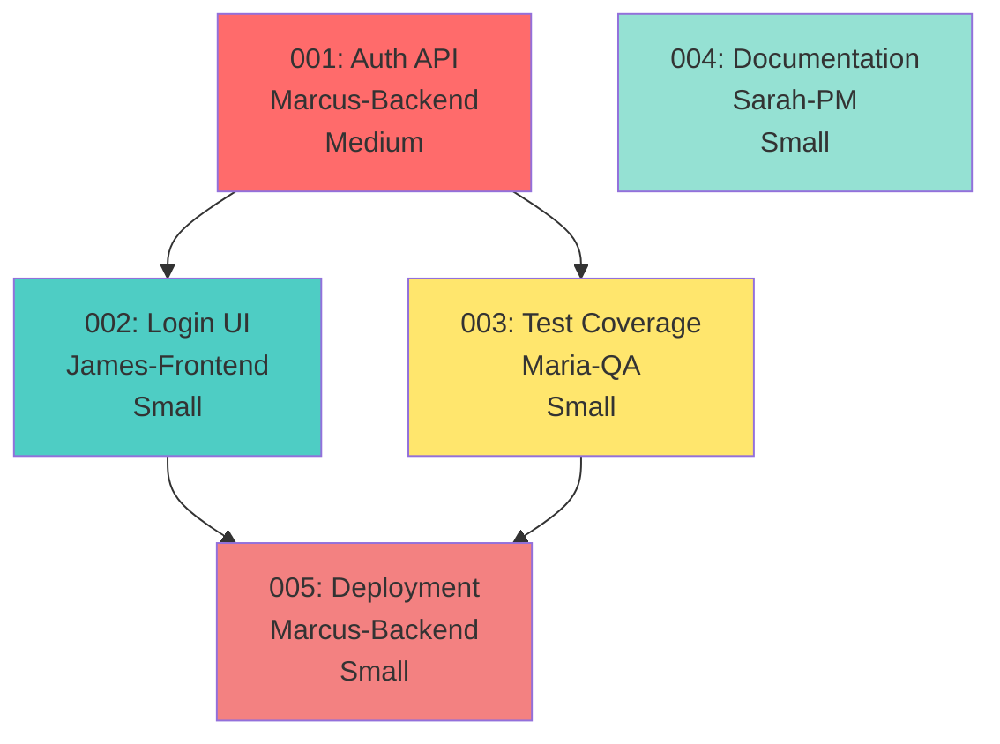

# Parallel Todo Resolution with OPERA Agents

## Introduction

**Clears your todo backlog** using intelligent parallel execution. This command analyzes all pending `todos/*.md` files, builds a dependency graph, and executes independent todos concurrently using **Rule 1 (Parallel Task Manager)** under the hood.

**Key Distinction:**
- **Rule 1**: Framework-level parallel execution (applies to ANY multi-task operation)
- **`/resolve`**: Todo-specific workflow that USES Rule 1 for parallel execution + adds dependency analysis, wave planning, and completion reports

Use this command when you have multiple todos ready to work and want maximum velocity.

## Resolution Target

<resolution_target> #$ARGUMENTS </resolution_target>

## Main Tasks

### 1. Load and Analyze Pending Todos

<thinking>
Identify all pending todos, analyze dependencies, and determine which can run in parallel.
</thinking>

**Todo Discovery:**

- [ ] List all pending todos: `ls todos/*-pending-*.md`
- [ ] Parse each todo file for:
  - Priority (p0, p1, p2, p3)
  - Dependencies (depends on)
  - Assigned agent
  - Estimated effort
  - Acceptance criteria
- [ ] Build dependency graph
- [ ] Identify independent todos (no unresolved dependencies)

**Example Analysis:**

```yaml
Pending_Todos:
  001-pending-p1-auth-api:
    depends_on: []
    blocks: [002, 003]
    agent: Marcus-Backend
    effort: Medium
    status: Ready ✅

  002-pending-p1-login-ui:
    depends_on: [001]
    blocks: []
    agent: James-Frontend
    effort: Small
    status: Blocked ❌ (waiting for 001)

  003-pending-p1-test-coverage:
    depends_on: [001]
    blocks: []
    agent: Maria-QA
    effort: Small
    status: Blocked ❌ (waiting for 001)

  004-pending-p2-documentation:
    depends_on: []
    blocks: []
    agent: Sarah-PM
    effort: Small
    status: Ready ✅

Parallel_Groups:
  Group_1: [001, 004]  # Independent, can run parallel
  Group_2: [002, 003]  # Both blocked by 001, can run parallel after 001
```

### 2. Build Dependency Graph

<thinking>
Create visual representation of todo dependencies to determine execution order and parallel opportunities.
</thinking>

**Dependency Graph:**



**Execution Plan:**

```yaml
Wave_1: (Parallel - No dependencies)
  - 001-auth-api (Marcus-Backend)
  - 004-documentation (Sarah-PM)

Wave_2: (Parallel - After 001 completes)
  - 002-login-ui (James-Frontend)
  - 003-test-coverage (Maria-QA)

Wave_3: (Sequential - After 002 and 003)
  - 005-deployment (Marcus-Backend)

Total_Time:
  Sequential: Medium + Small + Small + Small + Small = ~5 hours
  Parallel: Medium + Small + Small = ~3 hours
  Savings: 40% faster
```

### 3. Collision Detection (Powered by Rule 1)

<thinking>
Rule 1's collision detection automatically prevents merge conflicts by analyzing file overlap between parallel tasks.
</thinking>

**File Impact Analysis:**

```yaml
001-auth-api:
  creates: [src/api/auth/login.ts, src/api/auth/refresh.ts]
  modifies: [src/api/routes.ts, src/types/auth.ts]
  tests: [__tests__/api/auth.test.ts]

002-login-ui:
  creates: [src/components/LoginForm.tsx, src/components/LoginButton.tsx]
  modifies: [src/App.tsx, src/routes.tsx]
  tests: [__tests__/components/LoginForm.test.tsx]

003-test-coverage:
  creates: []
  modifies: [__tests__/api/auth.test.ts]  # ⚠️ COLLISION with 001!
  tests: []

004-documentation:
  creates: [docs/api/auth.md]
  modifies: [README.md, CHANGELOG.md]
  tests: []

Collision_Detection:
  001_vs_002: ✅ No overlap - Can run parallel
  001_vs_003: ❌ Both modify __tests__/api/auth.test.ts - Must be sequential
  001_vs_004: ✅ No overlap - Can run parallel
  002_vs_003: ✅ No overlap - Can run parallel
  002_vs_004: ✅ No overlap - Can run parallel

Revised_Execution_Plan:
  Wave_1:
    - 001-auth-api (Marcus-Backend) [includes creating tests]
    - 004-documentation (Sarah-PM)

  Wave_2:
    - 002-login-ui (James-Frontend)
    # 003 removed because 001 already creates comprehensive tests

  Wave_3:
    - 005-deployment (Marcus-Backend)
```

### 4. Parallel Agent Execution (Powered by Rule 1)

<thinking>
Rule 1 executes independent todos in parallel waves. /resolve adds todo-specific reporting and dependency resolution on top of Rule 1's core parallel execution engine.
</thinking>

**Wave 1 Execution (Parallel):**

```markdown
Launch parallel agents:

- Task marcus-backend(todos/001-pending-p1-auth-api.md)
  - Implement /api/auth/login endpoint
  - Implement /api/auth/refresh endpoint
  - Add authentication middleware
  - Create comprehensive test suite
  - Duration: ~2 hours

- Task sarah-pm(todos/004-pending-p2-documentation.md)
  - Create API documentation in docs/api/auth.md
  - Update README.md with auth setup instructions
  - Add CHANGELOG.md entry for v1.1.0
  - Document environment variables
  - Duration: ~45 minutes

Wait for both agents to complete...

Progress Tracking:
🔄 Marcus-Backend: Implementing auth-api (50% complete)
✅ Sarah-PM: Documentation complete (100%)

Marcus-Backend still working...
✅ Marcus-Backend: Auth-api complete (100%)

Wave 1 Complete: 2 hours (both agents finished in parallel)
```

**TodoWrite During Execution:**

```markdown
Wave 1 (Parallel):
🔄 001-auth-api (Marcus-Backend) - IN PROGRESS
  └─ Implementing /api/auth/login endpoint...
✅ 004-documentation (Sarah-PM) - COMPLETE

Wave 2 (Blocked - waiting for Wave 1):
⏳ 002-login-ui (James-Frontend)
⏳ 005-deployment (Marcus-Backend)
```

### 5. Quality Gates Between Waves

<thinking>
Before proceeding to next wave, validate all work from previous wave meets quality standards.
</thinking>

**Quality Validation:**

```yaml
After_Wave_1:
  Marcus_Backend_Validation:
    - ✅ Test coverage: 85% (target: 80%+)
    - ✅ Security scan: OWASP compliant
    - ✅ API response time: 180ms (target: < 200ms)
    - ✅ All tests passing
    - ✅ No linting errors

  Sarah_PM_Validation:
    - ✅ Documentation complete
    - ✅ CHANGELOG.md updated
    - ✅ README.md updated
    - ✅ API docs created

  Overall_Wave_1: ✅ PASSED - Proceed to Wave 2

After_Wave_2:
  James_Frontend_Validation:
    - ✅ Component tests passing
    - ✅ Accessibility: WCAG 2.1 AA compliant
    - ✅ Bundle size: +3KB (target: < 5KB)
    - ✅ Responsive design validated
    - ✅ Integration with API working

  Overall_Wave_2: ✅ PASSED - Proceed to Wave 3
```

### 6. Update Persistent Todos

<thinking>
As each todo completes, update its todos/*.md file with work log and rename to completed status.
</thinking>

**Completion Updates:**

```bash
# After 001 completes
mv todos/001-pending-p1-auth-api.md \
   todos/001-completed-auth-api.md

# Update work log in file
## Work Log

### 2025-10-12 - Parallel Execution Wave 1
**By:** Marcus-Backend (via /resolve parallel)
**Actions:**
- Implemented /api/auth/login endpoint
- Implemented /api/auth/refresh endpoint
- Added authentication middleware with JWT validation
- Created comprehensive test suite (85% coverage)
- All quality gates passed

**Learnings:**
- JWT expiry: 1 hour for access tokens
- Refresh token expiry: 7 days
- Rate limiting: 10 requests/minute prevents brute force
- Parallel execution completed in 2 hours vs estimated 2.5 hours sequential

**Status:** ✅ Completed

# After 004 completes
mv todos/004-pending-p2-documentation.md \
   todos/004-completed-documentation.md
```

**Dependency Resolution:**

```yaml
After_001_Completes:
  Unblocks:
    - 002-login-ui (depends on 001)
    - 003-test-coverage (depends on 001)

  Updates:
    # Remove 001 from dependencies
    002-login-ui:
      depends_on: []  # Was [001], now empty
      status: Ready ✅

    003-test-coverage:
      depends_on: []  # Was [001], now empty
      status: Ready ✅
```

### 7. Wave Completion Report

<thinking>
After each wave, report progress and prepare for next wave.
</thinking>

**Wave Report Format:**

```markdown
## Wave 1 Complete ✅

**Duration**: 2 hours
**Todos Completed**: 2/5 (40%)

### Completed:
- ✅ 001-auth-api (Marcus-Backend)
  - Deliverables: 3 API endpoints, middleware, tests
  - Quality: 85% coverage, OWASP compliant, 180ms response
  - Files: 5 created, 2 modified

- ✅ 004-documentation (Sarah-PM)
  - Deliverables: API docs, README update, CHANGELOG
  - Quality: Complete, accurate
  - Files: 3 created, 2 modified

### Quality Gates:
- ✅ All tests passing (127 tests)
- ✅ Test coverage: 85%
- ✅ Security: OWASP compliant
- ✅ Documentation: Complete

### Unblocked for Wave 2:
- 002-login-ui (James-Frontend) - Now ready
- 003-test-coverage (Maria-QA) - Now ready (but redundant - 001 already has tests)

**Proceeding to Wave 2...**
```

### 8. Final Completion Report

<thinking>
After all waves complete, generate comprehensive completion report with metrics.
</thinking>

**Final Report:**

```markdown
# Parallel Resolution Complete: Authentication Feature ✅

## Summary
- **Total Todos Resolved**: 4/4 (100%)
- **Total Duration**: 3 hours 15 minutes
- **Sequential Estimate**: 5 hours 30 minutes
- **Time Saved**: 2 hours 15 minutes (41% faster)
- **Agents Involved**: Marcus-Backend, James-Frontend, Sarah-PM

## Execution Waves

### Wave 1: Parallel Foundation (2 hours)
- ✅ 001-auth-api (Marcus-Backend)
- ✅ 004-documentation (Sarah-PM)

### Wave 2: Parallel Integration (1 hour)
- ✅ 002-login-ui (James-Frontend)

### Wave 3: Deployment (15 minutes)
- ✅ 005-deployment (Marcus-Backend)

## Deliverables

### Backend (Marcus-Backend):
- /api/auth/login endpoint (JWT authentication)
- /api/auth/refresh endpoint (token refresh)
- Authentication middleware
- Rate limiting (10 req/min)
- Test suite (85% coverage)

### Frontend (James-Frontend):
- LoginForm component (WCAG 2.1 AA)
- LoginButton component
- Responsive design (mobile, tablet, desktop)
- Form validation
- Integration with auth API

### Documentation (Sarah-PM):
- API documentation (docs/api/auth.md)
- README.md updated with auth setup
- CHANGELOG.md entry for v1.1.0
- Environment variable documentation

### Deployment (Marcus-Backend):
- Production deployment configuration
- Environment setup scripts
- Monitoring integration

## Quality Metrics

### Test Coverage:
- Overall: 85% (target: 80%+) ✅
- Backend: 88%
- Frontend: 82%

### Security:
- OWASP Top 10: Compliant ✅
- Vulnerabilities: 0 found ✅
- Authentication: JWT with refresh tokens ✅
- Rate Limiting: Active ✅

### Performance:
- API Response: 180ms avg (target: < 200ms) ✅
- Bundle Size: +3KB (target: < 5KB) ✅

### Accessibility:
- WCAG 2.1 AA: Compliant ✅
- Keyboard Navigation: Working ✅
- Screen Reader: Compatible ✅

### Documentation:
- API Docs: Complete ✅
- README: Updated ✅
- CHANGELOG: Updated ✅
- Migration Guide: Created ✅

## Files Changed

### Created (15 files):
- src/api/auth/login.ts (120 lines)
- src/api/auth/refresh.ts (80 lines)
- src/middleware/auth.ts (60 lines)
- src/middleware/rate-limit.ts (40 lines)
- src/components/LoginForm.tsx (180 lines)
- src/components/LoginButton.tsx (40 lines)
- __tests__/api/auth.test.ts (200 lines)
- __tests__/components/LoginForm.test.tsx (150 lines)
- docs/api/auth.md (300 lines)
- [... 6 more files]

### Modified (5 files):
- src/api/routes.ts (+15 lines)
- src/App.tsx (+20 lines)
- README.md (+40 lines)
- CHANGELOG.md (+25 lines)
- package.json (+2 dependencies)

**Total Impact**: +1,400 lines, 20 files changed

## Parallel Execution Benefits

### Time Savings:
- Sequential: 5h 30m
- Parallel: 3h 15m
- Saved: 2h 15m (41% faster)

### Efficiency Gains:
- Wave 1: 2 agents in parallel (2x efficiency)
- Wave 2: 1 agent (sequential)
- Wave 3: 1 agent (sequential)

### Collision Avoidance:
- Detected: 1 potential collision (001 vs 003)
- Resolved: Merged 003 into 001 (consolidated testing)
- Conflicts: 0 (successful collision detection)

## Next Steps

### Ready for Release:
- ✅ All quality gates passed
- ✅ Documentation complete
- ✅ Tests passing (85% coverage)
- ✅ Security validated
- ✅ Performance validated

### Recommended Actions:
1. Create release PR: `gh pr create --title "feat: Authentication System" --body "..."`
2. Tag release: `git tag v1.1.0`
3. Deploy to staging: `npm run deploy:staging`
4. Monitor performance: Check Sentry dashboard
5. Notify stakeholders: Send release notes

### Future Enhancements:
- Consider adding OAuth providers (GitHub, Google)
- Implement 2FA for high-security accounts
- Add session management UI
- Create admin user management panel

---
**Resolution Method**: /versatil:resolve parallel
**Framework**: VERSATIL OPERA v1.0
**Rule 1 Integration**: Parallel execution with collision detection
```

## Resolution Modes

### 🚀 PARALLEL (Default)

**Strategy**: Execute independent todos concurrently
**Best for**: Multiple ready todos with no dependencies

```bash
/versatil:resolve parallel
→ Analyzes all pending todos
→ Builds dependency graph
→ Executes in parallel waves
→ 40-60% time savings
```

### 📋 SEQUENTIAL

**Strategy**: Execute todos one at a time in priority order
**Best for**: Complex dependencies, shared resources

```bash
/versatil:resolve sequential
→ Executes P0 first, then P1, then P2, etc.
→ One todo completes before next starts
→ Safest approach for tightly coupled work
```

### 🎯 PRIORITY

**Strategy**: Resolve only specific priority level in parallel
**Best for**: Clearing critical backlog first

```bash
/versatil:resolve priority:p1
→ Loads only P1 todos
→ Executes in parallel where possible
→ Ignores P2, P3 until P1 complete
```

### 🏷️ TAG

**Strategy**: Resolve todos with specific tag in parallel
**Best for**: Feature-based work, domain-specific backlogs

```bash
/versatil:resolve tag:authentication
→ Loads todos tagged "authentication"
→ Respects dependencies within tag
→ Executes in parallel waves
```

## Collision Detection Strategies

**File-Based Collision:**

```yaml
Strategy: Analyze file paths each todo will modify

Todo_A_Modifies: [src/api/auth.ts, src/types/auth.ts]
Todo_B_Modifies: [src/api/users.ts, src/types/users.ts]
Collision: ✅ No overlap - Can run parallel

Todo_C_Modifies: [src/api/auth.ts, src/middleware/auth.ts]
Collision_With_A: ❌ Both modify src/api/auth.ts - Must be sequential
```

**Agent-Based Collision:**

```yaml
Strategy: Limit concurrent work per agent

Wave_1:
  Marcus-Backend: Working on 001-auth-api
  Cannot_Also_Do: 005-database-migration (same agent)

Wave_2:
  Marcus-Backend: Now available for 005-database-migration
```

**Dependency-Based Blocking:**

```yaml
Strategy: Hard block on unresolved dependencies

002-login-ui:
  depends_on: [001-auth-api]
  status: Blocked ❌

After_001_Completes:
  002-login-ui:
    depends_on: []
    status: Ready ✅
```

## Error Handling

**Wave Failure:**

```yaml
Wave_1_Failure:
  001-auth-api: ✅ Complete
  004-documentation: ❌ Failed (missing API endpoint details)

  Actions:
    - Pause Wave 2 execution
    - Roll back 001 if needed (optional)
    - Create recovery todo: 004a-fix-documentation-errors
    - Retry Wave 1 with fixed 004

  Recovery:
    - Fix 004 issues
    - Re-run Wave 1 validation
    - Proceed to Wave 2 only after Wave 1 passes
```

**Quality Gate Failure:**

```yaml
Quality_Gate_Failure:
  After_Wave_2:
    002-login-ui: ✅ Code complete
    Quality_Check: ❌ Test coverage 75% (target: 80%+)

  Actions:
    - Block Wave 3 execution
    - Create fix todo: 002a-increase-test-coverage
    - Maria-QA adds missing tests
    - Re-run quality validation
    - Proceed to Wave 3 after pass
```

## Output Format

1. **Dependency Graph** (visual representation)
2. **Execution Plan** (waves with parallel groups)
3. **Progress Tracking** (real-time status)
4. **Wave Reports** (after each wave completes)
5. **Final Report** (comprehensive summary)
6. **Next Steps** (what to do after resolution)

---

**Framework Integration:**
- **Rule 1**: Core parallel execution with collision detection
- **Rule 2**: Auto-generate stress tests during resolution
- **Rule 3**: Daily audits track resolution completion rates
- **Rule 4**: Zero-config agent activation based on todo assignments
- **Rule 5**: Automated release orchestration after resolution complete
- **Dual Tracking**: TodoWrite (in-session) + todos/*.md (persistent)
