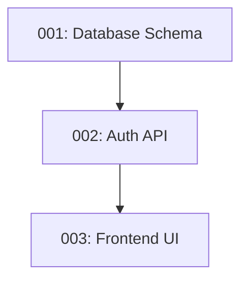

# planning/ - Todo Generation & Dependency Management

**Priority**: MEDIUM
**Agent(s)**: Sarah-PM (primary owner), all agents (consumers)
**Last Updated**: 2025-10-26

## When to Use

- Generating persistent todo files from plan breakdowns
- Creating dual todo systems (TodoWrite + persistent .md files)
- Analyzing task dependencies and execution order
- Detecting execution waves (parallel vs sequential opportunities)
- Generating Mermaid dependency graphs for visualization
- Implementing auto-numbering convention (001-pending-p1-*.md)
- Converting high-level plans to actionable tasks
- Managing cross-session task persistence

## What This Library Provides

### Core Services
- **TodoFileGenerator**: Creates numbered todo files with metadata
- **ExecutionWave**: Groups todos that can run in parallel
- **DependencyGraph**: Mermaid diagram generator for todo relationships

### Key Features
- **Dual System**: TodoWrite (ephemeral, in-session) + persistent .md files (cross-session)
- **Auto-Numbering**: 001-pending-p1-feature-name.md convention
- **Wave Detection**: Analyzes dependencies to find parallel execution opportunities
- **Mermaid Graphs**: Visual dependency diagrams
- **Template-Based**: Uses todos/000-pending-p1-TEMPLATE.md for consistency

### File Structure
```
src/planning/
├── todo-file-generator.ts           # Main todo generation service
├── execution-wave-detector.ts       # Parallel opportunity detection
├── dependency-analyzer.ts           # Dependency graph validation
└── types.ts                         # TodoFileSpec, ExecutionWave

todos/
├── 000-pending-p1-TEMPLATE.md       # Template for all todos
├── 001-pending-p1-feature-name.md   # Generated todos
└── ...
```

## Core Conventions

### DO ✓
- ✓ **Always create persistent files** - Todos survive session restarts
- ✓ **Use template** - todos/000-pending-p1-TEMPLATE.md for consistency
- ✓ **Detect parallel waves** - Maximize concurrent execution
- ✓ **Generate Mermaid graphs** - Visualize dependencies
- ✓ **Validate dependencies** - Check for circular references before generation

### DON'T ✗
- ✗ **Don't skip dependency analysis** - Required for wave detection
- ✗ **Don't hardcode todo numbers** - Use getNextTodoNumber()
- ✗ **Don't forget activeForm** - TodoWrite requires both content + activeForm
- ✗ **Don't create orphaned todos** - Every todo needs clear dependencies or blocks

## Quick Start Pattern

### Generate Todos from Plan
```typescript
import { todoFileGenerator, TodoFileSpec } from '@/planning/todo-file-generator.js';

const specs: TodoFileSpec[] = [
  {
    title: 'Create database schema',
    priority: 'p1',
    assigned_agent: 'Dana-Database',
    estimated_effort: 'Medium',
    acceptance_criteria: ['Users table created', 'RLS policies added'],
    dependencies: { depends_on: [], blocks: ['002'] },
    implementation_notes: 'Use Supabase migrations',
    files_involved: ['migrations/001_users.sql'],
    context: { feature_description: 'User authentication system' }
  },
  {
    title: 'Create auth API endpoints',
    priority: 'p1',
    assigned_agent: 'Marcus-Backend',
    estimated_effort: 'Large',
    acceptance_criteria: ['/auth/signup works', '/auth/login works'],
    dependencies: { depends_on: ['001'], blocks: ['003'] },
    implementation_notes: 'JWT with 24h expiry',
    files_involved: ['src/api/auth.ts'],
    context: { feature_description: 'User authentication system' }
  }
];

const result = await todoFileGenerator.generateTodos(specs);

console.log(`Created ${result.files_created.length} todo files`);
console.log(`Total effort: ${result.total_estimated_hours}h`);
console.log(`Execution waves: ${result.execution_waves.length}`);
console.log(result.dependency_graph); // Mermaid diagram
```

## Important Gotchas

### Gotcha 1: Circular Dependencies
**Problem**: Todo A depends on B, B depends on A → infinite loop

**Solution**: Validate dependency graph before generation
```typescript
// ✅ Good - Detect cycles first
import { validateDependencies } from '@/planning/dependency-analyzer.js';

const validation = validateDependencies(specs);
if (validation.hasCycles) {
  throw new Error(`Circular dependencies detected: ${validation.cycles.join(', ')}`);
}
```

### Gotcha 2: Missing activeForm in TodoWrite
**Problem**: TodoWrite requires both `content` and `activeForm` fields

**Solution**: Always provide both forms
```typescript
// ✅ Good - Both forms provided
{
  content: "Create database schema",
  activeForm: "Creating database schema",
  status: "pending"
}
```

### Gotcha 3: Execution Wave Miscalculation
**Problem**: Wave detector misses parallel opportunities if dependencies not explicitly declared

**Solution**: Always declare dependencies.depends_on = [] for independent tasks
```typescript
// ✅ Good - Explicit independence
const specs = [
  { title: 'Task A', dependencies: { depends_on: [], blocks: [] } }, // Can run in parallel
  { title: 'Task B', dependencies: { depends_on: [], blocks: [] } }  // with Task A
];
```

## Todo File Convention

### Naming Pattern
```
{number}-{status}-{priority}-{feature-name}.md

Examples:
001-pending-p1-database-schema.md
002-in-progress-p1-auth-api.md
003-completed-p1-frontend-ui.md
```

### Status Values
- **pending**: Not started
- **in-progress**: Currently being worked on
- **completed**: Finished and verified
- **blocked**: Waiting on dependencies

### Priority Values
- **p0**: Critical (blocking release)
- **p1**: High (current sprint)
- **p2**: Medium (next sprint)
- **p3**: Low (backlog)

## Execution Waves

**Wave 1** (parallel): All todos with `depends_on: []`
**Wave 2** (parallel): All todos depending only on Wave 1
**Wave 3** (parallel): All todos depending only on Waves 1-2
...and so on

Example:
```
Wave 1: [001-db-schema, 004-design-system] → Run in parallel
Wave 2: [002-auth-api, 005-ui-components] → Run after Wave 1
Wave 3: [003-frontend-integration] → Run after Wave 2
```

## Mermaid Dependency Graph

Generated automatically by TodoFileGenerator:


## Related Documentation

For detailed planning guides:
- [references/todo-file-spec.md](references/todo-file-spec.md) - Complete TodoFileSpec schema
- [references/execution-waves.md](references/execution-waves.md) - Wave detection algorithm
- [references/dependency-validation.md](references/dependency-validation.md) - Circular dependency detection

For templates and conventions:
- [todos/000-pending-p1-TEMPLATE.md](../../../todos/000-pending-p1-TEMPLATE.md) - Todo file template
- [docs/TODO_FILE_CONVENTION.md](../../../docs/TODO_FILE_CONVENTION.md) - Naming and structure rules

---

**Auto-injected via**: `.claude/hooks/before-prompt.ts` → Skill notification when editing `src/planning/**`
