# 🚀 Getting Started with VERSATIL

**Get from zero to first result in 5 minutes** with 18 AI agents working for you.

## 🎯 The VELOCITY Workflow (What You'll Set Up)

VERSATIL implements **Compounding Engineering** - each feature you build makes the next one 40% faster through automatic pattern learning.

```mermaid
graph LR
    User["👤 User Request:<br/>'Add user authentication'"] --> Step1

    Step1["<b>STEP 1: PLAN</b><br/>📋 Alex-BA<br/>━━━━━━━━<br/>• Extract requirements<br/>• Search RAG for similar features<br/>• Define API contract<br/>• Load auth-system template<br/>⏱️ 30 minutes"]

    Step2["<b>STEP 2: ASSESS</b><br/>✅ Sarah-PM<br/>━━━━━━━━<br/>• Framework health ≥ 80%<br/>• Git status clean<br/>• Dependencies installed<br/>• Database connected<br/>⏱️ 5 minutes"]

    Step3["<b>STEP 3: WORK</b><br/>🚀 Three-Tier Parallel<br/>━━━━━━━━"]

    subgraph Parallel["Parallel Execution (60 min max)"]
        Dana["🗄️ <b>Dana-Database</b><br/>• Users table<br/>• Sessions table<br/>• RLS policies<br/>⏱️ 45 min"]
        Marcus["⚙️ <b>Marcus-Backend</b><br/>• /auth/signup<br/>• /auth/login<br/>• JWT tokens<br/>⏱️ 60 min"]
        James["🎨 <b>James-Frontend</b><br/>• LoginForm<br/>• AuthProvider<br/>• Validation<br/>⏱️ 50 min"]
    end

    Step4["<b>STEP 4: CODIFY</b><br/>💾 RAG Update<br/>━━━━━━━━<br/>• Extract auth patterns<br/>• Store JWT examples<br/>• Update effort estimates<br/>• Document lessons<br/>⏱️ 10 minutes"]

    Quality["🧪 <b>Maria-QA</b><br/>━━━━━━━━<br/>• Unit tests<br/>• Integration tests<br/>• Security scan<br/>• 80%+ coverage<br/>⏱️ 20 minutes"]

    Result[["✅ <b>Feature Complete</b><br/>Total: 125 minutes<br/>(vs 220 sequential)<br/>━━━━━━━━<br/>Next similar feature:<br/><b>40% faster!</b>"]]

    Step1 --> Step2
    Step2 --> Step3
    Step3 --> Dana
    Step3 --> Marcus
    Step3 --> James
    Dana --> Quality
    Marcus --> Quality
    James --> Quality
    Quality --> Step4
    Step4 --> Result

    classDef user fill:#e0e0e0,stroke:#616161,stroke-width:2px,color:#000
    classDef plan fill:#e3f2fd,stroke:#2196f3,stroke-width:3px,color:#000
    classDef assess fill:#fff3e0,stroke:#ff9800,stroke-width:3px,color:#000
    classDef work fill:#e8f5e9,stroke:#4caf50,stroke-width:3px,color:#000
    classDef agent fill:#f3e5f5,stroke:#9c27b0,stroke-width:2px,color:#000
    classDef quality fill:#ffccbc,stroke:#ff5722,stroke-width:2px,color:#000
    classDef codify fill:#fce4ec,stroke:#e91e63,stroke-width:3px,color:#000
    classDef result fill:#c8e6c9,stroke:#2e7d32,stroke-width:4px,color:#000

    class User user
    class Step1 plan
    class Step2 assess
    class Step3 work
    class Dana,Marcus,James agent
    class Quality quality
    class Step4 codify
    class Result result
```



---

## Prerequisites

- **Node.js** 18.0.0 or higher
- **npm** or **yarn**
- **Cursor IDE** or **Claude Desktop** (recommended)

---

## Step 1: Install VERSATIL (2 minutes)

### Global Installation

```bash
# Install VERSATIL globally
npm install -g @versatil/sdlc-framework

# Verify installation
versatil --version
# Expected output: 6.5.0
```

### Or use via npx (no installation)

```bash
npx @versatil/sdlc-framework init
```

---

## Step 2: Initialize Your Project (1 minute)

```bash
# Navigate to your project directory
cd /path/to/your/project

# Initialize VERSATIL (auto-detects your tech stack)
npx versatil init
```

**What `versatil init` does:**
1. ✅ Detects your tech stack (React, Vue, Python, Node.js, etc.)
2. ✅ Recommends relevant agents from 18 available
3. ✅ Generates personalized 4-week roadmap (`docs/VERSATIL_ROADMAP.md`)
4. ✅ Creates `.versatil-project.json` configuration
5. ✅ Sets up quality gates (80%+ test coverage, WCAG 2.1 AA)

---

## Step 3: Configure IDE Integration (1 minute)

### For Cursor IDE

```bash
# Auto-configure MCP for Cursor
versatil-mcp-setup --cursor
```

This creates `.cursor/mcp_config.json`:

```json
{
  "mcpServers": {
    "versatil": {
      "command": "node",
      "args": ["~/.npm-global/bin/versatil-mcp", "/your/project"]
    }
  }
}
```

### For Claude Desktop

```bash
# Auto-configure MCP for Claude Desktop
versatil-mcp-setup --claude-desktop
```

This updates `~/Library/Application Support/Claude/claude_desktop_config.json`.

---

## Step 4: Start the Proactive Daemon (30 seconds)

```bash
# Start daemon (agents auto-activate on file saves)
versatil-daemon start

# Check daemon status
versatil-daemon status
# Expected output: ✅ Daemon running (PID: 12345)
```

**What the daemon does:**
- 👀 Watches your project files
- 🤖 Auto-activates relevant agents when you save files
- ⚡ Runs quality gates before commits
- 📊 Provides real-time feedback in statusline

---

## Step 5: See It In Action (30 seconds)

### How Agent Auto-Activation Works

When you edit a file, VERSATIL's proactive system springs into action automatically:

```mermaid
flowchart TD
    Start(["👤 You edit:<br/><b>src/components/Button.tsx</b>"]) --> Save["💾 File Save Event"]

    Save --> Hook["🪝 Cursor Hook:<br/><b>afterFileEdit</b><br/>⏱️ <50ms"]

    Hook --> Pattern["🔍 Pattern Match:<br/><b>*.tsx</b> detected<br/>⏱️ <500ms"]

    Pattern --> Agent["🤖 Agent Activation:<br/><b>James-Frontend</b><br/>⏱️ <2s"]

    Agent --> Tech{"🔬 Tech Detection"}

    Tech -->|"React patterns"| SubReact["🎨 Sub-Agent:<br/><b>James-React</b>"]
    Tech -->|"Vue patterns"| SubVue["🎨 Sub-Agent:<br/><b>James-Vue</b>"]
    Tech -->|"Angular patterns"| SubAngular["🎨 Sub-Agent:<br/><b>James-Angular</b>"]

    SubReact --> RAG["💾 Search RAG:<br/>Similar Button components<br/>⏱️ <800ms"]
    SubVue --> RAG
    SubAngular --> RAG

    RAG --> Checks["✅ Quality Checks"]

    Checks --> C1["🔍 Accessibility<br/>(WCAG 2.1 AA)"]
    Checks --> C2["📱 Responsive Design<br/>(Mobile, Tablet, Desktop)"]
    Checks --> C3["⚡ Performance<br/>(Bundle size, rendering)"]

    C1 --> Status["📊 Update Statusline:<br/><b>🤖 James-React: Button validation</b><br/>⏱️ <100ms"]
    C2 --> Status
    C3 --> Status

    Status --> Result

    Result{{"🎯 Result"}}

    Result -->|"All checks pass"| Pass["✅ <b>92% accessible</b><br/>✅ <b>Responsive</b><br/>✅ <b>Optimized</b><br/><br/>Total: <2 seconds"]
    Result -->|"Issues found"| Warn["⚠️ <b>Missing aria-label</b><br/>⚠️ <b>No mobile breakpoint</b><br/><br/>Inline suggestions provided<br/>Total: <2 seconds"]

    classDef user fill:#e0e0e0,stroke:#616161,stroke-width:2px
    classDef hook fill:#fff3e0,stroke:#ff9800,stroke-width:2px
    classDef agent fill:#e8f5e9,stroke:#4caf50,stroke-width:3px
    classDef subagent fill:#f3e5f5,stroke:#9c27b0,stroke-width:2px
    classDef check fill:#e3f2fd,stroke:#2196f3,stroke-width:2px
    classDef success fill:#c8e6c9,stroke:#2e7d32,stroke-width:3px
    classDef warning fill:#fff9c4,stroke:#f57f17,stroke-width:3px

    class Start,Save user
    class Hook,Pattern hook
    class Agent,Tech agent
    class SubReact,SubVue,SubAngular subagent
    class RAG,Checks,C1,C2,C3,Status check
    class Pass success
    class Warn warning
```



### Test 1: Edit a React Component

```bash
# Create or edit a component
# File: src/components/Button.tsx
```

**What happens** (as shown in diagram above):
1. Save the file → **James-Frontend** auto-activates
2. Detects React → **James-React** sub-agent takes over
3. Searches RAG for similar Button components
4. Validates: Accessibility (WCAG 2.1 AA), responsive design, performance
5. Provides inline suggestions if issues found
6. Updates statusline: `🤖 James-React: Button validation (92% accessible)`
7. **Total time: < 2 seconds**

### Test 2: Edit an API Route

```bash
# Create or edit an API file
# File: src/api/users.ts
```

**What happens:**
1. Save the file → **Marcus-Backend** auto-activates
2. Scans: SQL injection, XSS, CSRF, rate limiting, input sanitization
3. Generates stress tests automatically (Rule 2)
4. Updates statusline: `🤖 Marcus-Backend: Security scan (0 vulnerabilities)`

### Test 3: Edit a Test File

```bash
# Create or edit a test
# File: src/components/Button.test.tsx
```

**What happens:**
1. Save the file → **Maria-QA** auto-activates
2. Analyzes test coverage (requires 80%+)
3. Suggests missing test cases
4. Updates statusline: `🤖 Maria-QA: Coverage check (85% ✅)`

---

## Step 6: Check Framework Health

```bash
# Quick health check
versatil doctor

# Expected output:
# ✅ Framework Health: 95%
# ✅ All 8 core agents operational
# ✅ 12 MCP integrations configured
# ✅ Daemon running
# ✅ Quality gates enabled
```

---

## Next Steps

### View Your Personalized Roadmap

```bash
# Open the auto-generated roadmap
cat docs/VERSATIL_ROADMAP.md
```

Your roadmap includes:
- 📅 4-week development plan
- 🎯 Weekly milestones and tasks
- 🤖 Agent recommendations for each phase
- ✅ Quality gates and success metrics
- 💡 Technology-specific best practices

### Explore Agents

```bash
# List all available agents
versatil show-agents

# Expected output:
# 8 Core OPERA Agents:
#   • Alex-BA: Business Analyst
#   • Dana-Database: Database Architect
#   • Marcus-Backend: API Architect
#   • James-Frontend: UI/UX Expert
#   • Maria-QA: Quality Guardian
#   • Sarah-PM: Project Coordinator
#   • Dr.AI-ML: AI/ML Specialist
#   • Oliver-MCP: MCP Orchestrator
#
# 10 Language Sub-Agents:
#   • James-React, James-Vue, James-Next, James-Angular, James-Svelte
#   • Marcus-Node, Marcus-Python, Marcus-Rails, Marcus-Go, Marcus-Java
```

### Manual Agent Invocation

While agents auto-activate, you can also invoke them manually:

```bash
# Quality assurance
/maria-qa review test coverage

# Frontend optimization
/james-frontend optimize page load time

# Backend security
/marcus-backend review API security

# Database optimization
/dana-database optimize user queries

# Requirements analysis
/alex-ba extract requirements from conversation

# Project coordination
/sarah-pm generate sprint report

# AI/ML tasks
/dr-ai-ml optimize model performance

# MCP orchestration
/oliver-mcp test browser automation
```

---

## Common Issues

### Daemon won't start

```bash
# Check if port 3000 is already in use
lsof -i :3000

# Stop any existing daemon
versatil-daemon stop

# Restart
versatil-daemon start
```

### Agents not activating

```bash
# Check daemon status
versatil-daemon status

# View daemon logs
versatil-daemon logs

# Restart daemon
versatil-daemon restart
```

### MCP integration issues

```bash
# Validate MCP configuration
versatil-mcp-setup --validate

# Re-run setup
versatil-mcp-setup --cursor --force
```

---

## Getting Help

- **📖 Documentation**: [docs/README.md](docs/README.md)
- **💬 GitHub Discussions**: [Ask questions](https://github.com/Nissimmiracles/versatil-sdlc-framework/discussions)
- **🐛 Report Issues**: [GitHub Issues](https://github.com/Nissimmiracles/versatil-sdlc-framework/issues)
- **📧 Email**: nissim@versatil.vc

---

## What's Next?

### The Compounding Effect: Why Every Feature Gets Faster

VERSATIL implements the **VELOCITY Workflow Flywheel** - each feature you build automatically improves velocity for future features:

```mermaid
graph TB
    Start([Your Next Feature]) --> Phase1

    subgraph Flywheel["🔄 VELOCITY Workflow Flywheel (Compounding Engineering)"]
        direction TB

        Phase1["<b>1. PLAN</b><br/>📋 Research with RAG Memory<br/>Load similar features<br/>Use proven templates"]
        Phase2["<b>2. ASSESS</b><br/>✅ Validate Readiness<br/>Check dependencies<br/>Verify environment"]
        Phase3["<b>3. WORK</b><br/>🚀 Execute with Patterns<br/>3-tier parallel<br/>Apply learned best practices"]
        Phase4["<b>4. CODIFY</b><br/>💾 Store to RAG Memory<br/>Extract patterns<br/>Update estimates"]

        Phase1 --> Phase2
        Phase2 --> Phase3
        Phase3 --> Phase4
        Phase4 -.->|"Next feature<br/>40% faster"| Phase1
    end

    Phase4 --> Feature1

    subgraph Compounding["⚡ Compounding Effect Over Time"]
        direction LR
        Feature1["Feature 1:<br/>Authentication<br/>⏱️ 125 min"]
        Feature2["Feature 2:<br/>Admin Auth<br/>⏱️ 75 min<br/>🎯 40% faster"]
        Feature3["Feature 3:<br/>OAuth<br/>⏱️ 65 min<br/>🎯 48% faster"]

        Feature1 -->|"Patterns<br/>stored in RAG"| Feature2
        Feature2 -->|"More patterns<br/>+ refined estimates"| Feature3
    end

    Feature3 --> Result[["<b>Continuous Improvement</b><br/>Each feature benefits<br/>from all previous work<br/>✨ Exponential velocity gains"]]

    classDef plan fill:#e3f2fd,stroke:#2196f3,stroke-width:3px,color:#000
    classDef assess fill:#fff3e0,stroke:#ff9800,stroke-width:3px,color:#000
    classDef work fill:#e8f5e9,stroke:#4caf50,stroke-width:3px,color:#000
    classDef codify fill:#fce4ec,stroke:#e91e63,stroke-width:3px,color:#000
    classDef feature fill:#f3e5f5,stroke:#9c27b0,stroke-width:2px,color:#000
    classDef result fill:#c8e6c9,stroke:#2e7d32,stroke-width:4px,color:#000

    class Phase1 plan
    class Phase2 assess
    class Phase3 work
    class Phase4 codify
    class Feature1,Feature2,Feature3 feature
    class Result result
```



**Try it yourself**:
1. Build your first feature (e.g., user authentication)
2. Build a similar feature (e.g., admin authentication)
3. Notice the 40% time reduction automatically!

### Further Reading

1. **Read the Agent Reference**: [docs/agents/README.md](docs/agents/README.md)
2. **Explore MCP Integrations**: [docs/features/mcp-ecosystem.md](docs/features/mcp-ecosystem.md)
3. **See Real-World Examples**: [docs/MCP_EXAMPLES.md](docs/MCP_EXAMPLES.md)
4. **Compare with Other Tools**: [docs/COMPARISON.md](docs/COMPARISON.md)

---

**🎉 Congratulations!** You're now running VERSATIL with 18 AI agents working proactively on your project.

[← Back to README](README.md) | [View All Documentation](docs/README.md)
