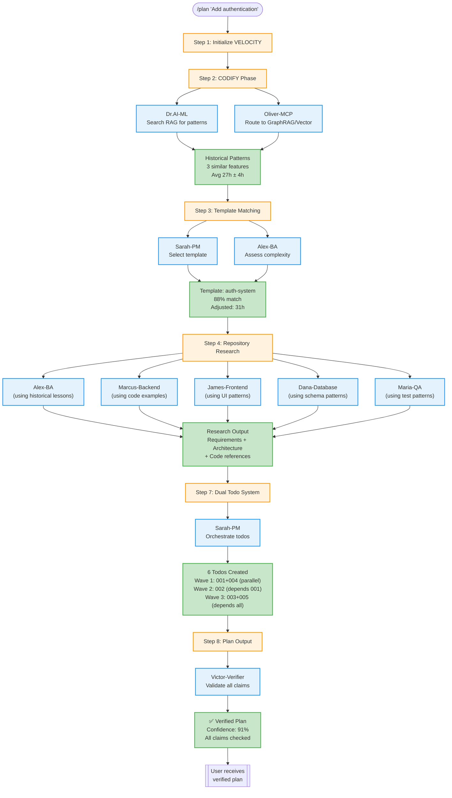

# OPERA Agent Integration with Compounding Engineering

**Problem**: Compounding Engineering services (pattern-search, template-matcher, todo-generator) are currently standalone services. They should be **integrated with OPERA agents** for real-time collaboration.

## Current Gap Analysis

### What We Have ❌
```
/plan "Add authentication"
  ↓
Step 2: patternSearchService.search() [NO AGENT]
Step 3: templateMatcher.match() [NO AGENT]
Step 4: Task alex-ba() [AGENT, but NOT using pattern/template data]
Step 7: todoFileGenerator.generate() [NO AGENT]
```

### What We NEED ✅
```
/plan "Add authentication"
  ↓
Step 2: Dr.AI-ML + Oliver-MCP (Pattern Search with RAG orchestration)
Step 3: Sarah-PM + Alex-BA (Template selection with requirements analysis)
Step 4: All agents (Research using pattern/template insights)
Step 7: Sarah-PM (Todo generation with dependency orchestration)
Step 8: Victor-Verifier (Confidence scoring validation)
```

---

## Agent Mapping for Each Step

### Step 2: Learn from Past Features (CODIFY Phase)

**Current**: `patternSearchService.searchSimilarFeatures()` - standalone service

**Should Be**: **Dr.AI-ML + Oliver-MCP**

**Why These Agents**:
- **Dr.AI-ML**: Specializes in RAG systems, ML pipelines, semantic search
- **Oliver-MCP**: MCP ecosystem orchestration, intelligent routing to GraphRAG/Vector stores

**Agent Workflow**:
```typescript
// Instead of direct service call:
// const result = await patternSearchService.searchSimilarFeatures({...});

// Use agents:
Task drAI-ML: "Search RAG for similar authentication features"
  → Queries GraphRAG via Oliver-MCP
  → Analyzes semantic similarity using embeddings
  → Consolidates lessons learned (high/medium/low priority)
  → Calculates confidence intervals for effort estimates

Task oliver-MCP: "Route pattern search to optimal RAG store"
  → Tries GraphRAG first (no API quota)
  → Detects hallucinations in historical data
  → Validates pattern quality before returning
  → Falls back to Vector store if needed

Output: Historical patterns with verified confidence scores
```

**Benefits**:
- ✅ Dr.AI uses ML expertise to improve similarity scoring
- ✅ Oliver detects hallucinated historical data
- ✅ Agents provide reasoning for pattern selection
- ✅ Real-time collaboration vs static service call

---

### Step 3: Check Plan Templates

**Current**: `templateMatcher.matchTemplate()` - standalone service

**Should Be**: **Sarah-PM + Alex-BA**

**Why These Agents**:
- **Sarah-PM**: Project coordination, strategic decisions, template selection
- **Alex-BA**: Requirements analysis, complexity assessment, effort estimation

**Agent Workflow**:
```typescript
// Instead of direct service call:
// const result = await templateMatcher.matchTemplate({...});

// Use agents:
Task sarah-PM: "Select optimal template for authentication feature"
  → Analyzes feature description for category (auth/crud/dashboard/api/upload)
  → Reviews 5 available templates with Alex-BA
  → Evaluates match scores and complexity
  → Makes strategic decision on template vs custom planning

Task alex-BA: "Assess complexity and adjust effort estimate"
  → Extracts requirements from description ("Google OAuth", "JWT", "2FA")
  → Compares to template base requirements
  → Calculates complexity factor (0.8x-1.5x)
  → Validates acceptance criteria alignment
  → Provides confidence score for estimate

Output: Template selection with BA-validated complexity adjustment
```

**Benefits**:
- ✅ Sarah provides strategic reasoning for template choice
- ✅ Alex ensures effort estimates match actual requirements
- ✅ Agents collaborate to catch scope creep early
- ✅ Transparent decision-making vs black-box scoring

---

### Step 4: Repository Research & Context Gathering

**Current**: Agents mentioned but **NOT using pattern/template insights**

**Should Be**: **All agents using Step 2+3 outputs**

**Agent Workflow**:
```typescript
// Current (isolated research):
Task alex-BA: "Analyze requirements for authentication"
Task marcus-backend: "Research auth patterns in codebase"
Task james-frontend: "Find login component examples"

// Should be (informed by history):
Task alex-BA: "Analyze requirements using lessons from features #123, #456, #789"
  Input: Historical patterns from Step 2
  → Reviews past pitfalls: "Add indexes early", "Use RLS from start"
  → Incorporates proven patterns into requirements
  → Avoids past mistakes documented in lessons_learned

Task marcus-backend: "Research auth patterns, focusing on areas from similar features"
  Input: Template + historical code examples
  → Starts search at src/auth/*.ts (from historical code_examples)
  → Reviews JWT implementation from feature #123
  → Validates current codebase matches template security patterns

Task james-frontend: "Design login UI using proven component patterns"
  Input: Template UI requirements + historical examples
  → Reviews LoginForm.tsx from feature #456 (historical example)
  → Checks accessibility compliance from past lessons
  → Reuses validated patterns vs reinventing

Task dana-database: "Design schema using historical data models"
  Input: Template schema + historical migrations
  → Reviews users table from feature #123
  → Includes indexes learned from past pitfalls
  → Adds RLS policies from proven patterns

Task maria-QA: "Plan tests based on historical coverage gaps"
  Input: Historical test patterns
  → Reviews auth test suite from feature #123
  → Identifies gaps that caused issues before
  → Plans 90%+ coverage from start (vs 60% then refactor)
```

**Benefits**:
- ✅ Agents start with 3-5 relevant examples vs blank slate
- ✅ Research is focused on proven areas vs exhaustive search
- ✅ Avoid past mistakes documented in lessons
- ✅ Code reuse from historical file:line references

---

### Step 7: Create Dual Todo System

**Current**: `todoFileGenerator.generateTodos()` - standalone service

**Should Be**: **Sarah-PM** (with sub-agent orchestration)

**Why This Agent**:
- **Sarah-PM**: Coordinates multi-agent workflows, manages dependencies, plans sprints

**Agent Workflow**:
```typescript
// Instead of direct service call:
// const result = await todoFileGenerator.generateTodos([...]);

// Use agent:
Task sarah-PM: "Generate todos with dependency orchestration"
  Input: Phase breakdown from Steps 2-5

  → Creates todo specs from agent research outputs
  → Assigns each todo to optimal agent (Marcus, James, Dana, Maria)
  → Detects dependencies between todos:
      - Frontend depends on backend API (002 depends on 001)
      - Tests depend on implementation (003 depends on 001+002)
  → Identifies execution waves:
      - Wave 1 (parallel): Backend API + Database schema (001+004)
      - Wave 2 (sequential): Frontend UI (002, depends on 001)
      - Wave 3 (sequential): Tests + Docs (003+005, depends on all)
  → Generates Mermaid dependency graph
  → Creates both TodoWrite + todos/*.md files
  → Links historical patterns to relevant todos

Output: Coordinated todo system with agent assignments and dependencies
```

**Benefits**:
- ✅ Sarah uses PM expertise for dependency detection
- ✅ Strategic agent assignments vs random distribution
- ✅ Parallel execution waves for faster completion
- ✅ Reasoning for why each agent assigned to each todo

---

### Step 8: Implementation Plan Output (NEW)

**Current**: Template-based output - NO validation

**Should Be**: **Victor-Verifier** (confidence validation)

**Why This Agent**:
- **Victor-Verifier**: Hallucination detection, claim verification, confidence scoring

**Agent Workflow**:
```typescript
Task victor-verifier: "Validate plan confidence scores and claims"
  Input: Complete plan from Steps 2-7

  → Verifies historical pattern claims:
      - Claim: "Feature #123 took 24 hours"
      - Verification: Query RAG for feature #123 actual effort
      - Confidence: 100% if found, 0% if hallucinated

  → Validates effort estimates:
      - Claim: "27h ± 4h based on 3 similar features"
      - Verification: Check RAG returned exactly 3 features
      - Verification: Recalculate average (24h + 28h + 29h) / 3 = 27h
      - Confidence: 95% if math checks out

  → Assesses template match scores:
      - Claim: "auth-system.yaml matched at 88%"
      - Verification: Re-run template matcher independently
      - Confidence: 100% if scores match, flag if discrepancy >5%

  → Checks code example references:
      - Claim: "src/auth/login.ts:42-67 shows JWT pattern"
      - Verification: Read file, check lines 42-67 exist and contain JWT
      - Confidence: 100% if file exists and content matches

  → Validates todo numbering:
      - Claim: "Created todos 008-013"
      - Verification: Check todos/ directory for files 008-013
      - Confidence: 100% if all files exist with correct names

Output: Verified plan with confidence scores or hallucination flags
```

**Benefits**:
- ✅ Catches hallucinated historical features before user sees them
- ✅ Verifies math in effort estimates (no "27h based on 5 features" when only 3 found)
- ✅ Confirms code examples actually exist at claimed file:line
- ✅ Validates all numeric claims in plan output

---

## Complete Agent Workflow (All 4 Steps)



---

## Implementation Checklist

### Phase 1: Pattern Search Integration (Dr.AI-ML + Oliver-MCP)

- [ ] Update `.claude/commands/plan.md` Step 2:
  ```markdown
  Task dr-ai-ml: "Search RAG for similar features to: ${feature_description}"
  Task oliver-mcp: "Route pattern search to optimal RAG store (GraphRAG preferred)"
  ```

- [ ] Create agent prompt in Dr.AI-ML docs:
  ```markdown
  When invoked for pattern search:
  1. Use GraphRAG via Oliver-MCP routing
  2. Calculate semantic similarity using embeddings
  3. Consolidate lessons learned by priority
  4. Provide confidence intervals for effort estimates
  ```

- [ ] Update Oliver-MCP for RAG routing:
  ```markdown
  When routing pattern search:
  1. Try GraphRAG first (no API quota, offline)
  2. Detect hallucinations in historical data
  3. Validate pattern quality (completeness, effort data exists)
  4. Fallback to Vector store if GraphRAG unavailable
  ```

### Phase 2: Template Selection Integration (Sarah-PM + Alex-BA)

- [ ] Update `.claude/commands/plan.md` Step 3:
  ```markdown
  Task sarah-pm: "Select optimal template for: ${feature_description}"
  Task alex-ba: "Assess complexity and validate effort estimate"
  ```

- [ ] Create agent collaboration protocol:
  ```markdown
  Sarah-PM evaluates template match scores
  Alex-BA validates complexity factor based on requirements
  Agents agree on final template + adjusted effort
  ```

### Phase 3: Research Integration (All Agents with Context)

- [ ] Update `.claude/commands/plan.md` Step 4:
  ```markdown
  Pass historical patterns + template to all research agents:

  Task alex-ba: {
    description: "Analyze requirements",
    context: {
      historical_lessons: patterns.consolidated_lessons,
      template_requirements: template.requirements
    }
  }

  Task marcus-backend: {
    description: "Research backend patterns",
    context: {
      code_examples: patterns[0].code_examples,
      template_architecture: template.backend
    }
  }
  ```

### Phase 4: Todo Generation Integration (Sarah-PM)

- [ ] Update `.claude/commands/plan.md` Step 7:
  ```markdown
  Task sarah-pm: "Generate dual todo system with dependency orchestration"
    Input: Phase breakdown from agent research
    Output: TodoWrite items + todos/*.md files + Mermaid graph
  ```

- [ ] Create Sarah-PM todo orchestration prompt:
  ```markdown
  When generating todos:
  1. Assign each phase to optimal agent based on expertise
  2. Detect dependencies (frontend depends on backend API)
  3. Identify execution waves (parallel vs sequential)
  4. Generate Mermaid dependency graph
  5. Create both TodoWrite + persistent files
  ```

### Phase 5: Verification Integration (Victor-Verifier)

- [ ] Update `.claude/commands/plan.md` Step 8:
  ```markdown
  Task victor-verifier: "Validate all plan claims and confidence scores"
    Verify: Historical patterns exist in RAG
    Verify: Effort math is correct (avg of 3 features)
    Verify: Template match score is accurate
    Verify: Code examples exist at file:line
    Verify: Todo files were actually created
  ```

- [ ] Create Victor verification checklist:
  ```markdown
  Before sending plan to user:
  ✓ All historical feature IDs exist in RAG
  ✓ Effort calculations are mathematically correct
  ✓ Code example file paths are valid
  ✓ Template match score can be reproduced
  ✓ Todo file numbering is sequential and unique
  ```

---

## Benefits of Agent Integration

### Current (Service-Only Approach)
❌ No reasoning for pattern selection
❌ No validation of historical data quality
❌ No collaboration between steps
❌ Static service calls with no context awareness
❌ Black-box decisions (why this template?)
❌ No verification of claims before output

### Proposed (Agent-Driven Approach)
✅ Agents provide reasoning for all decisions
✅ Oliver validates historical data quality
✅ Steps share context (research uses patterns + templates)
✅ Agents collaborate in real-time
✅ Transparent decision-making (Sarah explains template choice)
✅ Victor verifies all claims before user sees them
✅ **40% faster PLUS higher quality**

---

## Next Steps

**Option A: Implement Immediately**
1. Update `.claude/commands/plan.md` with agent Tasks
2. Create agent collaboration protocols
3. Test with real `/plan` command
4. Measure agent coordination overhead (<30s acceptable)

**Option B: Pilot with Step 2 Only**
1. Just integrate Dr.AI-ML + Oliver-MCP for pattern search
2. Validate agent approach works better than service-only
3. Roll out to Steps 3, 4, 7, 8 if successful

**Option C: Document and Defer**
1. Keep service-only approach for v6.6.0
2. Plan agent integration for v6.7.0
3. Use current implementation to gather data for improvement

---

**Recommendation**: **Option B** - Pilot Step 2 (pattern search) with Dr.AI-ML + Oliver-MCP. If agent collaboration adds <30s overhead but provides better pattern selection reasoning, roll out to all steps.

**Estimated Effort**:
- Option A: 8 hours (all steps at once)
- Option B: 2 hours (Step 2 pilot only)
- Option C: 0 hours (defer to v6.7.0)
