# VERSATIL Architecture Diagrams

Visual guide to understanding VERSATIL's architecture, agent coordination, and workflow patterns.

---

## 🏛️ System Architecture

### High-Level Overview

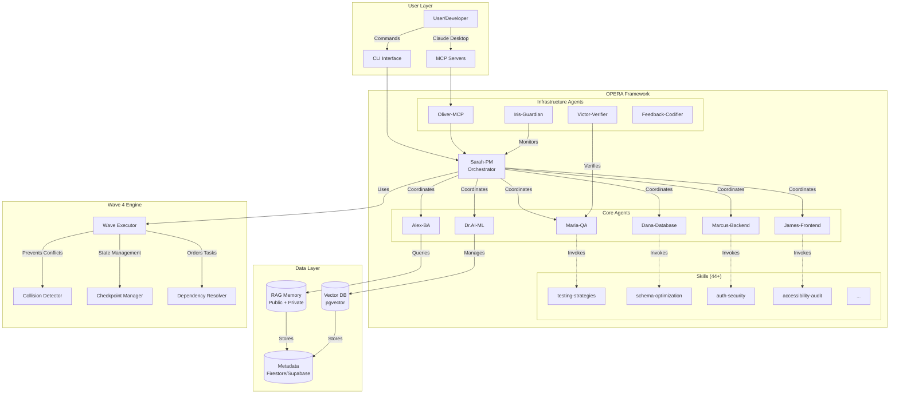

---

## 🌊 Wave 4 Coordination Flow

### Parallel Execution Pattern

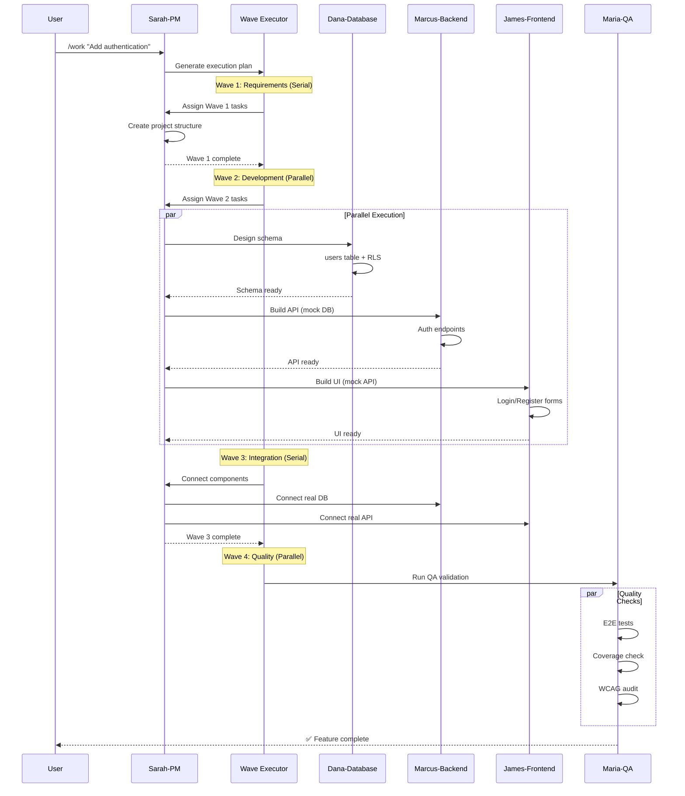

---

## 🔄 OPERA Methodology Flow

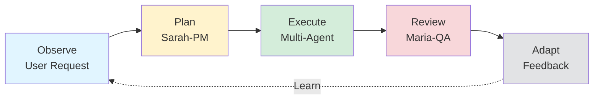

### Phase Transitions

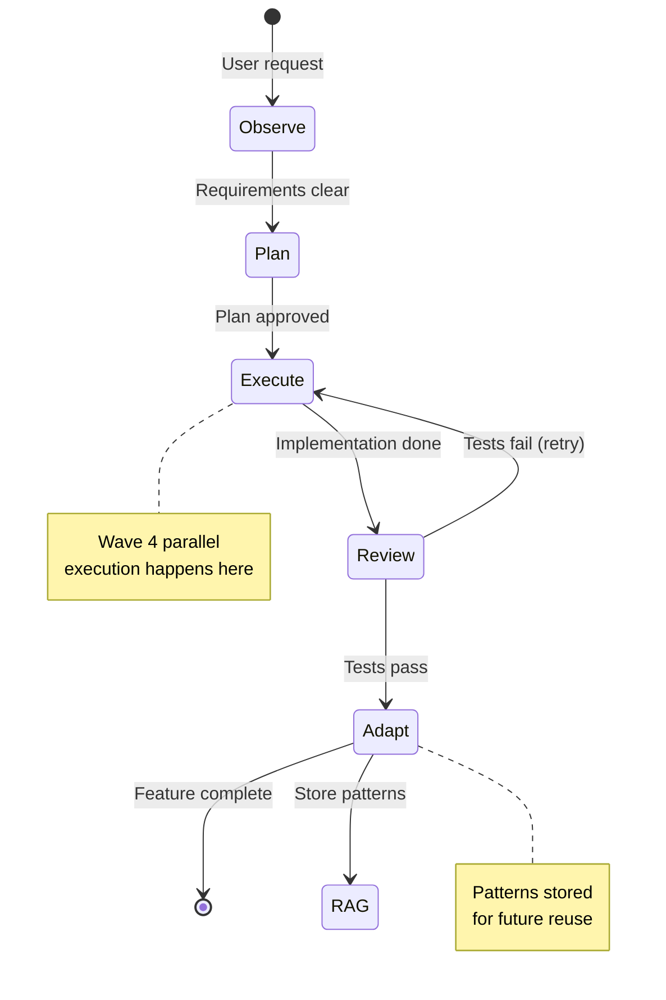

---

## 👥 Agent Interaction Patterns

### Pattern 1: Full-Stack Feature

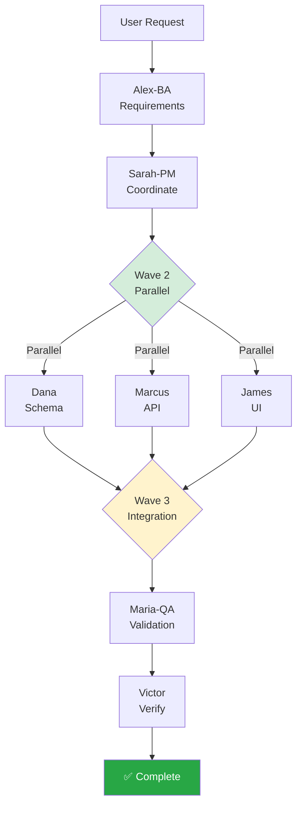

### Pattern 2: Emergency Bug Fix

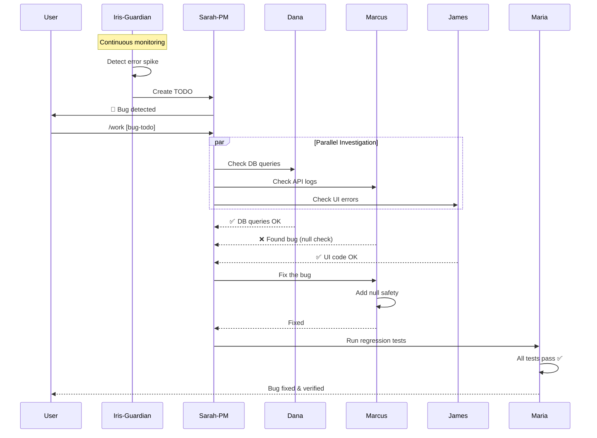

---

## 🧠 RAG Memory Architecture

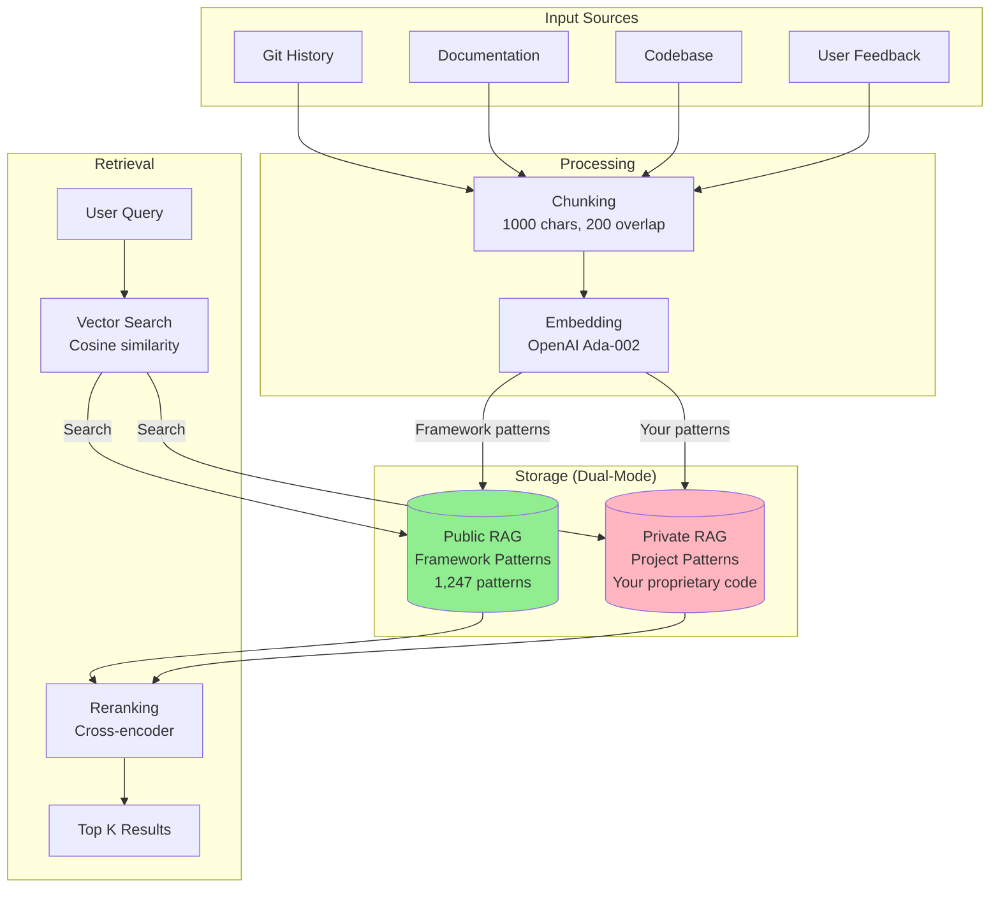

---

## 🔐 Security Architecture

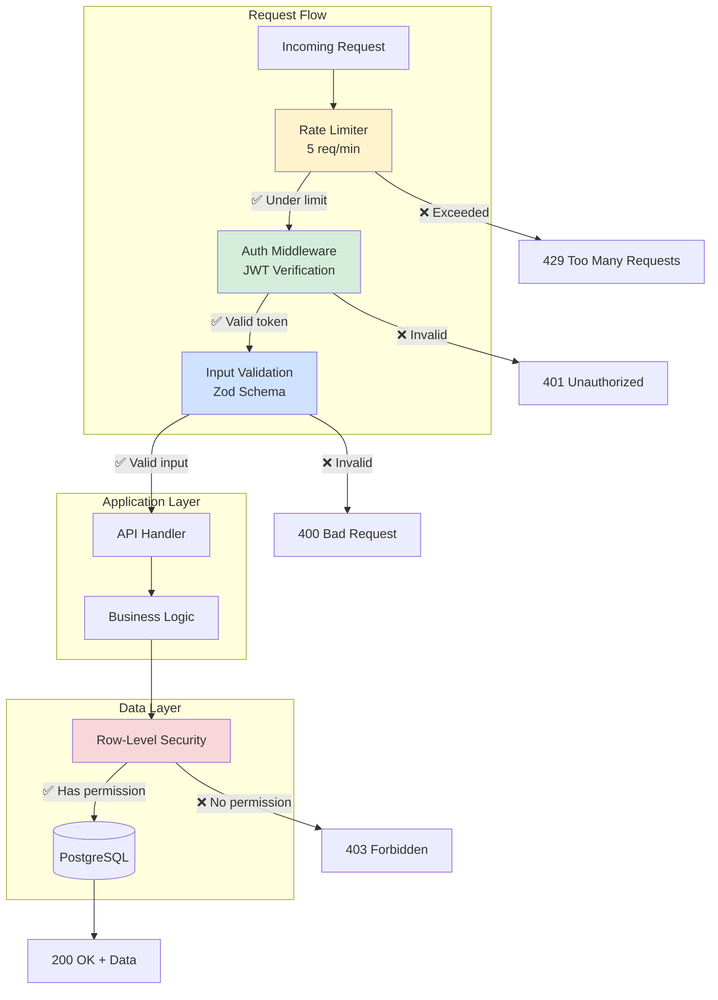

---

## 📦 Deployment Architecture

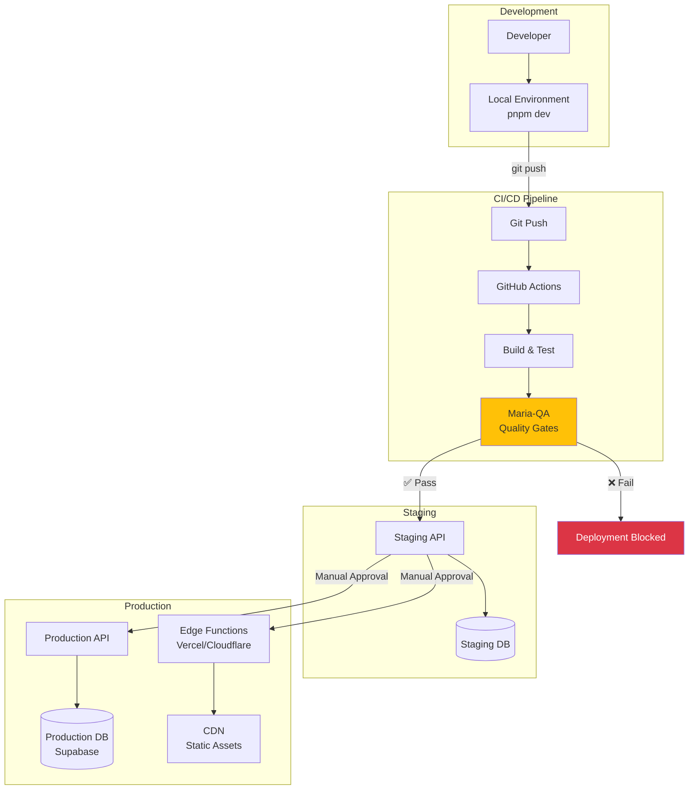

---

## 🎓 Learning & Compounding

```mermaid
graph LR
    F1[Feature 1<br/>Auth System<br/>125 min] --> LEARN1[/learn]
    LEARN1 --> RAG[(RAG Memory)]

    RAG -->|Retrieve patterns| F2[Feature 2<br/>Admin Panel<br/>75 min<br/>40% faster]

    F2 --> LEARN2[/learn]
    LEARN2 --> RAG

    RAG -->|More patterns| F3[Feature 3<br/>User Profile<br/>60 min<br/>52% faster]

    F3 --> LEARN3[/learn]
    LEARN3 --> RAG

    RAG -->|Even more patterns| F5[Feature 5<br/>Dashboard<br/>50 min<br/>60% faster]

    style F1 fill:#e3f2fd
    style F2 fill:#c8e6c9
    style F3 fill:#fff9c4
    style F5 fill:#c5e1a5
    style RAG fill:#f8bbd0
```

---

## 🔄 Collision Detection System

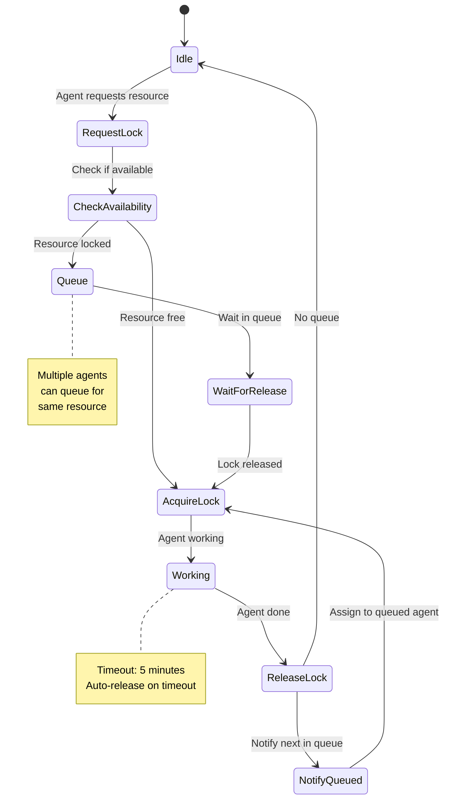

---

## 🛡️ Guardian Monitoring Flow

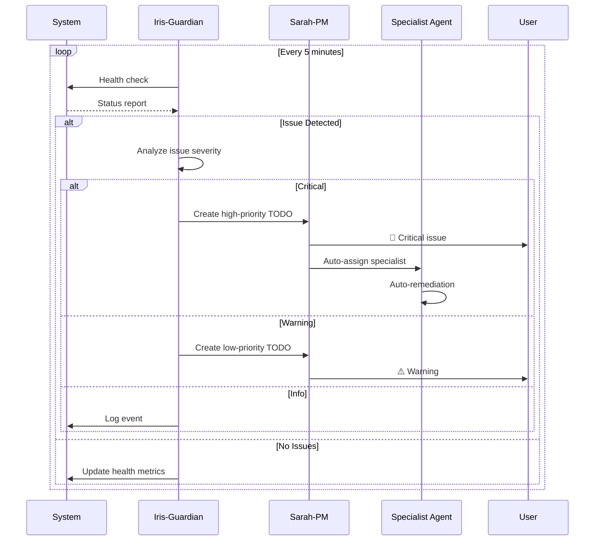

---

## 📊 Metrics & Observability

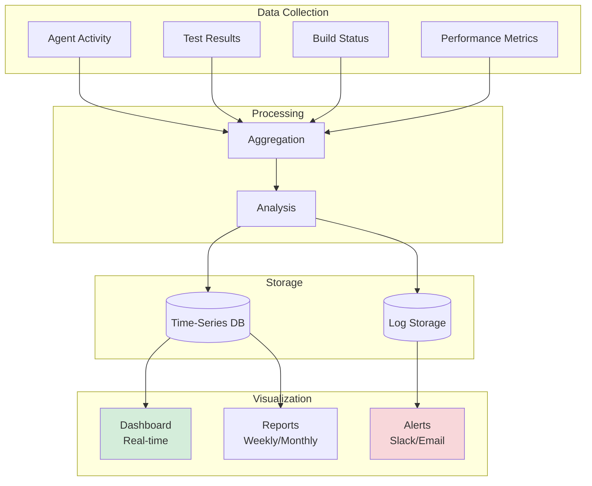

---

## 🔗 Integration Architecture

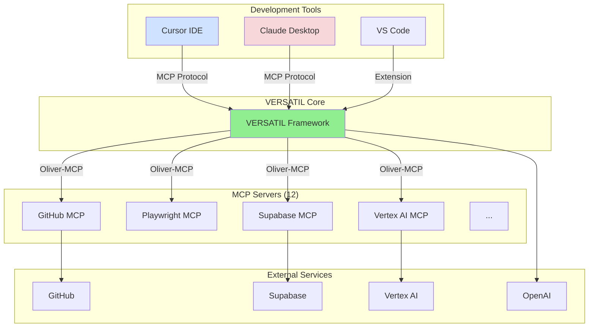

---

**Next**: [Wave 4 Coordination](./features/wave-4-coordination.md) | [Agent Overview](./agents/agents-overview.md)
