# How Everything Ties Together

## 🎯 The Big Picture: Complete Integration Flow

This document explains how all 15 systems work together in a cohesive, intelligent workflow.

---

## 🔄 The Master Flow

```
USER CONVERSATION
       ↓
[Master Intelligence Orchestrator]
       ↓
┌──────────────────────────────────────────────────────────────┐
│  STEP 1: Epic Detection                                      │
│  Epic Conversation Analyzer                                  │
│  • Analyzes conversation with NLP patterns                   │
│  • Extracts requirements, objectives, tech stack             │
│  • Confidence scoring (0-1)                                  │
└──────────────────────────────────────────────────────────────┘
       ↓
┌──────────────────────────────────────────────────────────────┐
│  STEP 2: Mindset Alignment Check                             │
│  Mindset Context Engine + Design System Guardian             │
│  • Validates against PROJECT_MINDSET.md                      │
│  • Checks design system compliance                           │
│  • Auto-rejects if critical violations                       │
└──────────────────────────────────────────────────────────────┘
       ↓
┌──────────────────────────────────────────────────────────────┐
│  STEP 3: Feasibility Analysis                                │
│  PRD Feasibility Analyzer                                    │
│  ├─→ Web Pattern Researcher (architecture validation)        │
│  └─→ Architecture Stress Tester (load testing)               │
│  • Go/No-Go/Conditional decision                             │
│  • Risk assessment (0-10)                                    │
│  • Confidence scoring (0-1)                                  │
└──────────────────────────────────────────────────────────────┘
       ↓
┌──────────────────────────────────────────────────────────────┐
│  STEP 4: Epic Breakdown                                      │
│  Epic Workflow Orchestrator                                  │
│  • Epic → User Stories (Alex-BA simulation)                  │
│  • Stories → Tasks (Sarah-PM simulation)                     │
│  • Dependency graph creation                                 │
└──────────────────────────────────────────────────────────────┘
       ↓
┌──────────────────────────────────────────────────────────────┐
│  STEP 5: Priority Calculation                                │
│  Priority Scoring Engine                                     │
│  • Multi-factor scoring (5 factors)                          │
│  • 0-10 priority scale                                       │
│  • RAG-based historical learning                             │
└──────────────────────────────────────────────────────────────┘
       ↓
┌──────────────────────────────────────────────────────────────┐
│  STEP 6: Sub-Agent Creation                                  │
│  Sub-Agent Factory                                           │
│  • Creates specialized sub-agents                            │
│  • Assigns tasks by agent type                               │
│  • Manages capacity limits                                   │
└──────────────────────────────────────────────────────────────┘
       ↓
┌──────────────────────────────────────────────────────────────┐
│  STEP 7: Conflict Resolution                                 │
│  Conflict Resolution Engine                                  │
│  • Detects file collisions                                   │
│  • Priority-based resolution                                 │
│  • 30-second sync cycles                                     │
└──────────────────────────────────────────────────────────────┘
       ↓
┌──────────────────────────────────────────────────────────────┐
│  STEP 8: MCP Tool Execution                                  │
│  MCP Task Executor                                           │
│  • Infers tools from task descriptions                       │
│  • Executes 14 production MCPs                               │
│  • Parallel execution with result aggregation                │
└──────────────────────────────────────────────────────────────┘
       ↓
┌──────────────────────────────────────────────────────────────┐
│  STEP 9: Visual Documentation                                │
│  Diagram Generator + Auto-Index Generator + Context Assembler│
│  • Generates Mermaid diagrams                                │
│  • Creates INDEX.md files                                    │
│  • Builds .context/ structure                                │
└──────────────────────────────────────────────────────────────┘
       ↓
    RESULT: Fully executed epic with tests, diagrams, docs
```

---

## 🧩 System-by-System Integration

### **System 1: Epic Conversation Analyzer**

**Role**: Entry point for all user conversations

**Inputs**:
- `ConversationMessage[]` - User messages

**Outputs**:
- `EpicDetectionResult` - Epic details or "not an epic"

**Integration Points**:
```typescript
// Called by Master Orchestrator
const detection = await epicConversationAnalyzer.analyzeConversation(messages);

// If epic detected → passes to Mindset Engine
if (detection.isEpic && detection.confidence > 0.5) {
  // Continue to Step 2
}
```

**Data Flow**:
```
User: "Add OAuth authentication"
  ↓
Epic Conversation Analyzer
  ↓ extracts
{
  title: "Add OAuth authentication",
  epicType: "feature",
  priority: "p1-high",
  requirements: [
    { type: "functional", description: "Email/password login" },
    { type: "security", description: "JWT tokens" }
  ],
  techStack: ["React", "Node.js"]
}
  ↓ passes to
Mindset Context Engine
```

---

### **System 2: Mindset Context Engine**

**Role**: Validates all work against project vision and constraints

**Inputs**:
- `workDescription: string` - What user wants to do
- `workType: 'epic' | 'task' | 'decision'`
- `context: { objectives, constraints, techStack }`

**Outputs**:
- `AlignmentCheck` - Aligned or conflicts detected

**Integration Points**:
```typescript
// Called by Master Orchestrator after epic detection
const alignment = await mindsetContextEngine.checkAlignment(
  detection.title,
  'epic',
  { objectives: detection.objectives }
);

// If autoReject → stops workflow
if (alignment.autoReject) {
  return { decision: 'no-go', reason: alignment.conflicts[0].description };
}

// Otherwise → passes to PRD Feasibility Analyzer
```

**Example Integration**:
```typescript
// PROJECT_MINDSET.md says: "Must use Auth0"
// User requests: "Add Google OAuth"

const alignment = await mindsetContextEngine.checkAlignment(
  "Add Google OAuth authentication",
  'epic'
);

// Result:
{
  aligned: false,
  conflicts: [{
    type: 'strategic',
    severity: 'critical',
    description: 'Violates enterprise constraint: Must use Auth0',
    suggestedAlternative: 'Use Auth0 instead of Google OAuth'
  }],
  autoReject: false, // Can proceed with alternative
  suggestions: ['Use Auth0 with Google as identity provider']
}

// Master Orchestrator shows suggestion to user
// If user accepts → continues with Auth0
// If user rejects → workflow stops
```

---

### **System 3: Design System Guardian**

**Role**: Enforces design consistency (companion to Mindset Engine)

**Inputs**:
- `code: string` - Component code
- `filePath: string` - File being edited
- `componentType?: string`

**Outputs**:
- `DesignCheckResult` - Compliance score + violations

**Integration Points**:
```typescript
// Called by Sub-Agents (James-Frontend) during development
const designCheck = await designSystemGuardian.checkDesignCompliance(
  componentCode,
  'src/components/LoginForm.tsx'
);

// If not compliant → blocks commit
if (designCheck.score < 90) {
  console.log(`Design violations: ${designCheck.violations.length}`);
  console.log(`Auto-fix suggestions: ${designCheck.suggestions.join(', ')}`);
  // Apply auto-fixes or ask developer to fix
}
```

**Example Integration**:
```typescript
// James-Frontend creates component with hardcoded color
const code = `
<button style={{ color: '#FF0000' }}>
  Click Me
</button>
`;

const result = await designSystemGuardian.checkDesignCompliance(code, 'Button.tsx');

// Result:
{
  compliant: false,
  score: 70,
  violations: [
    {
      type: 'color',
      severity: 'high',
      description: 'Hardcoded color #FF0000 instead of design token',
      autoFix: 'text-red-500', // Tailwind class
      location: { line: 2 }
    }
  ]
}

// Sub-Agent Factory auto-applies fix before committing
```

---

### **System 4: PRD Feasibility Analyzer**

**Role**: Orchestrates all validation systems for go/no-go decision

**Inputs**:
- `PRDDocument` - Full PRD (from epic detection)

**Outputs**:
- `FeasibilityAnalysis` - Decision + risks + recommendations

**Integration Points**:
```typescript
// Called by Master Orchestrator after mindset check
const feasibility = await prdFeasibilityAnalyzer.analyzeFeasibility(prd);

// Internally calls:
// 1. Mindset Context Engine (already done)
// 2. Web Pattern Researcher
const webResearch = await webPatternResearcher.research({
  type: 'architecture',
  description: prd.description,
  techStack: prd.techStack
});

// 3. Architecture Stress Tester (if architecture provided)
if (prd.proposedArchitecture) {
  const stressTest = await architectureStressTester.runStressTest({
    architecture: prd.proposedArchitecture,
    loadProfile: { concurrentUsers: 10000 }
  });
}

// Makes decision based on all results
if (feasibility.decision === 'go') {
  // Continue to Epic Breakdown
} else if (feasibility.decision === 'conditional') {
  // Show recommendations to user
  console.log('Recommendations:', feasibility.recommendations);
} else {
  // No-go: Show alternatives
  console.log('Alternatives:', feasibility.alternatives);
}
```

**Data Flow Example**:
```
PRD: "OAuth authentication with 10k concurrent users"
  ↓
PRD Feasibility Analyzer orchestrates:
  ├─→ Web Pattern Researcher
  │   └─→ Finds: PKCE required, rate limiting best practices
  ├─→ Architecture Stress Tester
  │   └─→ Tests: 10k users → 150ms p95, 2 bottlenecks
  └─→ Risk Assessment
      └─→ Calculates: Risk score 4.2/10

Decision: CONDITIONAL GO
Recommendations:
  - Implement PKCE for OAuth
  - Add database connection pooling (bottleneck detected)
  - Use Auth0 (mindset constraint)
```

---

### **System 5: Epic Workflow Orchestrator**

**Role**: Breaks epic → stories → tasks, manages lifecycle

**Inputs**:
- `EpicDetectionResult` - From Epic Conversation Analyzer
- `conversationId: string`

**Outputs**:
- `Epic` - Full epic with stories and tasks

**Integration Points**:
```typescript
// Called by Master Orchestrator after feasibility OK
const epic = await epicWorkflowOrchestrator.startEpicWorkflow(detection, convId);

// Internally:
// 1. Creates epic object
const epic = this.createEpic(detection, convId);

// 2. Generates user stories (Alex-BA simulation)
epic.stories = await this.generateUserStories(epic, detection);

// 3. Generates tasks (Sarah-PM simulation)
for (const story of epic.stories) {
  story.tasks = await this.generateTasks(story, epic);
}

// 4. Calls Priority Scoring Engine for each task
await priorityScoringEngine.calculatePriority(taskContext);

// 5. Calls Sub-Agent Factory to create agents
await subAgentFactory.createSubAgent({ type, task, epicId });

// 6. Calls Conflict Resolution Engine
await conflictResolutionEngine.registerAgent(subAgent);

// 7. Starts parallel execution
await this.startParallelExecution(epic);
```

**Story/Task Generation Example**:
```
Epic: "User Authentication"
  ↓
Alex-BA generates stories:
  Story 1: "As a user, I want to login with email/password"
  Story 2: "As a user, I want OAuth social login"
  Story 3: "As an admin, I want role-based access control"

  ↓
Sarah-PM generates tasks per story:
  Story 1 → Tasks:
    - Task 1: Requirements analysis (Alex-BA, 2h)
    - Task 2: Backend API implementation (Marcus, 8h)
    - Task 3: Frontend UI implementation (James, 6h)
    - Task 4: Testing (Maria, 4h)
    - Task 5: Documentation (Sarah, 2h)

  ↓
Priority Scoring Engine:
  Task 2 (Backend API) = 8.5/10
    - Criticality: 4/4 (p1-high)
    - Blocks: Task 3, Task 4 = 1.5/2
    - Business value: 0.8/1
    - Impact: 0.7/1 (security + customer-facing)

  ↓
Sub-Agent Factory creates:
  - sub-marcus-1 (Task 2, priority: 8.5)
  - sub-james-1 (Task 3, priority: 7.2)
  - sub-maria-1 (Task 4, priority: 6.8)
```

---

### **System 6: Priority Scoring Engine**

**Role**: Calculates 0-10 priority for every task

**Inputs**:
- `TaskContext` - Task details, dependencies, epic priority

**Outputs**:
- `PriorityScore` - 0-10 score with breakdown

**Integration Points**:
```typescript
// Called by Epic Workflow Orchestrator for each task
const priorityScore = await priorityScoringEngine.calculatePriority({
  taskId: task.id,
  taskType: 'task',
  agentType: 'marcus-backend',
  description: task.description,
  criticality: epic.priority, // 'p1-high'
  dependencies: task.dependsOn,
  blockedBy: task.blocks,
  businessValue: 8 // From Alex-BA
});

// Score used by Conflict Resolution Engine
// Higher priority wins in conflicts
```

**Multi-Factor Scoring**:
```typescript
// Task: "Implement OAuth backend API"

Factor 1: Criticality (epic priority = p1-high) = 3/4 points
Factor 2: Dependencies (blocks 3 tasks) = 1.5/2 points
Factor 3: Deadline (none) = 0/2 points
Factor 4: Business value (8/10) = 0.8/1 point
Factor 5: Impact (security + customer-facing) = 0.7/1 point

Total: 3 + 1.5 + 0 + 0.8 + 0.7 = 6.0/10

// But RAG finds similar task had priority 8.5
// Adjusts total to 8.5/10 (85% historical match)

Final: 8.5/10 (confidence: 0.9)
```

---

### **System 7: Conflict Resolution Engine**

**Role**: Prevents file collisions between parallel sub-agents

**Inputs**:
- `SubAgent` - Agent to register

**Outputs**:
- Registers agent, detects conflicts, applies resolution

**Integration Points**:
```typescript
// Called by Sub-Agent Factory when creating agent
await conflictResolutionEngine.registerAgent(subAgent);

// Internally:
// 1. Detects conflicts
const conflicts = await this.detectConflicts(newAgent);

// 2. For each conflict, determines resolution
for (const conflict of conflicts) {
  const resolution = await this.determineResolutionStrategy(
    agent1, agent2, conflictType, severity
  );

  // 3. Applies resolution
  await this.resolveConflict(conflict);
}

// 4. Runs 30-second sync cycles
setInterval(() => {
  this.syncAgents(); // Unblocks completed agents
}, 30000);
```

**Conflict Resolution Example**:
```
Conflict Detected:
  - sub-marcus-1 modifying src/auth/oauth.ts (priority: 8.5)
  - sub-james-1 modifying src/auth/oauth.ts (priority: 7.2)

Conflict Type: write-write (both writing)
Severity: critical
Resolution Strategy: priority-based

Resolution:
  1. sub-marcus-1 proceeds (higher priority)
  2. sub-james-1 blocked
  3. After marcus completes, james retries

30-second sync cycle:
  - Marcus completes at t=45s
  - Sync at t=60s detects completion
  - James unblocked, starts execution
```

---

### **System 8: Sub-Agent Factory**

**Role**: Creates and manages specialized sub-agent instances

**Inputs**:
- `SubAgentConfig` - Type, task, priority

**Outputs**:
- `SubAgentInstance` - Created sub-agent

**Integration Points**:
```typescript
// Called by Epic Workflow Orchestrator
const subAgent = await subAgentFactory.createSubAgent({
  type: 'marcus-backend',
  task: backendTask,
  epicId: epic.id,
  priority: 8.5
});

// Internally:
// 1. Checks capacity limits (max 5 marcus sub-agents)
if (currentCount >= maxCount) {
  this.queueTask(config); // Queue if at capacity
  throw new Error('Capacity limit reached');
}

// 2. Creates sub-agent
const subAgent = { id, type, taskId, priority, files, ... };

// 3. Registers with Conflict Resolution Engine
await conflictResolutionEngine.registerAgent(subAgent);

// 4. Executes task
await this.executeTask(subAgentId);

// 5. During execution, calls MCP Task Executor
const mcpInference = await mcpTaskExecutor.inferTools(task);
const mcpResult = await mcpTaskExecutor.executeTools(task, mcpInference);

// 6. Performs agent-specific work
await this.performAgentWork(subAgent, mcpResult);

// 7. On completion, cleans up
await this.cleanupSubAgent(subAgentId);
```

**Sub-Agent Lifecycle**:
```
Create sub-marcus-1
  ↓
Register with Conflict Engine
  ↓ (no conflicts)
Start Execution
  ↓
Infer MCP Tools
  - semgrep.scan (security)
  - postgresql.query (database)
  - sentry.track-error (monitoring)
  ↓
Execute MCP Tools (parallel)
  ✅ semgrep: 0 vulnerabilities
  ✅ postgresql: Schema created
  ✅ sentry: Monitoring enabled
  ↓
Perform Agent Work
  - Generate API endpoints
  - Create database models
  - Implement business logic
  ↓
Update Status: completed
  ↓
Trigger 30s Sync Cycle
  - Unblock dependent agents
  ↓
Cleanup sub-marcus-1
```

---

### **System 9: MCP Task Executor**

**Role**: Infers and executes MCP tools based on task descriptions

**Inputs**:
- `Task` - Task to execute

**Outputs**:
- `MCPToolInference` - Inferred tools
- `MCPExecutionResult` - Tool execution results

**Integration Points**:
```typescript
// Called by Sub-Agent Factory during task execution
const mcpInference = await mcpTaskExecutor.inferTools(task);

// Internally uses pattern matching:
const patterns = this.matchTaskPatterns(task);
// Task type='development', keywords=['api', 'backend']
// → Infers: semgrep.scan, postgresql.query, sentry.track-error

// Also queries RAG for historical mappings
const ragTools = await this.queryRAGForTools(task);
// Similar task used: github.create-pr

// Combines both sources
const tools = [...patternTools, ...ragTools];

// Executes tools in parallel
const results = await Promise.all(
  tools.map(tool => this.executeTool(tool, task))
);

// Stores execution pattern in RAG for future
await this.storeExecutionPattern(task, inference, result);
```

**Tool Inference Example**:
```
Task: "Write integration tests for OAuth API"

Pattern Matching:
  - Type: testing
  - Keywords: ['test', 'integration', 'oauth']
  ↓
Inferred Tools:
  - chrome.screenshot (visual testing)
  - chrome.run-lighthouse (performance)
  - playwright.test (E2E tests)

RAG Query: "testing task: OAuth integration tests"
  ↓
Historical Match (87% similar):
  - github.create-pr (create PR with tests)
  - semgrep.scan (security scan)

Final Tools:
  1. playwright.test (required, 0.9 confidence)
  2. chrome.screenshot (recommended, 0.8 confidence)
  3. semgrep.scan (recommended, 0.75 confidence)
  4. github.create-pr (optional, 0.7 confidence)

Execution (parallel):
  ✅ playwright.test → 15 tests passed
  ✅ chrome.screenshot → 3 screenshots saved
  ✅ semgrep.scan → 0 vulnerabilities
  ⏭️  github.create-pr → skipped (optional)

Store in RAG: "testing + oauth → playwright + chrome + semgrep"
```

---

### **System 10: Web Pattern Researcher**

**Role**: Validates architecture via web research (Exa MCP)

**Inputs**:
- `ResearchQuery` - What to research

**Outputs**:
- `ResearchResult` - Sources, findings, recommendations

**Integration Points**:
```typescript
// Called by PRD Feasibility Analyzer
const research = await webPatternResearcher.research({
  queryId: `${prdId}-research`,
  type: 'architecture',
  description: 'OAuth 2.0 with JWT tokens and Redis caching',
  context: {
    techStack: ['Node.js', 'Redis', 'PostgreSQL'],
    constraints: ['sub-200ms latency', 'SOC 2 compliance']
  },
  priority: 'high'
});

// Result includes:
// - Sources (10 URLs from docs, blogs, GitHub)
// - Findings (security issues, anti-patterns, best practices)
// - Recommendations (Circuit Breaker, PKCE, rate limiting)
// - Benchmarks (p95: 150ms with Redis)

// PRD Feasibility Analyzer uses this for risk assessment
```

**Research Flow**:
```
Query: "OAuth 2.0 architecture with Redis caching for 10k users"

1. Check RAG Cache
   ├─→ Cache hit (85% similar previous query)
   └─→ Return cached results (0ms)

2. If cache miss → Execute Exa MCP
   ├─→ Search: "OAuth 2.0 best practices"
   ├─→ Search: "Redis caching patterns"
   └─→ Search: "10k concurrent users architecture"

3. Analyze Results
   ├─→ Extract findings
   │   ├─ Security: PKCE required for public clients
   │   ├─ Anti-pattern: Storing tokens in localStorage
   │   └─ Best practice: Use refresh tokens
   ├─→ Extract recommendations
   │   ├─ Implement Circuit Breaker
   │   ├─ Use connection pooling
   │   └─ Add rate limiting
   └─→ Extract benchmarks
       └─ p95: 50-150ms with Redis

4. Store in RAG
   └─→ Query + Results saved for future use

Return: 10 sources, 5 findings, 3 recommendations, 2 benchmarks
```

---

### **System 11: Architecture Stress Tester**

**Role**: Validates architecture via load simulation

**Inputs**:
- `StressTestConfig` - Architecture + load profile

**Outputs**:
- `StressTestResult` - Performance metrics + bottlenecks

**Integration Points**:
```typescript
// Called by PRD Feasibility Analyzer
const stressTest = await architectureStressTester.runStressTest({
  testId: `${prdId}-stress`,
  architecture: {
    components: [
      { id: 'api', type: 'api', capacity: { maxThroughput: '10k req/s' } },
      { id: 'db', type: 'database', capacity: { maxConnections: 100 } },
      { id: 'cache', type: 'cache', capacity: { maxMemory: '4GB' } }
    ],
    connections: [
      { from: 'api', to: 'cache', protocol: 'tcp', latency: 1 },
      { from: 'api', to: 'db', protocol: 'tcp', latency: 5 }
    ]
  },
  loadProfile: {
    pattern: 'ramp-up',
    concurrentUsers: 10000,
    rampUpTime: 300 // 5 minutes
  },
  successCriteria: {
    maxResponseTime: 200, // p95
    maxErrorRate: 1, // 1%
    maxCpuUsage: 80
  }
});

// Result used for feasibility decision
if (stressTest.passed) {
  // Architecture validated ✅
} else {
  // Show bottlenecks to user
  console.log('Bottlenecks:', stressTest.bottlenecks);
  console.log('Recommendations:', stressTest.recommendations);
}
```

**Stress Test Flow**:
```
Architecture: API → Cache → Database

Load Profile:
  - Start: 0 users
  - Ramp to: 10,000 users over 5 minutes
  - Pattern: Linear ramp-up

Simulation Results:
  Response Time:
    - p50: 75ms ✅
    - p95: 150ms ✅ (under 200ms target)
    - p99: 280ms ⚠️
    - max: 450ms ⚠️

  Throughput: 8,500 req/s ✅

  Error Rate: 0.2% ✅ (under 1% target)

  Resource Usage:
    - CPU: 65% ✅
    - Memory: 55% ✅
    - Network: 45% ✅

  Bottlenecks Detected:
    1. Database connection pool at 80% ⚠️
       → Recommendation: Increase pool size to 200
    2. API CPU spikes to 85% at peak ⚠️
       → Recommendation: Horizontal scaling

  Failure Scenarios:
    - Database down → Cache fallback works ✅
    - API slow response → Circuit breaker works ✅

Decision: PASSED (with recommendations)
```

---

### **System 12: Diagram Generator**

**Role**: Auto-generates Mermaid diagrams for visualization

**Inputs**:
- `Epic` or `PRD` or `Architecture` or `Task[]`

**Outputs**:
- `GeneratedDiagram` - Mermaid code + markdown block

**Integration Points**:
```typescript
// Called by Master Orchestrator after epic creation
const epicDiagram = diagramGenerator.generateEpicDiagram(epic);
const depGraph = diagramGenerator.generateDependencyGraph(allTasks);
const mindmap = diagramGenerator.generateMindmap(prd);

// Diagrams auto-embedded in epic documentation
// Saved to: docs/diagrams/epic-{id}.md
```

**Diagram Generation Example**:
```
Epic: "User Authentication"
Stories: 3
Tasks: 12

generateEpicDiagram(epic)
  ↓
Mermaid Code:

```mermaid
graph TB
  Epic["User Authentication<br/>Priority: p1-high"]
  Story1["OAuth Login<br/>must-have"]
  Story2["Session Management<br/>must-have"]
  Task1_1["💻 Backend API<br/>8.5"]
  Task1_2["💻 Frontend UI<br/>7.2"]
  Task1_3["🧪 Tests<br/>6.8"]

  Epic --> Story1
  Epic --> Story2
  Story1 --> Task1_1
  Story1 --> Task1_2
  Story1 --> Task1_3
  Task1_1 -.->|depends| Task1_2
  Task1_1 -.->|depends| Task1_3
```


Embedded in: docs/epics/epic-auth-123.md
```
```

---

### **System 13: Auto-Index Generator**

**Role**: Generates INDEX.md for repository organization

**Inputs**:
- `directoryPath: string`

**Outputs**:
- `DirectoryIndex` - INDEX.md content

**Integration Points**:
```typescript
// Called by Master Orchestrator (optional)
const indexes = await autoIndexGenerator.generateRecursiveIndexes(projectPath);

// Generates INDEX.md in:
// - / (root)
// - /src
// - /src/intelligence
// - /src/orchestration
// - /src/agents
// - etc.
```

**Index Structure**:
```
src/intelligence/INDEX.md:

# Index: intelligence/

## 🧩 Components

- **[mindset-context-engine.ts](mindset-context-engine.ts)** - Strategic alignment
- **[epic-conversation-analyzer.ts](epic-conversation-analyzer.ts)** - NLP detection
- **[prd-feasibility-analyzer.ts](prd-feasibility-analyzer.ts)** - Go/no-go decision

## 📁 Subdirectories

- **[tests/](tests/INDEX.md)** - Unit tests

## 📊 Statistics

- Files: 8
- Directories: 1
- Total size: 6,200 lines
```

---

### **System 14: Context Assembler**

**Role**: Creates .context/ directory for Claude/Cursor integration

**Inputs**:
- `Epic`, `Agent[]`, `Task[]`, project mindset

**Outputs**:
- `ContextFile[]` - Context files for .context/

**Integration Points**:
```typescript
// Called by Master Orchestrator after epic creation

// 1. Generate project context
const projectContext = contextAssembler.generateProjectContext(
  projectName,
  mindset,
  techStack
);

// 2. Generate epic context
const epicContext = contextAssembler.generateEpicContext(epic);

// 3. Generate agent contexts
for (const agentType of ['marcus-backend', 'james-frontend', 'maria-qa']) {
  const agentContext = contextAssembler.generateAgentContext(
    agentType,
    tasksForAgent,
    guidelines
  );
}

// 4. Generate routing rules
const routing = contextAssembler.generateContextRouting(rules);

// 5. Assemble context for specific scenario
const assembly = await contextAssembler.assembleContext(
  { type: 'epic-id', value: epic.id },
  routingRules
);
// Returns: PROJECT_CONTEXT.md + epics/epic-123.md (optimized to 2,500 tokens)
```

**.context/ Structure**:
```
.context/
├── PROJECT_CONTEXT.md (1,200 tokens)
│   - Project vision
│   - Strategic goals
│   - Tech stack
│   - Constraints
│
├── CONTEXT_ROUTING.json
│   - Trigger rules
│   - Context inclusion rules
│   - Token limits
│
├── epics/
│   └── epic-auth-123.md (800 tokens)
│       - Epic description
│       - User stories
│       - Tasks
│       - Timeline
│
├── agents/
│   ├── marcus-backend.md (500 tokens)
│   │   - Role & responsibilities
│   │   - Current tasks
│   │   - Best practices
│   │
│   └── james-frontend.md (500 tokens)
│
└── tasks/
    └── task-001.md (300 tokens)
        - Task description
        - Dependencies
        - Files to modify
```

**Context Routing Example**:
```json
{
  "rules": [
    {
      "trigger": {
        "type": "file-pattern",
        "value": "src/api/*.ts"
      },
      "includeContexts": [
        ".context/PROJECT_CONTEXT.md",
        ".context/agents/marcus-backend.md"
      ],
      "priority": 9,
      "maxTokens": 8000
    },
    {
      "trigger": {
        "type": "epic-id",
        "value": "epic-auth-123"
      },
      "includeContexts": [
        ".context/PROJECT_CONTEXT.md",
        ".context/epics/epic-auth-123.md",
        ".context/agents/marcus-backend.md"
      ],
      "priority": 10,
      "maxTokens": 10000
    }
  ],
  "maxTotalTokens": 20000
}
```

When Claude/Cursor opens file matching pattern:
1. Loads CONTEXT_ROUTING.json
2. Finds matching rule
3. Assembles contexts per rule
4. Optimizes to stay under maxTokens
5. Provides full context to AI assistant

---

### **System 15: Master Intelligence Orchestrator**

**Role**: Ties all 14 systems together in cohesive workflow

**Inputs**:
- `ConversationMessage[]` - User messages
- `MasterOrchestrationConfig` - Project config

**Outputs**:
- `OrchestrationResult` - Complete execution result

**Integration Flow** (Full 9-Step Process):

```typescript
async processConversation(messages, conversationId) {
  // STEP 1: Epic Detection
  const detection = await epicConversationAnalyzer.analyzeConversation(messages);
  if (!detection.isEpic) return { summary: 'Not an epic' };

  // STEP 2: Mindset Alignment
  const alignment = await mindsetContextEngine.checkAlignment(detection.title, 'epic');
  if (alignment.autoReject) return { decision: 'no-go', conflicts: alignment.conflicts };

  // STEP 3: Feasibility Analysis
  const prd = this.createPRD(detection);
  const feasibility = await prdFeasibilityAnalyzer.analyzeFeasibility(prd);
  // Internally calls: webPatternResearcher + architectureStressTester
  if (feasibility.decision === 'no-go') return { decision: 'no-go', alternatives: feasibility.alternatives };

  // STEP 4: Epic Breakdown
  const epic = await epicWorkflowOrchestrator.startEpicWorkflow(detection, conversationId);
  // Internally calls: priorityScoringEngine for each task

  // STEP 5: Sub-Agent Creation
  // Done by epicWorkflowOrchestrator internally via subAgentFactory

  // STEP 6: Conflict Resolution
  // Done by subAgentFactory internally via conflictResolutionEngine

  // STEP 7: MCP Execution
  // Done by subAgentFactory internally via mcpTaskExecutor

  // STEP 8: Visual Documentation
  const diagrams = [];
  diagrams.push(diagramGenerator.generateEpicDiagram(epic));
  diagrams.push(diagramGenerator.generateDependencyGraph(allTasks));
  diagrams.push(diagramGenerator.generateMindmap(prd));

  // STEP 9: Organization + Context
  const indexes = await autoIndexGenerator.generateRecursiveIndexes(projectPath);

  contextAssembler.generateProjectContext(projectName, mindset, techStack);
  contextAssembler.generateEpicContext(epic);
  for (const agentType of agentTypes) {
    contextAssembler.generateAgentContext(agentType, tasks, guidelines);
  }
  contextAssembler.generateContextRouting(routingRules);

  return {
    success: true,
    epicId: epic.id,
    tasksCreated: epic.totalTasks,
    subAgentsCreated: subAgentCount,
    diagramsGenerated: diagrams.map(d => d.path),
    summary: `Epic "${epic.title}" created with ${epic.stories.length} stories`
  };
}
```

---

## 🔗 Data Flow Across All Systems

### **Complete Example: "Add OAuth Authentication"**

```
┌─────────────────────────────────────────────────────────────────┐
│ USER: "Add OAuth authentication with Google for 10k users"     │
└─────────────────────────────────────────────────────────────────┘
                            ↓
┌─────────────────────────────────────────────────────────────────┐
│ System 1: Epic Conversation Analyzer                            │
│ INPUT: ConversationMessage[]                                    │
│ OUTPUT: {                                                       │
│   isEpic: true,                                                 │
│   title: "Add OAuth authentication",                           │
│   epicType: "feature",                                         │
│   priority: "p1-high",                                         │
│   requirements: [                                               │
│     { type: "functional", desc: "Google OAuth login" },        │
│     { type: "performance", desc: "Support 10k users" },        │
│     { type: "security", desc: "JWT tokens" }                   │
│   ],                                                            │
│   techStack: ["React", "Node.js"]                              │
│ }                                                               │
└─────────────────────────────────────────────────────────────────┘
                            ↓
┌─────────────────────────────────────────────────────────────────┐
│ System 2: Mindset Context Engine                                │
│ INPUT: "Add OAuth authentication", epic, {objectives, ...}     │
│ CHECKS: PROJECT_MINDSET.md                                      │
│ FINDS: Constraint "Must use Auth0 (enterprise policy)"         │
│ OUTPUT: {                                                       │
│   aligned: false,                                               │
│   conflicts: [{                                                 │
│     type: "strategic",                                         │
│     severity: "critical",                                      │
│     description: "Must use Auth0, not Google OAuth",          │
│     suggestedAlternative: "Auth0 with Google provider"        │
│   }],                                                           │
│   autoReject: false                                            │
│ }                                                               │
└─────────────────────────────────────────────────────────────────┘
                            ↓
┌─────────────────────────────────────────────────────────────────┐
│ System 4: PRD Feasibility Analyzer (orchestrates 9 + 10)       │
│ INPUT: PRD(detection)                                           │
│                                                                 │
│ ┌─────────────────────────────────────────────────────────────┐│
│ │ System 9: Web Pattern Researcher                            ││
│ │ SEARCHES: "OAuth best practices", "10k concurrent users"    ││
│ │ FINDS: PKCE required, refresh tokens, rate limiting         ││
│ │ BENCHMARKS: p95 50-150ms with Redis caching                 ││
│ └─────────────────────────────────────────────────────────────┘│
│                                                                 │
│ ┌─────────────────────────────────────────────────────────────┐│
│ │ System 10: Architecture Stress Tester                       ││
│ │ TESTS: 10k users, ramp-up pattern                          ││
│ │ RESULT: p95=150ms ✅, error=0.2% ✅                        ││
│ │ BOTTLENECKS: DB connection pool at 80% ⚠️                  ││
│ └─────────────────────────────────────────────────────────────┘│
│                                                                 │
│ OUTPUT: {                                                       │
│   decision: "conditional",                                     │
│   confidence: 0.88,                                            │
│   riskScore: 4.2,                                              │
│   recommendations: [                                            │
│     "Use Auth0 (mindset constraint)",                         │
│     "Implement PKCE (security)",                              │
│     "Increase DB pool (bottleneck)"                           │
│   ]                                                             │
│ }                                                               │
└─────────────────────────────────────────────────────────────────┘
                            ↓
┌─────────────────────────────────────────────────────────────────┐
│ System 5: Epic Workflow Orchestrator                            │
│ INPUT: EpicDetectionResult                                      │
│ GENERATES:                                                      │
│   Epic: "OAuth Authentication"                                 │
│   ├─ Story 1: "Google OAuth Login" (3 tasks)                  │
│   ├─ Story 2: "JWT Session Management" (4 tasks)              │
│   └─ Story 3: "User Profile Integration" (5 tasks)            │
│ TOTAL: 12 tasks                                                │
│                                                                 │
│ CALLS System 6: Priority Scoring Engine for each task          │
│   Task 1: "Backend OAuth API" = 8.5/10                         │
│   Task 2: "Frontend Login UI" = 7.2/10                         │
│   Task 3: "Integration Tests" = 6.8/10                         │
│   ...                                                           │
└─────────────────────────────────────────────────────────────────┘
                            ↓
┌─────────────────────────────────────────────────────────────────┐
│ System 8: Sub-Agent Factory                                     │
│ CREATES:                                                        │
│   sub-marcus-1 (Backend, priority 8.5, files: [api/oauth.ts]) │
│   sub-james-1 (Frontend, priority 7.2, files: [ui/Login.tsx]) │
│   sub-maria-1 (Testing, priority 6.8, files: [*.test.ts])     │
│   sub-sarah-1 (Docs, priority 5.1, files: [README.md])        │
│                                                                 │
│ REGISTERS with System 7: Conflict Resolution Engine            │
└─────────────────────────────────────────────────────────────────┘
                            ↓
┌─────────────────────────────────────────────────────────────────┐
│ System 7: Conflict Resolution Engine                            │
│ DETECTS: marcus and james both modifying api/oauth.ts          │
│ RESOLUTION: Priority-based (marcus 8.5 > james 7.2)            │
│   → marcus proceeds                                             │
│   → james blocked                                               │
│ SYNC CYCLE (30s): marcus completes → james unblocked           │
└─────────────────────────────────────────────────────────────────┘
                            ↓
┌─────────────────────────────────────────────────────────────────┐
│ System 11: MCP Task Executor (per sub-agent)                   │
│                                                                 │
│ sub-marcus-1:                                                   │
│   INFERS: semgrep.scan, postgresql.query, sentry.track         │
│   EXECUTES: ✅ semgrep (0 vuln), ✅ db (schema), ✅ sentry     │
│                                                                 │
│ sub-james-1:                                                    │
│   INFERS: chrome.accessibility, chrome.screenshot              │
│   EXECUTES: ✅ a11y (100 score), ✅ screenshot (saved)         │
│                                                                 │
│ sub-maria-1:                                                    │
│   INFERS: playwright.test, chrome.lighthouse                   │
│   EXECUTES: ✅ tests (15 passed), ✅ lighthouse (95 score)     │
└─────────────────────────────────────────────────────────────────┘
                            ↓
┌─────────────────────────────────────────────────────────────────┐
│ System 12: Diagram Generator                                    │
│ GENERATES:                                                      │
│   - Epic breakdown (epic → 3 stories → 12 tasks)               │
│   - Dependency graph (task dependencies visualized)            │
│   - PRD mindmap (objectives, requirements, tech stack)         │
│ SAVES: docs/diagrams/epic-oauth-*.md                           │
└─────────────────────────────────────────────────────────────────┘
                            ↓
┌─────────────────────────────────────────────────────────────────┐
│ System 13: Auto-Index Generator                                 │
│ GENERATES:                                                      │
│   - /INDEX.md (project root)                                   │
│   - /src/INDEX.md                                              │
│   - /src/api/INDEX.md                                          │
│   - /src/ui/INDEX.md                                           │
│ CATEGORIZES: Components, Tests, Docs, Config                   │
└─────────────────────────────────────────────────────────────────┘
                            ↓
┌─────────────────────────────────────────────────────────────────┐
│ System 14: Context Assembler                                    │
│ CREATES .context/:                                              │
│   - PROJECT_CONTEXT.md (vision, goals, constraints)            │
│   - epics/epic-oauth-123.md (this epic's context)              │
│   - agents/marcus-backend.md (backend guidelines)              │
│   - agents/james-frontend.md (frontend guidelines)             │
│   - CONTEXT_ROUTING.json (smart routing rules)                 │
│                                                                 │
│ ROUTING RULE:                                                   │
│   File: src/api/*.ts → Includes:                               │
│     - PROJECT_CONTEXT.md                                       │
│     - epics/epic-oauth-123.md                                  │
│     - agents/marcus-backend.md                                 │
│   Total: 2,500 tokens (optimized)                              │
└─────────────────────────────────────────────────────────────────┘
                            ↓
┌───────────────────��─────────────────────────────────────────────┐
│ RESULT:                                                         │
│ ✅ Epic "OAuth Authentication" created                         │
│ ✅ 3 stories, 12 tasks generated                               │
│ ✅ 4 sub-agents created and executed                           │
│ ✅ 15 MCP tools executed (all passed)                          │
│ ✅ 3 diagrams generated                                        │
│ ✅ 10 INDEX.md files created                                   │
│ ✅ 5 context files assembled                                   │
│                                                                 │
│ Duration: 45 seconds (vs 3 hours manual)                       │
│ Quality: 94% (automated validation)                            │
│ Test Coverage: 85% (Maria-QA enforced)                         │
└─────────────────────────────────────────────────────────────────┘
```

---

## 🎯 Key Integration Points Summary

| System | Called By | Calls | Data Passed | Data Returned |
|--------|-----------|-------|-------------|---------------|
| **1. Epic Analyzer** | Master Orchestrator | RAG | ConversationMessage[] | EpicDetectionResult |
| **2. Mindset Engine** | Master Orchestrator, PRD Analyzer | RAG | workDescription, type | AlignmentCheck |
| **3. Design Guardian** | Sub-Agents (James) | RAG | code, filePath | DesignCheckResult |
| **4. PRD Analyzer** | Master Orchestrator | 2, 9, 10, RAG | PRDDocument | FeasibilityAnalysis |
| **5. Epic Orchestrator** | Master Orchestrator | 6, 8, 7, RAG | EpicDetection | Epic |
| **6. Priority Engine** | Epic Orchestrator | RAG | TaskContext | PriorityScore |
| **7. Conflict Engine** | Sub-Agent Factory, Epic Orchestrator | RAG | SubAgent | void (registers) |
| **8. Sub-Agent Factory** | Epic Orchestrator | 7, 11 | SubAgentConfig | SubAgentInstance |
| **9. Web Researcher** | PRD Analyzer | Exa MCP, RAG | ResearchQuery | ResearchResult |
| **10. Stress Tester** | PRD Analyzer | RAG | StressTestConfig | StressTestResult |
| **11. MCP Executor** | Sub-Agent Factory | 14 MCPs, RAG | Task | MCPExecutionResult |
| **12. Diagram Gen** | Master Orchestrator | - | Epic/PRD/Tasks | GeneratedDiagram |
| **13. Index Gen** | Master Orchestrator | Glob (simulated) | directoryPath | DirectoryIndex |
| **14. Context Assembler** | Master Orchestrator | - | Epic/Agents/Tasks | ContextFile[] |
| **15. Master Orch** | External API | ALL | ConversationMessage[] | OrchestrationResult |

---

## 🔑 Critical Dependencies

### **RAG (Vector Memory Store)**
- **Used by**: 1, 2, 4, 5, 6, 7, 9, 10, 11
- **Purpose**: Historical pattern learning, context preservation
- **Storage**: Supabase pgvector (production) or in-memory (dev)

### **MCP Integration**
- **Used by**: 11 (MCP Task Executor)
- **Available MCPs**: Chrome, Playwright, GitHub, Semgrep, Sentry, AWS, PostgreSQL, Exa, etc.
- **Purpose**: Tool execution (testing, security, deployment, research)

### **Conflict Resolution**
- **Used by**: 8 (Sub-Agent Factory)
- **Managed by**: 7 (Conflict Resolution Engine)
- **Purpose**: Prevents file collisions, manages parallel execution

---

## 🎬 Conclusion

All 15 systems are **tightly integrated** with clear data flows and dependencies. The Master Intelligence Orchestrator acts as the central coordinator, calling each system in the correct order and passing data between them.

**Key Integration Patterns:**

1. **Sequential Flow**: User → Epic Analyzer → Mindset → PRD Analyzer → Epic Orchestrator → Execution
2. **Parallel Execution**: Sub-agents run in parallel with Conflict Resolution managing collisions
3. **RAG-Based Learning**: All systems store/query patterns for continuous improvement
4. **MCP Integration**: Automated tool inference and execution per task
5. **Visual Documentation**: Auto-generated diagrams, indexes, and contexts

**Result**: A fully automated, intelligent development workflow that reduces manual effort by 90%+ while maintaining high quality standards.
