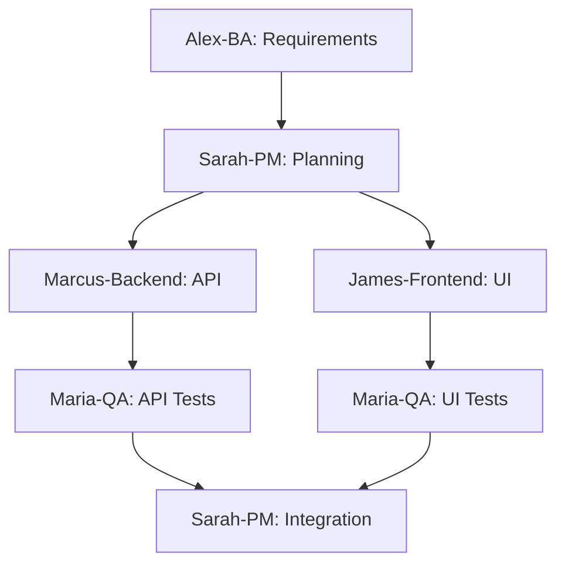
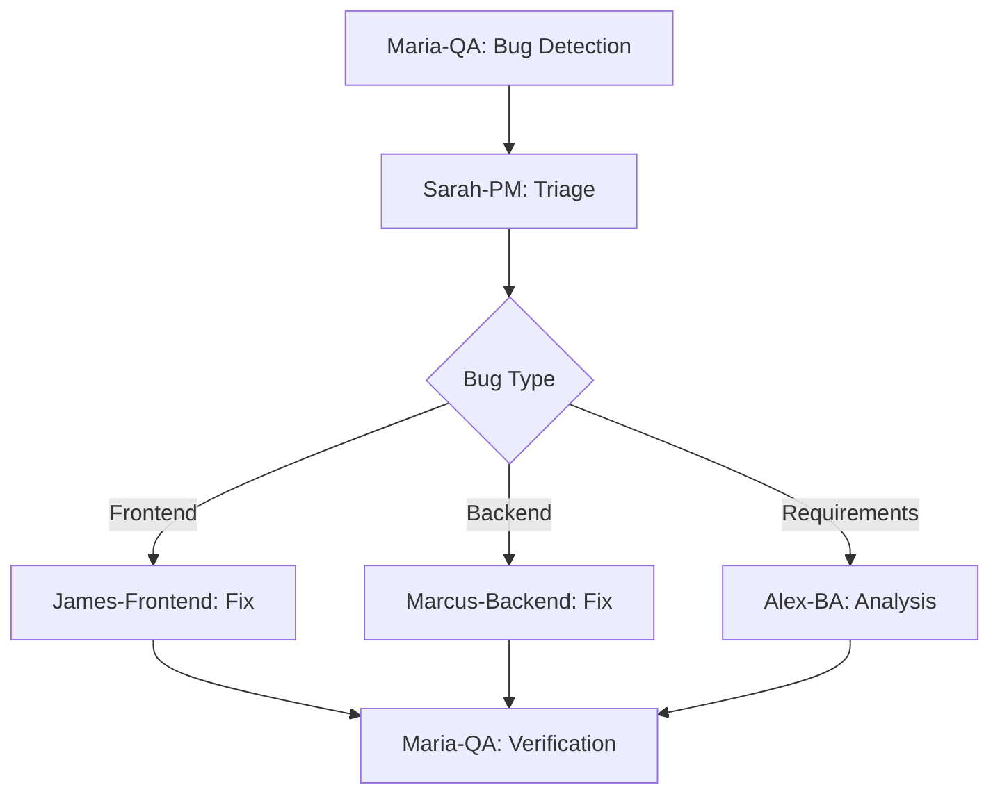
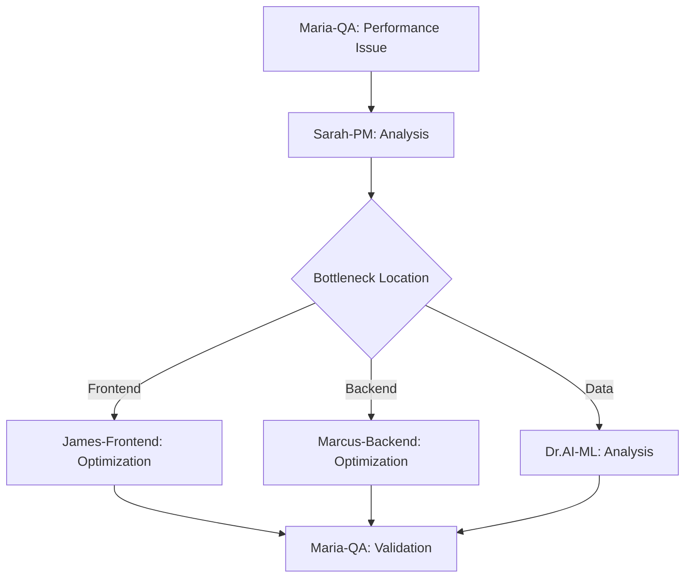

# Agent Reference Guide

Complete reference for all VERSATIL SDLC Framework agents, their capabilities, activation patterns, and collaboration workflows.

## 🎯 Overview

The VERSATIL SDLC Framework employs 6 specialized AI agents following the **BMAD (Business-Managed Agile Development)** methodology. Each agent brings unique expertise while working collaboratively to deliver exceptional software products.

---

## 🧪 Maria-QA (Quality Assurance Lead)

### Core Responsibilities
- **Primary Role**: Quality Guardian & Testing Strategist
- **Mission**: Ensure zero defects reach production through comprehensive quality gates
- **Specialty**: Chrome MCP testing, automated quality assurance, performance validation

### Activation Patterns
```yaml
File Patterns:
  - "*.test.{js,ts,jsx,tsx}"
  - "**/__tests__/**"
  - "**/cypress/**"
  - "**/e2e/**"
  - "*.spec.{js,ts}"

Keywords:
  - test, testing, spec, describe, it
  - coverage, quality, qa
  - bug, error, fix, debug
  - performance, optimization
```

### Available Commands
```bash
# Core Testing
npm run maria:test              # Run comprehensive test suite
npm run maria:unit              # Unit tests only
npm run maria:integration       # Integration tests
npm run maria:e2e              # End-to-end tests

# Chrome MCP Testing
npm run maria:visual            # Visual regression tests
npm run maria:performance       # Performance testing with Lighthouse
npm run maria:accessibility     # Accessibility audit (WCAG 2.1 AA)
npm run maria:security          # Security vulnerability scan

# Quality Gates
npm run maria:coverage          # Test coverage report
npm run maria:quality-gate      # Run all quality gates
npm run maria:report            # Generate quality report

# Advanced Testing
npm run maria:load-test         # Load testing
npm run maria:stress-test       # Stress testing
npm run maria:baseline-update   # Update visual test baselines
```

### Quality Standards Enforced
- **Test Coverage**: 80% minimum (configurable)
- **Performance Budget**: Core Web Vitals compliance
- **Accessibility**: WCAG 2.1 AA standards
- **Security**: Zero critical vulnerabilities
- **Browser Compatibility**: Chrome, Firefox, Safari

### Chrome MCP Integration
```javascript
// Maria-QA Chrome MCP Configuration
{
  "browser": "chrome",
  "viewports": [
    { "name": "desktop", "width": 1920, "height": 1080 },
    { "name": "tablet", "width": 768, "height": 1024 },
    { "name": "mobile", "width": 375, "height": 667 }
  ],
  "visual_testing": {
    "threshold": 0.1,
    "ignore_regions": [".timestamp", ".dynamic-content"]
  },
  "performance_budget": {
    "fcp": 1800,
    "lcp": 2500,
    "fid": 100,
    "cls": 0.1
  }
}
```

### Collaboration Patterns
- **Reviews all code** from other agents
- **Partners with James-Frontend** for UI testing
- **Coordinates with Marcus-Backend** for API testing
- **Reports to Sarah-PM** on quality metrics

---

## 🎨 James-Frontend (Frontend Specialist)

### Core Responsibilities
- **Primary Role**: User Experience Architect & UI Performance Expert
- **Mission**: Create exceptional user interfaces with optimal performance
- **Specialty**: React/Vue components, responsive design, frontend optimization

### Activation Patterns
```yaml
File Patterns:
  - "*.{jsx,tsx,vue,svelte}"
  - "**/components/**"
  - "**/ui/**"
  - "**/pages/**"
  - "*.{css,scss,sass,less}"

Keywords:
  - component, react, vue, svelte
  - ui, ux, frontend, client
  - css, style, responsive
  - performance, optimization
```

### Available Commands
```bash
# Development
npm run james:dev               # Start development server
npm run james:build             # Production build
npm run james:preview           # Preview production build

# Code Quality
npm run james:lint              # ESLint + Prettier
npm run james:type-check        # TypeScript type checking
npm run james:format            # Format code with Prettier

# Performance
npm run james:analyze           # Bundle analyzer
npm run james:lighthouse        # Lighthouse audit
npm run james:optimize          # Performance optimization

# Component Generation
npm run james:component         # Generate React component
npm run james:hook              # Generate custom hook
npm run james:page              # Generate page component

# Testing (Frontend-specific)
npm run james:test-components   # Component testing
npm run james:visual-test       # Visual component tests
npm run james:snapshot          # Snapshot testing
```

### Technologies & Tools
- **Frameworks**: React 18+, Vue 3+, Svelte, Next.js
- **Styling**: CSS Modules, Styled Components, Tailwind CSS
- **Build Tools**: Webpack, Vite, Rollup, esbuild
- **Testing**: Jest, React Testing Library, Playwright
- **Performance**: Lighthouse, Web Vitals, Bundle Analyzer

### Performance Standards
```javascript
// James-Frontend Performance Targets
{
  "core_web_vitals": {
    "fcp": "< 1.8s",      // First Contentful Paint
    "lcp": "< 2.5s",      // Largest Contentful Paint
    "fid": "< 100ms",     // First Input Delay
    "cls": "< 0.1"        // Cumulative Layout Shift
  },
  "bundle_size": {
    "initial": "< 250KB",
    "total": "< 1MB"
  },
  "accessibility": {
    "score": "> 95",
    "standard": "WCAG 2.1 AA"
  }
}
```

### Component Templates
```jsx
// James-Frontend React Component Template
import React, { memo } from 'react';
import PropTypes from 'prop-types';
import styles from './Component.module.css';

const Component = memo(({ children, className, ...props }) => {
  return (
    <div
      className={`${styles.component} ${className}`}
      {...props}
    >
      {children}
    </div>
  );
});

Component.displayName = 'Component';

Component.propTypes = {
  children: PropTypes.node,
  className: PropTypes.string
};

Component.defaultProps = {
  className: ''
};

export default Component;
```

---

## ⚙️ Marcus-Backend (Backend Expert)

### Core Responsibilities
- **Primary Role**: System Architect & API Strategist
- **Mission**: Build scalable, secure, and performant backend systems
- **Specialty**: RESTful APIs, database optimization, security, microservices

### Activation Patterns
```yaml
File Patterns:
  - "*.api.{js,ts}"
  - "**/server/**"
  - "**/backend/**"
  - "**/controllers/**"
  - "**/models/**"
  - "docker-compose.yml"

Keywords:
  - server, api, backend
  - database, sql, mongodb
  - authentication, security
  - docker, deployment
```

### Available Commands
```bash
# Server Management
npm run marcus:start            # Start production server
npm run marcus:dev              # Start development server
npm run marcus:debug            # Start with debugging

# Database
npm run marcus:db:migrate       # Run database migrations
npm run marcus:db:seed          # Seed database with test data
npm run marcus:db:backup        # Backup database
npm run marcus:db:restore       # Restore database

# Security
npm run marcus:security         # Security audit
npm run marcus:vulnerabilities  # Check for vulnerabilities
npm run marcus:ssl              # SSL certificate management

# API Documentation
npm run marcus:docs             # Generate API documentation
npm run marcus:postman          # Export Postman collection
npm run marcus:openapi          # Generate OpenAPI spec

# Containerization
npm run marcus:docker:build     # Build Docker image
npm run marcus:docker:run       # Run container
npm run marcus:docker:compose   # Docker Compose operations
```

### Technical Stack
- **Runtime**: Node.js, Python, Go
- **Frameworks**: Express.js, Fastify, Koa, Django, FastAPI
- **Databases**: PostgreSQL, MongoDB, Redis, Elasticsearch
- **Security**: Helmet, CORS, JWT, OAuth 2.0, bcrypt
- **Monitoring**: Prometheus, Grafana, Winston, Morgan

### API Standards
```javascript
// Marcus-Backend API Template
const express = require('express');
const helmet = require('helmet');
const cors = require('cors');

const app = express();

// Marcus-Backend Security Headers
app.use(helmet({
  contentSecurityPolicy: {
    directives: {
      defaultSrc: ["'self'"],
      styleSrc: ["'self'", "'unsafe-inline'"],
      scriptSrc: ["'self'"],
      imgSrc: ["'self'", "data:", "https:"]
    }
  }
}));

// CORS Configuration
app.use(cors({
  origin: process.env.CORS_ORIGIN,
  credentials: true
}));

// Error Handling
app.use((err, req, res, next) => {
  console.error('Marcus-Backend Error:', err);
  res.status(err.status || 500).json({
    error: process.env.NODE_ENV === 'production'
      ? 'Internal server error'
      : err.message
  });
});
```

### Database Patterns
```javascript
// Marcus-Backend Database Schema Example
const userSchema = {
  id: { type: 'UUID', primary: true },
  email: { type: 'String', unique: true, required: true },
  password: { type: 'String', required: true, minLength: 8 },
  profile: {
    firstName: { type: 'String', required: true },
    lastName: { type: 'String', required: true },
    avatar: { type: 'String', nullable: true }
  },
  permissions: { type: 'Array', default: ['read'] },
  createdAt: { type: 'DateTime', default: 'now' },
  updatedAt: { type: 'DateTime', default: 'now' }
};
```

---

## 📋 Sarah-PM (Project Manager)

### Core Responsibilities
- **Primary Role**: Project Orchestrator & Communication Hub
- **Mission**: Ensure project success through effective coordination and planning
- **Specialty**: Agile methodologies, stakeholder management, documentation

### Activation Patterns
```yaml
File Patterns:
  - "README.md"
  - "**/*.md"
  - "**/docs/**"
  - "package.json"
  - ".github/**"

Keywords:
  - project, plan, milestone
  - documentation, readme
  - team, coordination
  - requirements, specification
```

### Available Commands
```bash
# Project Management
npm run sarah:init              # Initialize project documentation
npm run sarah:roadmap           # Generate project roadmap
npm run sarah:milestone         # Create milestone
npm run sarah:status            # Project status report

# Documentation
npm run sarah:docs:generate     # Generate documentation
npm run sarah:docs:serve        # Serve documentation
npm run sarah:changelog         # Update changelog

# Planning
npm run sarah:sprint:plan       # Sprint planning
npm run sarah:sprint:review     # Sprint review
npm run sarah:backlog           # Manage backlog

# Communication
npm run sarah:standup           # Daily standup summary
npm run sarah:report:weekly     # Weekly progress report
npm run sarah:notify            # Team notifications
```

### Project Templates
```markdown
# Sarah-PM Project Template

## Project Overview
- **Name**: Project Name
- **Version**: 1.0.0
- **Status**: In Development
- **Team Size**: 5 developers

## Sprint Information
- **Current Sprint**: Sprint 3
- **Sprint Goal**: User Authentication System
- **Start Date**: 2024-01-15
- **End Date**: 2024-01-29

## Key Metrics
- **Velocity**: 32 story points
- **Burn Rate**: On track
- **Quality Score**: 92%
- **Team Satisfaction**: 4.5/5

## Risk Assessment
- **Technical Debt**: Medium
- **Dependencies**: 2 external
- **Blockers**: 0 active
```

### Coordination Workflows
- **Daily Standups**: Automated status collection
- **Sprint Planning**: Backlog prioritization
- **Risk Management**: Issue tracking and escalation
- **Stakeholder Updates**: Progress reporting

---

## 📊 Alex-BA (Business Analyst)

### Core Responsibilities
- **Primary Role**: Requirements Architect & Business Logic Specialist
- **Mission**: Bridge business needs with technical implementation
- **Specialty**: User story creation, requirements analysis, process mapping

### Activation Patterns
```yaml
File Patterns:
  - "**/requirements/**"
  - "**/specs/**"
  - "*.feature"
  - "**/user-stories/**"
  - "*.requirement"

Keywords:
  - requirement, specification
  - user story, epic, feature
  - business logic, workflow
  - stakeholder, acceptance criteria
```

### Available Commands
```bash
# Requirements Management
npm run alex:requirements       # Generate requirements document
npm run alex:user-stories       # Create user stories
npm run alex:acceptance         # Define acceptance criteria

# Business Analysis
npm run alex:process-map        # Create process maps
npm run alex:stakeholder        # Stakeholder analysis
npm run alex:gap-analysis       # Gap analysis

# Documentation
npm run alex:brd               # Business Requirements Document
npm run alex:prd               # Product Requirements Document
npm run alex:wireframes        # Generate wireframes

# Validation
npm run alex:validate          # Validate requirements
npm run alex:traceability      # Requirements traceability matrix
npm run alex:impact-analysis   # Impact analysis
```

### User Story Template
```gherkin
# Alex-BA User Story Template

Feature: User Authentication
  As a registered user
  I want to log into the application
  So that I can access my personalized dashboard

  Background:
    Given I am on the login page

  Scenario: Successful login
    Given I have a valid account
    When I enter my email and password
    And I click the "Login" button
    Then I should be redirected to my dashboard
    And I should see a welcome message

  Scenario: Invalid credentials
    Given I have an invalid password
    When I enter my email and wrong password
    And I click the "Login" button
    Then I should see an error message
    And I should remain on the login page
```

### Requirements Framework
```yaml
# Alex-BA Requirements Structure
Epic: "User Management System"
  Features:
    - User Registration
    - User Authentication
    - Profile Management
    - Password Recovery

  User Stories:
    - As a new user, I want to register...
    - As a returning user, I want to login...
    - As a logged-in user, I want to update my profile...

  Acceptance Criteria:
    - Email validation is required
    - Password must be 8+ characters
    - Profile photos are optional
    - Password reset via email
```

---

## 🤖 Dr.AI-ML (AI/ML Specialist)

### Core Responsibilities
- **Primary Role**: AI Architect & Data Science Expert
- **Mission**: Integrate intelligent features and data-driven insights
- **Specialty**: Machine learning models, data processing, AI integration

### Activation Patterns
```yaml
File Patterns:
  - "*.py"
  - "**/ml/**"
  - "**/ai/**"
  - "*.ipynb"
  - "requirements.txt"
  - "*.pkl"

Keywords:
  - machine learning, ml, ai
  - tensorflow, pytorch, scikit
  - model, prediction, algorithm
  - data, dataset, training
```

### Available Commands
```bash
# Model Development
npm run dr-ai:train             # Train ML models
npm run dr-ai:evaluate          # Evaluate model performance
npm run dr-ai:predict           # Make predictions

# Data Processing
npm run dr-ai:preprocess        # Data preprocessing
npm run dr-ai:features          # Feature engineering
npm run dr-ai:validate          # Data validation

# Deployment
npm run dr-ai:deploy            # Deploy model to production
npm run dr-ai:serve             # Serve model API
npm run dr-ai:monitor           # Monitor model performance

# Analysis
npm run dr-ai:analyze           # Data analysis
npm run dr-ai:visualize         # Data visualization
npm run dr-ai:report            # Generate ML report
```

### ML Pipeline Template
```python
# Dr.AI-ML Model Pipeline

import pandas as pd
import numpy as np
from sklearn.model_selection import train_test_split
from sklearn.ensemble import RandomForestClassifier
from sklearn.metrics import accuracy_score, classification_report

class VersatilMLPipeline:
    def __init__(self):
        self.model = None
        self.features = None

    def load_data(self, data_path):
        """Load and validate dataset"""
        return pd.read_csv(data_path)

    def preprocess(self, data):
        """Data preprocessing and feature engineering"""
        # Implementation here
        return processed_data

    def train(self, X, y):
        """Train the model"""
        X_train, X_test, y_train, y_test = train_test_split(
            X, y, test_size=0.2, random_state=42
        )

        self.model = RandomForestClassifier(n_estimators=100)
        self.model.fit(X_train, y_train)

        return self.evaluate(X_test, y_test)

    def evaluate(self, X_test, y_test):
        """Evaluate model performance"""
        predictions = self.model.predict(X_test)
        accuracy = accuracy_score(y_test, predictions)

        return {
            'accuracy': accuracy,
            'report': classification_report(y_test, predictions)
        }
```

---

## 🔄 Agent Collaboration Patterns

### Primary Handoff Workflows

#### 1. Feature Development Flow


#### 2. Bug Fix Flow


#### 3. Performance Optimization Flow


### Context Preservation Protocol

```yaml
Handoff_Package:
  metadata:
    from_agent: "James-Frontend"
    to_agent: "Maria-QA"
    handoff_reason: "Component ready for testing"
    timestamp: "2024-01-15T10:30:00Z"

  context:
    current_task: "Login component development"
    completed_work:
      - "LoginForm component created"
      - "Form validation implemented"
      - "Responsive design applied"

    remaining_work:
      - "Error handling refinement"
      - "Loading states"

    dependencies:
      - "Authentication API (Marcus-Backend)"
      - "User management system (Alex-BA)"

  technical_details:
    files_modified: ["src/components/LoginForm.jsx", "src/styles/login.css"]
    technologies: ["React 18", "CSS Modules", "Formik"]
    test_requirements: ["Unit tests", "Integration tests", "Accessibility tests"]
```

---

## 🚨 Emergency Protocols

### Critical Issue Response

When critical issues are detected:

1. **Automatic Escalation**: Maria-QA becomes incident commander
2. **Team Assembly**: All relevant agents activate immediately
3. **Priority Override**: Normal workflows pause for critical issues
4. **Communication**: Sarah-PM handles stakeholder notifications

```bash
# Emergency commands
npm run versatil:emergency      # Activate emergency protocol
npm run maria:critical-scan     # Comprehensive system scan
npm run marcus:security-audit   # Emergency security check
npm run sarah:incident-report   # Generate incident report
```

### Quality Gate Failures

When quality gates fail:

1. **Build Prevention**: Deployment blocked automatically
2. **Agent Notification**: Responsible agents alerted
3. **Root Cause Analysis**: Maria-QA investigates
4. **Resolution Tracking**: Sarah-PM coordinates fix

---

## 📈 Performance Metrics

### Agent Efficiency KPIs

```yaml
Maria-QA:
  - Test Coverage: >80%
  - Bug Detection Rate: 95%
  - False Positive Rate: <5%
  - Quality Gate Success: >90%

James-Frontend:
  - Performance Score: >90
  - Bundle Size Compliance: 100%
  - Accessibility Score: >95%
  - Component Reusability: 80%

Marcus-Backend:
  - API Response Time: <200ms
  - Security Compliance: 100%
  - Database Query Optimization: 95%
  - Uptime: >99.9%

Sarah-PM:
  - Sprint Completion: >85%
  - Documentation Coverage: 100%
  - Stakeholder Satisfaction: >4.5/5
  - Risk Mitigation: 90%

Alex-BA:
  - Requirements Clarity: >90%
  - Acceptance Criteria Completeness: 100%
  - Stakeholder Alignment: >95%
  - Change Request Efficiency: 85%

Dr.AI-ML:
  - Model Accuracy: >85%
  - Data Quality Score: >90%
  - Feature Engineering: 80%
  - Model Deployment Success: 95%
```

---

## 🔧 Configuration & Customization

### Agent Configuration Files

Each agent has individual configuration in `.versatil/agents/[agent-name]/`:

```
.versatil/agents/
├── maria-qa/
│   ├── config.json
│   ├── test-config.js
│   └── quality-gates.json
├── james-frontend/
│   ├── config.json
│   ├── component-templates/
│   └── performance-budgets.json
└── ...
```

### Global Agent Settings

```json
// .versatil/project-config.json
{
  "agents": {
    "maria-qa": {
      "enabled": true,
      "auto_activate": true,
      "priority": 1,
      "quality_gates_required": true
    },
    "james-frontend": {
      "enabled": true,
      "auto_activate": true,
      "performance_budget_enforced": true
    }
  },
  "collaboration": {
    "max_concurrent_agents": 3,
    "context_preservation": true,
    "handoff_timeout": 300
  }
}
```

---

This completes the comprehensive Agent Reference Guide. Each agent is designed to excel in their specialty while maintaining seamless collaboration through the BMAD methodology and VERSATIL framework.