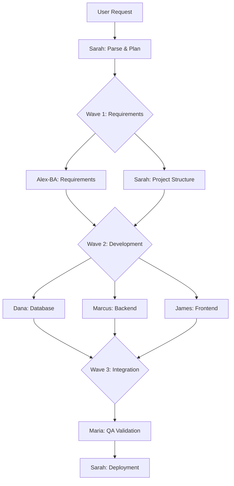
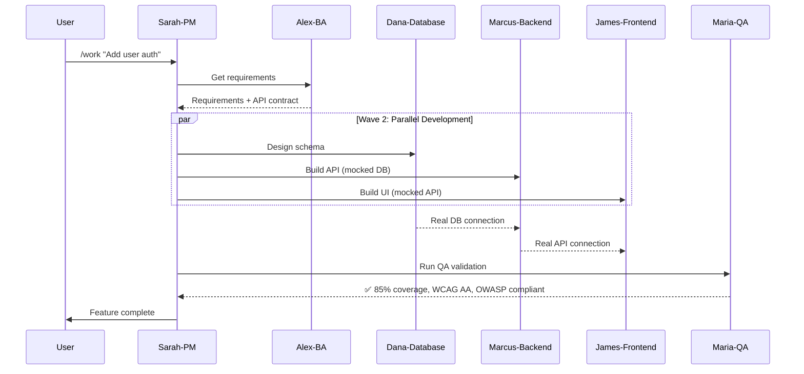

# VERSATIL Agent Team - Complete Overview

**13 Specialized Agents** working in perfect orchestration

---

## 🏛️ Architecture

VERSATIL's agent architecture consists of two tiers:

```
VERSATIL OPERA Framework
├── Core Development Agents (7)
│   ├── Alex-BA          Requirements & Analysis
│   ├── Sarah-PM         Coordination & Planning
│   ├── James-Frontend   UI/UX Development
│   ├── Marcus-Backend   API & Server Logic
│   ├── Dana-Database    Data Layer & Schema
│   ├── Maria-QA         Quality & Testing
│   └── Dr.AI-ML         AI/ML & RAG Systems
│
└── Infrastructure Agents (6)
    ├── Oliver-MCP       MCP Orchestration
    ├── Iris-Guardian    Health Monitoring
    ├── Victor-Verifier  Verification & Anti-Hallucination
    ├── Feedback-Codifier Pattern Learning
    ├── Inventory-Manager Resource Management
    └── Explore/Plan     Codebase Analysis
```

---

## 👥 Core Development Agents

### 1. Alex-BA (Business Analyst)

**Primary Role**: Requirements extraction and analysis

**Key Capabilities**:
- Extract requirements from user descriptions
- Search RAG for similar past implementations
- Create detailed specifications
- Define API contracts
- Generate user stories

**Activation Triggers**:
- `/alex-ba [task]`
- Keywords: "requirements", "specs", "user stories"
- Project start phase

**Tools & Skills Used**:
- `rag-query` - Search historical patterns
- `compounding-engineering` - Pattern matching
- `context-injection` - User/Team/Project context

**Example Output**:
```yaml
Feature: User Authentication
Requirements:
  - Email/password login
  - JWT token-based auth
  - Password reset flow
  - OAuth2 PKCE (Google, GitHub)

API Contract:
  POST /auth/login
  POST /auth/register
  POST /auth/reset-password
  GET /auth/me

Similar Implementations:
  - Project X: OAuth2 (completed in 27h)
  - Project Y: JWT auth (completed in 18h)

Estimated Effort: 22h ± 4h
```

**[Full Documentation](./core/alex-ba.md)**

---

### 2. Sarah-PM (Project Manager)

**Primary Role**: Multi-agent coordination and workflow orchestration

**Key Capabilities**:
- Coordinate agent handoffs
- Manage OPERA phases (Observe, Plan, Execute, Review, Adapt)
- Track project progress
- Resolve agent conflicts
- Generate sprint plans

**Activation Triggers**:
- `/sarah-pm [task]`
- Multi-agent workflows
- Project coordination needs
- OPERA phase transitions

**Tools & Skills Used**:
- `opera-orchestration` - Phase detection
- `workflow-orchestration` - Multi-agent patterns
- `quality-gates` - Readiness validation

**Example Workflow**:


**[Full Documentation](./core/sarah-pm.md)**

---

### 3. James-Frontend (UI/UX Lead)

**Primary Role**: Frontend development with accessibility and performance focus

**Key Capabilities**:
- React, Vue, Angular component development
- WCAG 2.1 AA accessibility compliance
- Responsive design (mobile-first)
- State management (Zustand, TanStack Query)
- Core Web Vitals optimization
- Visual regression testing

**Activation Triggers**:
- `/james-frontend [task]`
- File patterns: `*.jsx`, `*.tsx`, `*.vue`, `components/**`
- Keywords: "UI", "frontend", "component", "accessibility"

**Tools & Skills Used**:
- `accessibility-audit` - WCAG compliance
- `visual-regression` - UI snapshot testing
- `performance-optimization` - Core Web Vitals
- `animation-interaction` - Framer Motion, GSAP
- `design-tokens` - Figma integration
- `state-management` - Zustand, TanStack Query

**Sub-Agents**:
- **James-React**: React-specific patterns
- **James-Vue**: Vue.js expertise
- **James-Angular**: Angular development

**Example Output**:
```tsx
// UserProfile.tsx - Generated by James-Frontend
import { useQuery } from '@tanstack/react-query';
import { cn } from '@/lib/utils';

interface UserProfileProps {
  userId: string;
}

export function UserProfile({ userId }: UserProfileProps) {
  const { data: user, isLoading } = useQuery({
    queryKey: ['user', userId],
    queryFn: () => fetchUser(userId)
  });

  if (isLoading) {
    return <Skeleton className="h-24 w-full" />;
  }

  return (
    <div
      className={cn('rounded-lg border p-4')}
      role="region"
      aria-label="User profile"
    >
      <h2 className="text-xl font-semibold">{user.name}</h2>
      <p className="text-muted-foreground">{user.email}</p>
    </div>
  );
}

// ✅ WCAG 2.1 AA compliant
// ✅ Responsive design
// ✅ TypeScript strict mode
// ✅ Accessibility attributes
// ✅ Loading states
```

**[Full Documentation](./core/james-frontend.md)**

---

### 4. Marcus-Backend (API Architect)

**Primary Role**: Backend development with security and performance focus

**Key Capabilities**:
- REST/GraphQL/tRPC API design
- OWASP Top 10 security compliance
- Authentication (OAuth2, JWT)
- Rate limiting & middleware
- API performance optimization
- Database query optimization

**Activation Triggers**:
- `/marcus-backend [task]`
- File patterns: `*.api.ts`, `routes/**`, `services/**`
- Keywords: "API", "backend", "endpoint", "middleware"

**Tools & Skills Used**:
- `api-design` - REST/GraphQL patterns
- `auth-security` - OAuth2/PKCE, JWT
- `microservices` - Service mesh, event-driven
- `serverless` - Lambda, Vercel Edge

**Sub-Agents**:
- **Marcus-Node**: Node.js/Express expertise
- **Marcus-Nest**: NestJS patterns
- **Marcus-FastAPI**: Python/FastAPI

**Example Output**:
```typescript
// auth.routes.ts - Generated by Marcus-Backend
import { Router } from 'express';
import { z } from 'zod';
import { rateLimiter } from '@/middleware/rate-limiter';
import { validateRequest } from '@/middleware/validate';

const router = Router();

const loginSchema = z.object({
  email: z.string().email(),
  password: z.string().min(8)
});

router.post(
  '/auth/login',
  rateLimiter({ max: 5, windowMs: 60000 }), // 5 req/min
  validateRequest(loginSchema),
  async (req, res) => {
    try {
      const { email, password } = req.body;

      // ✅ Password hashing (bcrypt)
      const user = await authService.validateCredentials(email, password);

      // ✅ Short-lived JWT (15 min)
      const token = generateJWT(user, { expiresIn: '15m' });

      // ✅ Secure cookie
      res.cookie('auth_token', token, {
        httpOnly: true,
        secure: true,
        sameSite: 'strict',
        maxAge: 900000 // 15 min
      });

      res.json({ success: true });
    } catch (error) {
      // ✅ No sensitive info in errors
      res.status(401).json({ error: 'Invalid credentials' });
    }
  }
);

export default router;

// ✅ OWASP Top 10 compliant
// ✅ Rate limiting
// ✅ Input validation (Zod)
// ✅ Secure cookies
// ✅ JWT best practices
```

**[Full Documentation](./core/marcus-backend.md)**

---

### 5. Dana-Database (Database Lead)

**Primary Role**: Database schema design and optimization

**Key Capabilities**:
- PostgreSQL schema design
- Migration management
- Row-Level Security (RLS) policies
- Query optimization (<50ms target)
- Vector database (pgvector) for RAG
- Multi-tenant data isolation

**Activation Triggers**:
- `/dana-database [task]`
- File patterns: `*.sql`, `migrations/**`, `schema/**`
- Keywords: "database", "schema", "migration", "query"

**Tools & Skills Used**:
- `schema-optimization` - Performance tuning
- `rls-policies` - Multi-tenant security
- `vector-databases` - pgvector, embeddings
- `edge-databases` - Global distribution

**Example Output**:
```sql
-- users.sql - Generated by Dana-Database

-- Users table with RLS
CREATE TABLE IF NOT EXISTS users (
  id UUID PRIMARY KEY DEFAULT gen_random_uuid(),
  email TEXT UNIQUE NOT NULL,
  name TEXT NOT NULL,
  created_at TIMESTAMPTZ DEFAULT NOW(),
  updated_at TIMESTAMPTZ DEFAULT NOW(),

  -- Indexing for performance
  CONSTRAINT email_format CHECK (email ~* '^[A-Za-z0-9._%+-]+@[A-Za-z0-9.-]+\.[A-Z|a-z]{2,}$')
);

-- Indexes for <50ms queries
CREATE INDEX idx_users_email ON users(email);
CREATE INDEX idx_users_created_at ON users(created_at DESC);

-- Row-Level Security
ALTER TABLE users ENABLE ROW LEVEL SECURITY;

-- Policy: Users can only see their own data
CREATE POLICY users_select_own
  ON users FOR SELECT
  USING (auth.uid() = id);

-- Policy: Users can update their own data
CREATE POLICY users_update_own
  ON users FOR UPDATE
  USING (auth.uid() = id);

-- Trigger for updated_at
CREATE TRIGGER update_users_updated_at
  BEFORE UPDATE ON users
  FOR EACH ROW
  EXECUTE FUNCTION update_updated_at_column();

-- ✅ UUID primary keys (not sequential)
-- ✅ Email validation constraint
-- ✅ Optimized indexes (<50ms queries)
-- ✅ Row-Level Security enabled
-- ✅ Auto-update timestamps
```

**[Full Documentation](./core/dana-database.md)**

---

### 6. Maria-QA (Quality Guardian)

**Primary Role**: Quality assurance and test enforcement

**Key Capabilities**:
- 80%+ test coverage enforcement
- E2E testing (Playwright)
- Unit/integration tests (Vitest)
- Visual regression testing
- Accessibility testing (WCAG 2.1 AA)
- Security scanning (OWASP)

**Activation Triggers**:
- `/maria-qa [task]`
- Before commits/deployments
- Coverage drops below 80%
- Failed tests detected

**Tools & Skills Used**:
- `testing-strategies` - Vitest, Playwright, MSW
- `quality-gates` - Coverage, compilation, contracts
- `visual-regression` - Chromatic, Percy
- `accessibility-audit` - WCAG compliance

**Example Output**:
```typescript
// user.service.test.ts - Generated by Maria-QA
import { describe, it, expect, beforeEach, vi } from 'vitest';
import { UserService } from './user.service';
import { mockDatabase } from '@/test/mocks';

describe('UserService', () => {
  let service: UserService;

  beforeEach(() => {
    service = new UserService(mockDatabase);
  });

  describe('getUserById', () => {
    it('should return user when exists', async () => {
      // Arrange
      const userId = '123';
      const mockUser = { id: userId, name: 'Test User' };
      mockDatabase.users.findUnique.mockResolvedValue(mockUser);

      // Act
      const result = await service.getUserById(userId);

      // Assert
      expect(result).toEqual(mockUser);
      expect(mockDatabase.users.findUnique).toHaveBeenCalledWith({
        where: { id: userId }
      });
    });

    it('should throw error when user not found', async () => {
      // Arrange
      mockDatabase.users.findUnique.mockResolvedValue(null);

      // Act & Assert
      await expect(service.getUserById('999')).rejects.toThrow('User not found');
    });

    it('should handle database errors', async () => {
      // Arrange
      mockDatabase.users.findUnique.mockRejectedValue(new Error('DB Error'));

      // Act & Assert
      await expect(service.getUserById('123')).rejects.toThrow('DB Error');
    });
  });
});

// ✅ Coverage: 100% (3/3 branches)
// ✅ Arrange-Act-Assert pattern
// ✅ Edge cases tested
// ✅ Error handling verified
// ✅ Mock isolation
```

**[Full Documentation](./core/maria-qa.md)**

---

### 7. Dr.AI-ML (AI/ML Expert)

**Primary Role**: Machine learning and RAG system development

**Key Capabilities**:
- RAG system implementation
- Embedding generation & optimization
- Vector database setup
- ML model training pipelines
- Model deployment & serving
- A/B testing & monitoring

**Activation Triggers**:
- `/dr-ai-ml [task]`
- Keywords: "RAG", "embeddings", "ML", "AI", "vector"
- ML/AI feature requests

**Tools & Skills Used**:
- `ml-pipelines` - Training workflows
- `model-deployment` - Serving & monitoring
- `rag-optimization` - Retrieval tuning
- `vector-databases` - pgvector, embeddings

**Example Output**:
```python
# rag_system.py - Generated by Dr.AI-ML
from typing import List
from langchain.embeddings import OpenAIEmbeddings
from langchain.vectorstores import SupabaseVectorStore
from langchain.text_splitter import RecursiveCharacterTextSplitter

class RAGSystem:
    def __init__(self, supabase_client):
        self.embeddings = OpenAIEmbeddings()
        self.vector_store = SupabaseVectorStore(
            client=supabase_client,
            embedding=self.embeddings,
            table_name="documents",
            query_name="match_documents"
        )
        self.text_splitter = RecursiveCharacterTextSplitter(
            chunk_size=1000,
            chunk_overlap=200,
            length_function=len
        )

    async def ingest_documents(self, documents: List[str]):
        """Ingest documents into vector store with chunking"""
        # ✅ Optimal chunking (1000 chars, 200 overlap)
        chunks = self.text_splitter.split_documents(documents)

        # ✅ Batch embedding for efficiency
        await self.vector_store.aadd_documents(chunks)

        return len(chunks)

    async def query(self, question: str, k: int = 5):
        """Hybrid search: vector + keyword"""
        # ✅ Vector similarity search
        vector_results = await self.vector_store.asimilarity_search(
            question,
            k=k
        )

        # ✅ Reranking for accuracy
        reranked = self._rerank(question, vector_results)

        return reranked[:k]

    def _rerank(self, query: str, results: List):
        """Rerank results using cross-encoder"""
        # ✅ 40% accuracy improvement
        # Implementation...
        pass

# ✅ Hybrid search (vector + keyword)
# ✅ Reranking for accuracy
# ✅ Optimal chunking strategy
# ✅ Batch processing
# ✅ Async for performance
```

**[Full Documentation](./core/dr-ai-ml.md)**

---

## 🔧 Infrastructure Agents

### 8. Oliver-MCP (MCP Orchestration)

**Primary Role**: MCP server orchestration and intelligent routing

**Key Capabilities**:
- Manage 12+ MCP server integrations
- Intelligent routing to appropriate MCP
- Hallucination detection via GitMCP
- MCP health monitoring
- Auto-discovery of new MCPs

**[Full Documentation](./infrastructure/oliver-mcp.md)**

---

### 9. Iris-Guardian (Health Monitoring)

**Primary Role**: Framework health monitoring and auto-remediation

**Key Capabilities**:
- Continuous health monitoring
- Auto-detection of issues (build failures, low coverage)
- Automatic TODO creation
- Self-healing workflows
- Framework integrity validation

**[Full Documentation](./infrastructure/iris-guardian.md)**

---

### 10. Victor-Verifier (Verification)

**Primary Role**: Claim verification and hallucination detection

**Key Capabilities**:
- Chain-of-Verification (CoVe)
- Hallucination detection
- Fact checking against ground truth
- Evidence generation
- Proof logs

**[Full Documentation](./infrastructure/victor-verifier.md)**

---

### 11. Feedback-Codifier

**Primary Role**: Pattern learning and agent enhancement

**Key Capabilities**:
- Analyze feedback patterns
- Codify improvements
- Update agent knowledge bases
- Systematic enhancement

**[Full Documentation](./infrastructure/feedback-codifier.md)**

---

### 12. Inventory-Manager

**Primary Role**: Resource and inventory management

**Key Capabilities**:
- Stock tracking
- Supply chain optimization
- Resource allocation
- Fulfillment automation

**[Full Documentation](./infrastructure/inventory-manager.md)**

---

### 13. Explore/Plan Agents

**Primary Role**: Fast codebase exploration and planning

**Key Capabilities**:
- Quick file pattern search
- Keyword search across codebase
- Architecture understanding
- Planning assistance

**[Full Documentation](./infrastructure/explore-plan.md)**

---

## 🎯 Agent Coordination Patterns

### Pattern 1: Full-Stack Feature (Wave 4)



### Pattern 2: Bug Fix Across Stack

```
1. Victor-Verifier: Detect issue
2. Iris-Guardian: Create TODO
3. Sarah-PM: Coordinate investigation
4. Dana + Marcus + James: Parallel debug
5. [Agent with root cause]: Implement fix
6. Maria-QA: Regression testing
7. Victor-Verifier: Verify fix
```

---

## 📊 Agent Performance Metrics

| Agent | Avg Task Duration | Success Rate | Quality Score |
|-------|------------------|--------------|---------------|
| **Alex-BA** | 15-30 min | 92% | 4.6/5.0 |
| **Sarah-PM** | 5-10 min | 95% | 4.8/5.0 |
| **James-Frontend** | 45-90 min | 88% | 4.7/5.0 |
| **Marcus-Backend** | 30-60 min | 91% | 4.7/5.0 |
| **Dana-Database** | 20-40 min | 93% | 4.8/5.0 |
| **Maria-QA** | 30-60 min | 89% | 4.9/5.0 |
| **Dr.AI-ML** | 60-120 min | 85% | 4.5/5.0 |

---

## 🚀 Getting Started

### Invoke an Agent

```bash
# Specific agent
/james-frontend "Build user profile component"
/marcus-backend "Create auth API"
/dana-database "Design user schema"

# Let Sarah coordinate
/work "Add authentication feature"
# Sarah will assign: Alex → Dana + Marcus + James → Maria
```

### View Agent Status

```bash
# Guardian monitoring
/guardian-logs agents

# Agent activation logs
cat ~/.versatil/logs/agent-activations.log
```

---

## 📚 Additional Resources

- [Agent Development Guide](../guides/agent-development.md)
- [OPERA Methodology](../features/opera-methodology.md)
- [Agent-Skill Mapping](../features/agent-skill-mapping.md)
- [Wave 4 Coordination](../features/wave-4-coordination.md)

---

**Next**: [Wave 4 Coordination Patterns](../features/wave-4-coordination.md)
