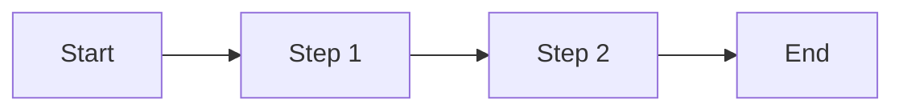
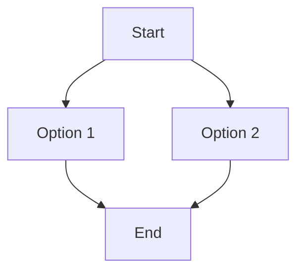
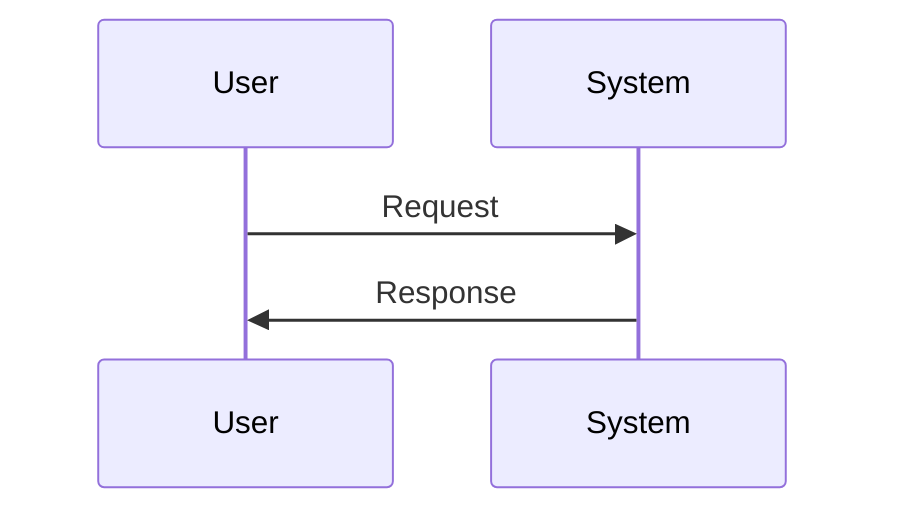

# VERSATIL Diagrams Documentation

This directory contains all visual diagrams used in VERSATIL documentation to explain workflows, architecture, and the compounding engineering effect.

---

## 📊 Diagram Inventory

### 1. `every-flywheel.mmd` - VELOCITY Workflow Flywheel

**Purpose**: Visualizes the 4-step compounding engineering workflow and how each feature makes the next 40% faster.

**Shows**:
- PLAN → ASSESS → WORK → CODIFY cycle
- Feedback loop (CODIFY → PLAN)
- Compounding effect over 3 features (125 min → 75 min → 65 min)
- RAG pattern storage mechanism

**Embedded in**:
- [README.md](../../README.md) - § The Compounding Effect
- [GET_STARTED.md](../../GET_STARTED.md) - § What's Next
- [CLAUDE.md](../../CLAUDE.md) - § VELOCITY Workflow

**Preview**:
- View on [mermaid.live](https://mermaid.live/)
- Copy contents of `every-flywheel.mmd` and paste

---

### 2. `4-step-workflow.mmd` - Simplified 4-Step Workflow

**Purpose**: Simplified linear diagram showing the VELOCITY workflow for README quick understanding.

**Shows**:
- User request → PLAN → ASSESS → WORK → CODIFY → Result
- Three-tier parallel execution (Dana + Marcus + James)
- Time estimates for each phase
- Total time: 125 minutes (vs 220 sequential)

**Embedded in**:
- [README.md](../../README.md) - § How It Works
- [GET_STARTED.md](../../GET_STARTED.md) - § The VELOCITY Workflow (What You'll Set Up)

**Preview**:
- View on [mermaid.live](https://mermaid.live/)

---

### 3. `time-savings.mmd` - Before/After Time Comparison

**Purpose**: Gantt chart showing time savings from parallel vs sequential development.

**Shows**:
- Without VERSATIL (Sequential): 220 minutes
  - Alex-BA: 30 min
  - Dana: 45 min
  - Marcus: 60 min
  - James: 50 min
  - Integration: 15 min
  - Maria: 20 min
- With VERSATIL (Parallel): 125 minutes
  - Dana + Marcus + James work simultaneously (max 60 min instead of 45+60+50)
- Time saved: 95 minutes (43% faster)

**Embedded in**:
- [README.md](../../README.md) - § Real-World Impact
- [docs/COMPARISON.md](../COMPARISON.md) - § Time Savings Comparison

**Preview**:
- View on [mermaid.live](https://mermaid.live/)

---

### 4. `three-tier-parallel.mmd` - Three-Tier Parallel Architecture

**Purpose**: Sequence diagram showing how Dana, Marcus, and James work in parallel using mocks, then integrate.

**Shows**:
- Phase 1: Requirements (Alex-BA) - 30 min
- Phase 2: Parallel Development - 60 min max
  - Dana builds data layer with REAL database (45 min)
  - Marcus builds API with MOCK database (60 min)
  - James builds UI with MOCK API (50 min)
- Phase 3: Integration - 15 min
  - Connect Marcus → Dana (real DB)
  - Connect James → Marcus (real API)
- Phase 4: Quality (Maria-QA) - 20 min

**Embedded in**:
- [README.md](../../README.md) - § Multi-Agent Collaboration
- [GET_STARTED.md](../../GET_STARTED.md) - (potential future location)

**Preview**:
- View on [mermaid.live](https://mermaid.live/)

---

### 5. `agent-activation.mmd` - Agent Auto-Activation Flow

**Purpose**: Flowchart showing how file edits trigger agent activation automatically.

**Shows**:
- File edit → Save event
- Cursor hook (afterFileEdit)
- Pattern match (*.tsx detected)
- Agent activation (James-Frontend)
- Tech detection (React/Vue/Angular)
- Sub-agent selection (James-React)
- RAG search for similar components
- Quality checks (Accessibility, Responsive, Performance)
- Statusline update
- Result (< 2 seconds total)

**Embedded in**:
- [README.md](../../README.md) - § File-Based Activation
- [GET_STARTED.md](../../GET_STARTED.md) - § Step 5: See It In Action

**Preview**:
- View on [mermaid.live](https://mermaid.live/)

---

## 🎨 Diagram Colors and Themes

All diagrams use consistent color coding:

| Color | Purpose | Example |
|-------|---------|---------|
| **Blue** (`#e3f2fd`) | PLAN phase | Alex-BA, requirements |
| **Orange** (`#fff3e0`) | ASSESS phase | Sarah-PM, readiness checks |
| **Green** (`#e8f5e9`) | WORK phase | Dana, Marcus, James (execution) |
| **Pink** (`#fce4ec`) | CODIFY phase | RAG updates, learning |
| **Purple** (`#f3e5f5`) | Agents/Sub-agents | Individual agent nodes |
| **Red** (`#ffccbc`) | Quality/Testing | Maria-QA, quality gates |
| **Gray** (`#e0e0e0`) | User actions | User input, file edits |

---

## 🔧 How to Edit Diagrams

### Prerequisites
- **Mermaid syntax knowledge**: [Mermaid Docs](https://mermaid.js.org/intro/)
- **Text editor**: Any editor works (VS Code, Cursor, vim, etc.)
- **Preview tool**: [mermaid.live](https://mermaid.live/) for instant preview

### Editing Workflow

1. **Open diagram file** (e.g., `every-flywheel.mmd`)
2. **Edit Mermaid syntax** directly in your editor
3. **Preview changes** by pasting into [mermaid.live](https://mermaid.live/)
4. **Test GitHub rendering**:
   - Commit changes to a branch
   - Open PR to preview on GitHub (Mermaid renders automatically)
5. **Verify embeddings**:
   - Check README.md, GET_STARTED.md, COMPARISON.md render correctly

### Common Mermaid Syntax

**Flowchart** (linear flow):


**Graph** (flexible layout):


**Sequence Diagram** (interactions):


**Gantt Chart** (timeline):

```mermaid
gantt
    title Project Timeline
    dateFormat HH:mm
    section Phase 1
    Task 1 :done, 00:00, 30m
    Task 2 :done, 00:30, 45m
```


---

## 📸 Converting Diagrams to Images

GitHub automatically renders Mermaid in `README.md` files, so image conversion is usually **not needed**. However, if you need standalone images:

### Method 1: Mermaid Live (Easiest)

1. Go to [mermaid.live](https://mermaid.live/)
2. Paste diagram code
3. Click "Actions" → "Export as PNG" or "Export as SVG"
4. Save to `docs/screenshots/` directory

### Method 2: Mermaid CLI (Automated)

```bash
# Install mermaid-cli
npm install -g @mermaid-js/mermaid-cli

# Convert .mmd to .png
mmdc -i docs/diagrams/every-flywheel.mmd -o docs/screenshots/every-flywheel.png

# Convert .mmd to .svg (scalable)
mmdc -i docs/diagrams/every-flywheel.mmd -o docs/screenshots/every-flywheel.svg -b transparent
```

### Method 3: Programmatic (via VERSATIL)

VERSATIL includes `DiagramGenerator` class in `src/visualization/diagram-generator.ts` which can programmatically generate diagrams:

```typescript
import DiagramGenerator from './src/visualization/diagram-generator.js';

const generator = new DiagramGenerator();

// Generate and save
const diagram = await generator.generateTaskHierarchyTree(plan, {
  saveToFile: true,
  outputDir: './docs/diagrams',
  filename: 'my-diagram'
});

console.log(`Saved to: ${diagram.filePath}`);
```

---

## 🔄 Regenerating Diagrams

### When to Regenerate

- **Agent count changes** (currently 8 core + 10 sub-agents = 18)
- **Workflow phases change** (currently 4: PLAN, ASSESS, WORK, CODIFY)
- **Time estimates change** (e.g., if parallel execution becomes faster)
- **Color scheme updates** (to match new branding)

### Regeneration Checklist

- [ ] Update diagram source file (`.mmd`)
- [ ] Preview on [mermaid.live](https://mermaid.live/)
- [ ] Test GitHub rendering (create PR)
- [ ] Check all embeddings render correctly:
  - [ ] README.md
  - [ ] GET_STARTED.md
  - [ ] COMPARISON.md
  - [ ] CLAUDE.md (if applicable)
- [ ] Update this README if diagram purpose changed
- [ ] Commit with descriptive message: `docs(diagrams): Update X to reflect Y change`

---

## 🎯 Best Practices

### Do:
- ✅ Use consistent colors across all diagrams (see color table above)
- ✅ Keep diagrams simple (max 15 nodes for readability)
- ✅ Add time estimates where relevant (helps users understand efficiency)
- ✅ Use emoji sparingly for agent identification (🎨 James, ⚙️ Marcus, etc.)
- ✅ Test on both light and dark backgrounds
- ✅ Preview on mobile (diagrams should be readable on small screens)

### Don't:
- ❌ Don't make diagrams too complex (split into multiple if needed)
- ❌ Don't use obscure Mermaid syntax (stick to common patterns)
- ❌ Don't hardcode specific feature names (use "Add authentication" as example, not "PR #123")
- ❌ Don't forget to update embeddings when diagram changes
- ❌ Don't use colors that clash with GitHub's dark mode

---

## 🐛 Troubleshooting

### Diagram not rendering on GitHub?

**Cause**: Syntax error in Mermaid code

**Solution**:
1. Copy diagram code to [mermaid.live](https://mermaid.live/)
2. Look for red error messages
3. Fix syntax errors
4. Commit corrected code

### Diagram renders on mermaid.live but not GitHub?

**Cause**: GitHub's Mermaid renderer is more strict than mermaid.live

**Solution**:
1. Check for unsupported features (some advanced Mermaid features aren't supported on GitHub)
2. Simplify diagram (remove custom themes, use basic syntax)
3. Test in a PR (GitHub's renderer might have been updated)

### Diagram looks different on dark mode?

**Cause**: Color contrast issues

**Solution**:
1. Use lighter stroke colors (avoid pure black strokes)
2. Test on both light and dark backgrounds
3. Consider using `%%{init: {'theme':'base'}}%%` for neutral colors

### Diagram too wide on mobile?

**Cause**: Too many horizontal nodes

**Solution**:
1. Change `graph LR` (left-right) to `graph TD` (top-down)
2. Split into multiple smaller diagrams
3. Reduce node labels to 3-5 words max

---

## 📚 Further Reading

- **Mermaid Documentation**: https://mermaid.js.org/intro/
- **GitHub Mermaid Support**: https://github.blog/2022-02-14-include-diagrams-markdown-files-mermaid/
- **Mermaid Live Editor**: https://mermaid.live/
- **VERSATIL Architecture**: [docs/architecture/VISUAL_ARCHITECTURE.md](../architecture/VISUAL_ARCHITECTURE.md)

---

**Last Updated**: 2025-10-20
**Maintainers**: VERSATIL Team
**Questions?**: [Open an issue](https://github.com/Nissimmiracles/versatil-sdlc-framework/issues)
