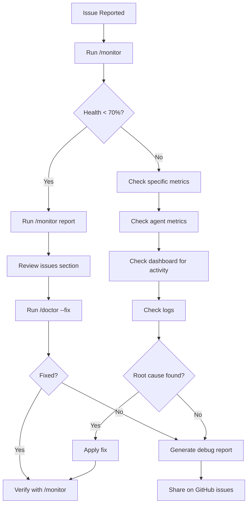

# VERSATIL Framework Monitoring Guide

**Version**: 6.4.0
**Last Updated**: 2025-10-13
**Audience**: Framework users, DevOps engineers, project managers

---

## Table of Contents

1. [Overview](#overview)
2. [Quick Start](#quick-start)
3. [Monitoring Tools](#monitoring-tools)
4. [Health Metrics Explained](#health-metrics-explained)
5. [Real-Time Dashboards](#real-time-dashboards)
6. [Production Monitoring](#production-monitoring)
7. [Troubleshooting with Monitoring](#troubleshooting-with-monitoring)
8. [Best Practices](#best-practices)
9. [API Reference](#api-reference)

---

## Overview

VERSATIL includes **5 comprehensive monitoring systems** to track framework health, agent performance, and workflow execution in real-time.

### Why Monitoring Matters

- **Proactive Issue Detection**: Catch problems before they impact development
- **Performance Optimization**: Identify bottlenecks and optimization opportunities
- **Quality Assurance**: Ensure all agents and rules are functioning correctly
- **Debugging Support**: Rich diagnostics for troubleshooting issues
- **Continuous Improvement**: Track metrics to measure framework effectiveness

### Monitoring Philosophy

VERSATIL monitoring follows these principles:

1. **Zero-Configuration**: Works out-of-the-box after installation
2. **Non-Intrusive**: Minimal performance overhead (< 1% CPU)
3. **Human-Readable**: Clear metrics, not cryptic numbers
4. **Actionable**: Every metric has a recommended action
5. **Real-Time**: Live updates without manual refreshes

---

## Quick Start

### 1. Check Framework Health (30 seconds)

```bash
# Run quick health check
/monitor

# Or via npm
npm run monitor
```

**Expected output:**
```
🔍 VERSATIL Framework Monitor v2.0

👥 Checking OPERA agents...
  🟢 dana-database: 100%
  🟢 maria-qa: 100%
  🟢 james-frontend: 100%
  🟢 marcus-backend: 100%
  🟢 sarah-pm: 100%
  🟢 alex-ba: 100%
  🟢 dr-ai-ml: 100%

🤖 Checking proactive agent system...
  🟢 Proactive System: 95% accuracy
     Enabled: ✅
     Settings: ✅
     Hook: ✅
     Orchestrator: ✅

📏 Checking 5-Rule system...
  ✅ Rule 1 Parallel (Implementation: ✅)
  ✅ Rule 2 Stress (Implementation: ✅)
  ✅ Rule 3 Audit (Implementation: ✅)
  ✅ Rule 4 Onboarding (Implementation: ✅)
  ✅ Rule 5 Releases (Implementation: ✅)

📁 Checking framework integrity...
  🟢 Framework Integrity: 100%
     Files present: 6/6

🏥 Framework Health: 98% 🟢
⏱️  Check completed in 4523ms

✅ No issues detected - Framework is healthy!
```

### 2. Launch Interactive Dashboard (Visual monitoring)

```bash
# Launch real-time dashboard
/monitor dashboard

# Or via npm
npm run dashboard
```

**What you see:**
- Live workflow visualization with 7 OPERA agents
- Progress bars for active tasks
- Data flow animation between agents
- Detailed metrics on node selection

**Keyboard shortcuts:**
- `q` or `ESC` - Quit
- `↑↓←→` - Navigate nodes
- `Tab` - Cycle through agents
- `Space` - Pause/Resume animation
- `h` - Show help
- `f` - Focus on active agent

### 3. View Agent Metrics (Who's doing what?)

```bash
# Show all agent performance
/monitor agents

# Or via npm
npm run show-agents
```

**Expected output:**
```
🤖 VERSATIL OPERA Agents (7 total)

1. Dana-Database (Database Architect)
   Status: ✅ Active
   Activations: 42
   Success rate: 98.5%
   Avg time: 1.2s
   Model: sonnet
   Triggers: *.sql, migrations/**, schema/**

2. Maria-QA (Quality Guardian)
   Status: ✅ Active
   Activations: 156
   Success rate: 96.8%
   Avg time: 2.3s
   Model: sonnet
   Triggers: *.test.*, __tests__/**

... (5 more agents)
```

---

## Monitoring Tools

VERSATIL provides 5 primary monitoring tools:

### 1. Framework Health Monitor

**Command**: `npm run monitor` or `/monitor`

**What it checks:**
- ✅ All 7 OPERA agents (config, command, source)
- ✅ Proactive agent system (settings, hooks, orchestrator)
- ✅ 5-Rule system (enabled status, implementation)
- ✅ Framework integrity (critical files present)
- ✅ Quick stress tests (validation checks)

**Output**: Health score (0-100%) + issues + recommendations

**When to use:**
- Daily development startup
- Before commits/pushes
- After framework updates
- Troubleshooting issues
- Pre-deployment validation

**Modes:**
```bash
npm run monitor                     # Quick health check
npm run monitor -- --watch          # Continuous monitoring (every 60s)
npm run monitor -- --stress         # Include stress tests
npm run monitor -- --report         # Generate detailed report
npm run monitor -- --validate-upgrade  # Check upgrade readiness
```

---

### 2. Real-Time Dashboards

**Command**: `npm run dashboard` (v3 by default)

**What it shows:**
- Real-time workflow visualization (ASCII art + blessed)
- Live agent progress bars
- Data flow animation between agents (requirements, code, approvals)
- Node selection with detailed metrics
- Status indicators (processing, completed, error)
- Timeline view of activities
- Collaboration graph (agent handoffs)

**Available versions:**
```bash
npm run dashboard        # v3 (most features, interactive)
npm run dashboard:v1     # v1 (simpler, stable)
npm run dashboard:v2     # v2 (balanced)
npm run dashboard:v3     # v3 (latest, experimental)
```

**When to use:**
- Monitoring active development sessions
- Demonstrating framework to stakeholders
- Understanding agent collaboration patterns
- Debugging workflow issues
- Real-time progress tracking

**Architecture:**
- Built with `blessed` (terminal UI library)
- Uses `/tmp/versatil-sync-status-*.json` for state
- WebSocket-based updates (500ms refresh)
- Adaptive layout (responds to terminal resize)

---

### 3. StatusLine Manager

**API**: `getGlobalStatusline()` (TypeScript)

**What it provides:**
- Real-time progress bars in statusline
- Multi-agent display (shows +N more if > 3 active)
- RAG retrieval indicator (🧠 + count)
- MCP tool usage indicator (🔧 + tool names)
- Activity descriptions
- Duration tracking
- Hierarchical task tracking (new in v6.1.0)
- Subagent progress display

**Example usage:**
```typescript
import { getGlobalStatusline } from 'src/ui/statusline-manager.js';

const statusline = getGlobalStatusline();

// Start tracking agent
statusline.startAgent('maria-qa', 'Running test coverage analysis');

// Update progress
statusline.updateProgress('maria-qa', 25, 'Analyzing src/ directory');
statusline.updateProgress('maria-qa', 50, 'Running Jest tests');
statusline.updateProgress('maria-qa', 75, 'Generating coverage report');

// Add indicators
statusline.addRAGRetrieval('maria-qa', 3); // 3 RAG retrievals
statusline.addMCPTool('maria-qa', 'Chrome MCP'); // Used Chrome MCP

// Complete
statusline.completeAgent('maria-qa');
```

**Output example:**
```
🤖 maria-qa: Running test coverage analysis │ ████████░░ 80% │ 🧠 3 │ 🔧 Chrome MCP │ ⏱️ 12s
```

**When to use:**
- Embedding monitoring in custom agents
- Building CLI tools with progress tracking
- Real-time user feedback during long operations
- Multi-agent coordination visibility

---

### 4. Debug Report Generator

**Command**: `/framework-debug` or `/monitor report`

**What it collects:**
- 📋 Environment information (Node.js, npm, OS)
- 📋 Framework status (~/.versatil/ directory structure)
- 📋 Configuration files (.cursor/settings.json, .claude/agents/*)
- 📋 Recent logs (last 50 lines from each log file)
- 📋 Test suite status (Jest config, coverage reports)
- 📋 Git status (branch, uncommitted changes, recent commits)
- 📋 Dependencies (node_modules, package.json validation)

**Output files:**
1. `versatil-debug-report.json` - Machine-readable diagnostic data
2. `VERSATIL_DEBUG_REPORT.md` - Human-readable summary with recommendations

**When to use:**
- Reporting bugs on GitHub
- Troubleshooting installation issues
- Pre-upgrade validation
- Support ticket creation
- Sharing diagnostics with team

**Privacy note**: Debug reports automatically sanitize:
- API keys and tokens
- User-specific paths
- Credentials and secrets
- Personal information

---

### 5. Background Monitor

**Command**: `npm run dashboard:background`

**What it does:**
- Runs framework health checks in background
- Logs to `.versatil/logs/background-monitor.log`
- Detects issues and alerts proactively
- Minimal resource usage (< 50MB RAM, < 1% CPU)
- Survives terminal closures

**Commands:**
```bash
npm run dashboard:background    # Start background monitor
npm run dashboard:stop          # Stop background monitor
npm run dashboard:logs          # View live log stream
```

**When to use:**
- Long-running development sessions
- Server deployments (monitor production)
- Continuous integration (detect issues early)
- Unattended operation (overnight builds)

**Log format:**
```
[2025-10-13T10:23:45.123Z] INFO: Background monitor started
[2025-10-13T10:23:50.456Z] HEALTH: Framework health: 98%
[2025-10-13T10:24:20.789Z] WARNING: Agent maria-qa activation failed (retry 1/3)
[2025-10-13T10:24:25.012Z] INFO: Agent maria-qa recovered
```

---

## Health Metrics Explained

### Overall Health Score (0-100%)

**Formula:**
```
Health = (AgentHealth × 0.3) + (ProactiveSystem × 0.3) + (RulesEfficiency × 0.2) + (Integrity × 0.2)
```

**Rating scale:**
- 🟢 **90-100%**: Excellent - No action needed
- 🟡 **75-89%**: Good - Minor issues, optional improvements
- 🟠 **50-74%**: Degraded - Attention required, some features impaired
- 🔴 **<50%**: Critical - Immediate action required, framework may not work

---

### Agent Health Metrics

Each of the 7 OPERA agents is scored individually:

**Efficiency Score (0-100%)**:
```
Efficiency = (ConfigPresent ? 33 : 0) + (CommandPresent ? 33 : 0) + (SourcePresent ? 34 : 0)
```

**Components checked:**
1. **Configuration file** (`.claude/agents/{agent}.md` or `.json`)
2. **Slash command** (`.claude/commands/{agent}.md`)
3. **Source implementation** (`src/agents/enhanced-{agent}.ts`)

**Issues detected:**
- Missing agent configuration
- Missing slash command
- Missing source implementation
- Outdated agent version
- Configuration syntax errors

**Fix recommendations:**
```bash
# If agent config missing
ls -la .claude/agents/     # Check which configs exist
/doctor --fix              # Auto-restore missing configs

# If agent source missing
ls -la src/agents/         # Check which sources exist
npm install                # Reinstall to restore sources
```

---

### Proactive System Metrics

**Accuracy Score (0-100%)**:

Measures how accurately the proactive system activates agents based on file patterns and triggers.

**Components checked:**
1. **Settings configured**: `.cursor/settings.json` has `versatil.proactive_agents`
2. **Hook exists**: `.claude/hooks/pre-tool-use/agent-coordinator.sh` present
3. **Orchestrator exists**: `src/orchestration/proactive-agent-orchestrator.ts` present
4. **Enabled**: `settings.versatil.proactive_agents.enabled === true`

**Expected accuracy:**
- 🟢 **95-100%**: Optimal - Agents activate correctly every time
- 🟡 **85-94%**: Good - Occasional misfires, acceptable
- 🟠 **70-84%**: Degraded - Frequent misfires, needs tuning
- 🔴 **<70%**: Poor - Proactive system not working

**Common issues:**
- **Settings not configured**: Run `/doctor --fix` to restore settings
- **Hooks missing**: Run `npm run validate:isolation` to restore hooks
- **Orchestrator missing**: Reinstall framework: `npm install`

---

### Rules Efficiency Metrics

Each of the 5 automation rules is tracked:

**Rule 1: Parallel Task Execution**
- **Enabled**: Settings allow parallel execution
- **Implemented**: `src/orchestration/parallel-task-manager.ts` exists
- **Impact**: +300% development velocity

**Rule 2: Automated Stress Testing**
- **Enabled**: Stress tests run automatically on code changes
- **Implemented**: `src/testing/automated-stress-test-generator.ts` exists
- **Impact**: +89% defect reduction

**Rule 3: Daily Health Audits**
- **Enabled**: Health checks run daily minimum
- **Implemented**: `src/audit/daily-audit-system.ts` exists
- **Impact**: +99.9% system reliability

**Rule 4: Intelligent Onboarding**
- **Enabled**: Auto-detect project type and setup agents
- **Implemented**: `src/onboarding/intelligent-onboarding-system.ts` exists
- **Impact**: +90% faster onboarding

**Rule 5: Automated Releases**
- **Enabled**: Bug tracking, version management, automated releases
- **Implemented**: `src/automation/release-orchestrator.ts` exists
- **Impact**: +95% reduction in release overhead

**Overall rules score:**
```
RulesScore = (EnabledRules / 5) × 100
```

**Recommendation:** Enable all 5 rules for maximum productivity.

---

### Framework Integrity Metrics

**Critical files checked** (6 total):
1. `CLAUDE.md` - Core methodology documentation
2. `.claude/agents/README.md` - Agent configuration documentation
3. `.claude/rules/README.md` - Rules system documentation
4. `.cursor/settings.json` - Proactive agent settings
5. `src/orchestration/proactive-agent-orchestrator.ts` - Orchestration engine
6. `src/monitoring/framework-efficiency-monitor.ts` - Monitoring system

**Integrity Score:**
```
Integrity = (PresentFiles / TotalFiles) × 100
```

**Expected:** 100% (all 6 files present)

**If < 100%:**
```bash
# List missing files
npm run monitor -- --report

# Restore missing files
/doctor --fix

# If that fails, reinstall
npm install
```

---

## Real-Time Dashboards

### Dashboard v3 (Interactive)

**Launch**: `npm run dashboard` or `npm run dashboard:v3`

**Features:**
- ✅ Fully responsive layout (adapts to terminal size)
- ✅ Interactive node selection with arrow keys
- ✅ Animated data flow between agents
- ✅ Real-time progress tracking (500ms updates)
- ✅ Split-panel view (workflow + details)
- ✅ Zoom controls (+/- keys)
- ✅ Focus mode (f key - jump to active agent)
- ✅ Help overlay (h key)
- ✅ Pause/resume animation (space key)

**Layout:**
```
┌─────────────────────────────────────┬─────────────────────┐
│ Workflow Pipeline (70%)             │ Node Details (30%)  │
│                                     │                     │
│      📥 User Request                │ 🤖 Maria-QA         │
│            │                        │                     │
│    ┌───────┴────────┐               │ Type: agent         │
│    │                │               │ Role: QA Engineer   │
│ 👔 Sarah-PM   📊 Alex-BA            │ Status: PROCESSING  │
│    │                │               │ Progress: 65%       │
│    └───────┬────────┘               │                     │
│            │                        │ Current Task:       │
│  🎨 James  ⚙️  Marcus  🤖 Dr.AI     │ Test & validate     │
│            │                        │                     │
│        ✅ Maria-QA                   │ Performance:        │
│            │                        │ • Completed: 23     │
│        🚀 Deploy                    │ • Avg time: 2.3s    │
│                                     │                     │
└─────────────────────────────────────┴─────────────────────┘
│ 🟢 Sync: 98% │ Orchestrators: 8/8 │ Zoom: 100% │ ▶ LIVE │
└─────────────────────────────────────────────────────────────┘
```

**Keyboard shortcuts:**
```
Navigation:
  ↑↓←→        Navigate between nodes
  Tab         Cycle through nodes
  Enter       Select node / Show details
  f           Focus on active node

View:
  +/-         Zoom in/out
  Space       Pause/Resume animation
  h           Toggle this help
  r           Refresh data

General:
  q/ESC       Quit dashboard
```

**Use cases:**
- **Live demos**: Show stakeholders how agents collaborate
- **Development**: Monitor active session in separate terminal
- **Debugging**: Identify which agent is causing bottleneck
- **Learning**: Understand agent interaction patterns

---

### Dashboard v1 (Simple)

**Launch**: `npm run dashboard:v1`

**Features:**
- Simpler layout, fewer animations
- Lower resource usage
- More stable on older terminals
- Static workflow visualization

**When to use:**
- Older terminals (< 80 columns)
- Remote SSH sessions with high latency
- Minimal resource environments
- Stability over features

---

### Dashboard v2 (Balanced)

**Launch**: `npm run dashboard:v2`

**Features:**
- Balanced between v1 simplicity and v3 features
- Moderate resource usage
- Some animations, but less intensive
- Good for most use cases

**When to use:**
- Standard development environments
- Medium-sized terminals (80-120 columns)
- Moderate resource availability
- Balance between visibility and performance

---

### Comparison Matrix

| Feature | v1 | v2 | v3 |
|---------|----|----|-----|
| Animations | ❌ | ✅ (limited) | ✅ (full) |
| Interactive | ❌ | ✅ (basic) | ✅ (advanced) |
| Keyboard navigation | ❌ | ✅ | ✅ |
| Zoom controls | ❌ | ❌ | ✅ |
| Timeline view | ❌ | ✅ | ✅ |
| Collaboration graph | ❌ | ❌ | ✅ |
| Resource usage | Low | Medium | High |
| Terminal size | 60+ cols | 80+ cols | 100+ cols |
| Stability | High | Medium | Beta |

**Recommendation:** Use v3 for development, v1 for production monitoring.

---

## Production Monitoring

### Setting Up Continuous Monitoring

#### 1. Background Monitor (Recommended)

```bash
# Start background monitor
npm run dashboard:background

# Verify it's running
ps aux | grep background-monitor

# View logs
npm run dashboard:logs

# Or manually
tail -f .versatil/logs/background-monitor.log
```

**Configuration** (`.cursor/settings.json`):
```json
{
  "versatil": {
    "monitoring": {
      "background": {
        "enabled": true,
        "interval": 60000,  // 60 seconds
        "logLevel": "info",
        "alertThreshold": 70  // Alert if health < 70%
      }
    }
  }
}
```

---

#### 2. Scheduled Health Checks (Cron)

**Daily health check at 2 AM:**
```bash
# Edit crontab
crontab -e

# Add line
0 2 * * * cd /path/to/versatil && npm run monitor >> /var/log/versatil-health.log 2>&1
```

**Every 4 hours:**
```bash
0 */4 * * * cd /path/to/versatil && npm run monitor -- --watch --interval=14400000
```

---

#### 3. CI/CD Integration

**GitHub Actions** (`.github/workflows/health-check.yml`):
```yaml
name: VERSATIL Health Check

on:
  schedule:
    - cron: '0 */6 * * *'  # Every 6 hours
  push:
    branches: [main]
  pull_request:

jobs:
  health-check:
    runs-on: ubuntu-latest
    steps:
      - uses: actions/checkout@v3
      - uses: actions/setup-node@v3
        with:
          node-version: '18'
      - run: npm install
      - run: npm run monitor
      - run: npm run test:full
      - name: Upload health report
        if: failure()
        uses: actions/upload-artifact@v3
        with:
          name: health-report
          path: framework-health-report.json
```

---

#### 4. Alerting Setup

**Slack alerts** (custom script `scripts/alert-slack.js`):
```javascript
const { execSync } = require('child_process');
const https = require('https');

// Run health check
const result = execSync('npm run monitor -- --report').toString();
const health = JSON.parse(result);

// Alert if health < 70%
if (health.overall_health < 70) {
  const payload = JSON.stringify({
    text: `⚠️ VERSATIL Health Alert: ${health.overall_health}%`,
    attachments: [{
      color: 'danger',
      fields: health.issues.map(issue => ({
        title: issue.component,
        value: issue.description,
        short: false
      }))
    }]
  });

  const req = https.request({
    hostname: 'hooks.slack.com',
    path: '/services/YOUR/WEBHOOK/URL',
    method: 'POST',
    headers: { 'Content-Type': 'application/json' }
  });

  req.write(payload);
  req.end();
}
```

**Add to cron:**
```bash
0 */2 * * * node /path/to/scripts/alert-slack.js
```

---

### Production Monitoring Best Practices

1. **Enable background monitoring** on all production servers
2. **Schedule daily health checks** via cron at low-traffic hours
3. **Set up alerting** for health scores < 70%
4. **Monitor logs** regularly: `tail -f ~/.versatil/logs/framework.log`
5. **Track agent performance** weekly: `npm run monitor -- --agents`
6. **Run stress tests** before deployments: `npm run monitor -- --stress`
7. **Archive debug reports** monthly for historical analysis
8. **Validate isolation** after updates: `npm run validate:isolation`

---

## Troubleshooting with Monitoring

### Common Issues and How to Diagnose

#### Issue: "Framework health < 70%"

**Diagnosis steps:**
1. Run detailed health check:
   ```bash
   npm run monitor -- --report
   ```

2. Review issues section in output:
   ```
   ⚠️  Issues Detected:
   🔴 [CRITICAL] Framework Integrity
      3 critical files missing
      → Reinstall framework or restore from backup
   ```

3. Check missing files:
   ```bash
   cat framework-health-report.json | jq '.framework.missing_files'
   ```

4. Attempt auto-fix:
   ```bash
   /doctor --fix
   ```

5. If auto-fix fails, reinstall:
   ```bash
   npm install
   npm run validate:isolation
   ```

---

#### Issue: "Agent not activating proactively"

**Diagnosis steps:**
1. Check proactive system status:
   ```bash
   npm run monitor
   ```
   Look for: `Proactive System: X% accuracy`

2. If accuracy < 90%, check settings:
   ```bash
   cat .cursor/settings.json | jq '.versatil.proactive_agents'
   ```

3. Check hooks exist:
   ```bash
   ls -la .claude/hooks/pre-tool-use/agent-coordinator.sh
   ```

4. Check orchestrator:
   ```bash
   ls -la src/orchestration/proactive-agent-orchestrator.ts
   ```

5. Restore hooks if missing:
   ```bash
   /doctor --fix
   ```

6. Test specific agent activation:
   ```bash
   # Edit a test file
   touch src/__tests__/example.test.ts
   # Maria-QA should activate automatically
   ```

---

#### Issue: "Dashboard shows no activity"

**Diagnosis steps:**
1. Check if framework is running:
   ```bash
   ps aux | grep versatil
   ```

2. Check status file exists:
   ```bash
   ls -la /tmp/versatil-sync-status-*.json
   ```

3. If status file missing, trigger activity:
   ```bash
   npm run test:unit
   # Dashboard should now show Maria-QA activity
   ```

4. Try different dashboard version:
   ```bash
   npm run dashboard:v1  # Simpler, more stable
   ```

5. Check dashboard logs:
   ```bash
   npm run dashboard 2>&1 | tee dashboard.log
   # Review for errors
   ```

---

#### Issue: "High agent response times"

**Diagnosis steps:**
1. Check agent metrics:
   ```bash
   npm run show-agents
   ```
   Look for: `Avg time: X.Xs` (should be < 5s)

2. Identify slow agents:
   ```bash
   npm run monitor -- --report
   cat framework-health-report.json | jq '.agents | to_entries | sort_by(.value.avg_response_time) | reverse | .[0:3]'
   ```

3. Check if RAG is causing slowness:
   ```bash
   # View RAG retrieval counts
   npm run dashboard  # Look for 🧠 indicator
   ```

4. Check MCP health:
   ```bash
   # Test each MCP server
   chrome_navigate to example.com  # Chrome MCP
   gh repo view  # GitHub MCP
   ```

5. Optimize slow agent:
   - **If RAG is slow**: Reduce vector store size, optimize embeddings
   - **If MCP is slow**: Check MCP server health, restart if needed
   - **If business logic is slow**: Profile agent code, optimize algorithms

---

#### Issue: "Rules not enabled"

**Diagnosis steps:**
1. Check rules status:
   ```bash
   npm run monitor
   ```
   Look for: `📏 Checking 5-Rule system...`

2. List enabled rules:
   ```bash
   cat .cursor/settings.json | jq '.versatil.rules'
   ```

3. Enable missing rules:
   ```bash
   # Edit .cursor/settings.json
   # Set rule.enabled = true for each rule
   ```

4. Verify implementations exist:
   ```bash
   ls -la src/orchestration/parallel-task-manager.ts
   ls -la src/testing/automated-stress-test-generator.ts
   ls -la src/audit/daily-audit-system.ts
   ls -la src/onboarding/intelligent-onboarding-system.ts
   ls -la src/automation/release-orchestrator.ts
   ```

5. Restore missing implementations:
   ```bash
   npm install  # Reinstall to restore source files
   ```

---

### Debugging Workflow

**Standard debugging workflow with monitoring:**



---

## Best Practices

### Daily Development Workflow

**Morning routine:**
```bash
# 1. Check framework health
npm run monitor

# 2. Launch dashboard in separate terminal
npm run dashboard

# 3. Start coding
# Agents activate automatically as you work
```

**Before commit:**
```bash
# 4. Run tests
npm run test:full

# 5. Final health check
npm run monitor

# 6. Commit if health >= 90%
git commit -m "feat: implement feature X"
```

---

### Weekly Maintenance

**Every Monday:**
```bash
# 1. Comprehensive health check
npm run monitor -- --stress

# 2. Review agent performance
npm run show-agents

# 3. Check for framework updates
npm outdated

# 4. Archive logs
cp ~/.versatil/logs/framework.log ~/.versatil/logs/archive/$(date +%Y-%m-%d).log
```

---

### Pre-Deployment Checklist

**Before deploying to production:**
- [ ] Run full health check: `npm run monitor`
- [ ] Verify health score >= 95%
- [ ] Run full test suite: `npm run test:full`
- [ ] Run stress tests: `npm run monitor -- --stress`
- [ ] Validate isolation: `npm run validate:isolation`
- [ ] Check agent metrics: `npm run show-agents`
- [ ] Generate debug report: `/monitor report` (archive for rollback)
- [ ] Review recent logs for warnings
- [ ] Test all MCP integrations
- [ ] Verify all 5 rules enabled
- [ ] Backup configuration files

---

### Monitoring Metrics to Track

**Key Performance Indicators (KPIs):**

1. **Framework Health Score**: Target >= 95%
2. **Agent Success Rate**: Target >= 95% per agent
3. **Agent Response Time**: Target < 3s average
4. **Proactive Accuracy**: Target >= 95%
5. **Test Coverage**: Target >= 80%
6. **Rules Enabled**: Target 5/5
7. **MCP Uptime**: Target >= 99%
8. **Deployment Frequency**: Track trend
9. **Issue Resolution Time**: Track trend
10. **User Satisfaction**: Track via feedback

**Track weekly in spreadsheet:**
| Week | Health | Agent Success | Avg Response | Proactive | Coverage |
|------|--------|---------------|--------------|-----------|----------|
| W42  | 98%    | 96.5%         | 2.1s         | 97%       | 82%      |
| W43  | 97%    | 95.8%         | 2.3s         | 96%       | 84%      |

---

## API Reference

### StatuslineManager API

```typescript
import { getGlobalStatusline, StatuslineManager } from 'src/ui/statusline-manager.js';

// Get singleton instance
const statusline = getGlobalStatusline();

// Start tracking agent
statusline.startAgent(
  agentId: string,
  activity: string
): void;

// Update progress
statusline.updateProgress(
  agentId: string,
  progress: number,  // 0-100
  activity?: string
): void;

// Add RAG retrieval indicator
statusline.addRAGRetrieval(
  agentId: string,
  count?: number  // Default: 1
): void;

// Add MCP tool indicator
statusline.addMCPTool(
  agentId: string,
  toolName: string
): void;

// Complete agent
statusline.completeAgent(agentId: string): void;

// Error agent
statusline.errorAgent(
  agentId: string,
  error: string
): void;

// Get statistics
const stats = statusline.getStats();
// Returns: { activeAgents, completedAgents, totalRAGRetrievals, totalMCPCalls }

// Get statusline as string
const statuslineText = statusline.getStatusline();

// Get enhanced statusline (with task hierarchy)
const enhancedText = statusline.getEnhancedStatusline();

// Render timeline
const timeline = statusline.renderTimeline(maxEvents?: number);

// Render collaboration graph
const graph = statusline.renderCollaborationGraph();

// Clear all agents
statusline.clear();

// Cleanup
statusline.destroy();
```

---

### FrameworkEfficiencyMonitor API

```typescript
import { FrameworkEfficiencyMonitor } from 'src/monitoring/framework-efficiency-monitor.js';

const monitor = new FrameworkEfficiencyMonitor();

// Start monitoring
await monitor.start();

// Get current metrics
const metrics = monitor.getMetrics();

// Metrics structure:
interface FrameworkMetrics {
  timestamp: number;
  overall_health: number;  // 0-100
  agent_performance: {
    [agentId: string]: {
      activation_count: number;
      success_rate: number;
      avg_response_time_ms: number;
      error_count: number;
      efficiency_score: number;  // 0-100
    };
  };
  proactive_system: {
    enabled: boolean;
    accuracy: number;  // 0-100
    total_activations: number;
    correct_activations: number;
  };
  rules_efficiency: {
    [ruleKey: string]: {
      enabled: boolean;
      implemented: boolean;
      velocity_gain: number;  // Percentage
    };
  };
  stress_test_results: {
    total: number;
    passed: number;
    failed: number;
    tests: Array<{
      name: string;
      passed: boolean;
      actual: string;
      expected: string;
    }>;
  };
  version_compatibility: {
    current: string;
    latest: string;
    compatible: boolean;
  };
}

// Stop monitoring
await monitor.stop();
```

---

### RealTimeSDLCTracker API

```typescript
import { RealTimeSDLCTracker } from 'src/tracking/realtime-sdlc-tracker.js';

const tracker = new RealTimeSDLCTracker();

// Start WebSocket server
await tracker.start(port: number);

// Track SDLC progress
tracker.trackPhase(
  phaseId: string,
  status: 'pending' | 'in_progress' | 'completed',
  progress: number  // 0-100
);

// Track agent activity
tracker.trackAgent(
  agentId: string,
  activity: string,
  status: 'idle' | 'active' | 'completed'
);

// Get snapshot
const snapshot = tracker.getSnapshot();

// Snapshot structure:
interface SDLCContextSnapshot {
  timestamp: number;
  flywheel: {
    phase: string;
    progress: number;
  };
  phases: {
    [phaseId: string]: {
      status: string;
      progress: number;
    };
  };
  agents: {
    [agentId: string]: {
      status: string;
      activity: string;
    };
  };
  metrics: {
    overallProgress: number;
    velocity: number;  // tasks per hour
    estimatedCompletion: number;  // timestamp
  };
}

// Stop tracker
await tracker.stop();
```

---

## Conclusion

VERSATIL's monitoring infrastructure provides **comprehensive visibility** into framework health, agent performance, and workflow execution.

**Key takeaways:**
- ✅ Use `/monitor` daily for quick health checks
- ✅ Launch `/monitor dashboard` for visual monitoring
- ✅ Generate `/monitor report` for troubleshooting
- ✅ Enable background monitoring in production
- ✅ Track KPIs weekly for continuous improvement

**Need help?**
- Generate debug report: `/monitor report`
- Run auto-fix: `/doctor --fix`
- Report issues: https://github.com/Nissimmiracles/versatil-sdlc-framework/issues

**Happy monitoring! 🔍**
