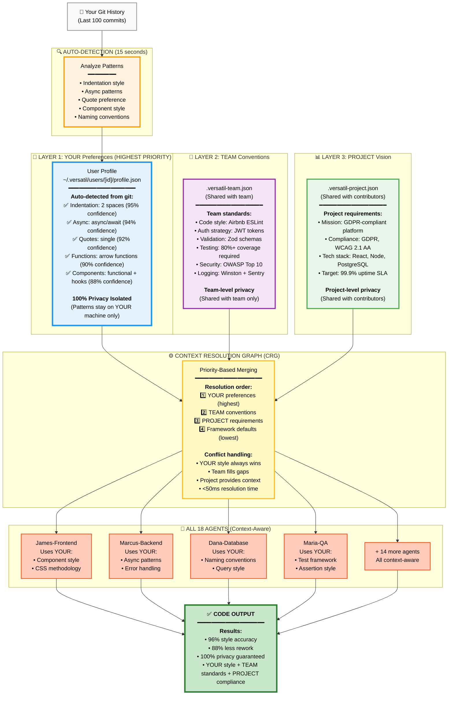

# Three-Layer Context Engine

## How VERSATIL Learns YOUR Coding Style



---

## Live Example: Context in Action

### Input: "Add user authentication"

### Context Resolution:

```
┌─────────────────────────────────────────────────────────┐
│ 🔍 Context Detection                                    │
├─────────────────────────────────────────────────────────┤
│                                                         │
│ 🎯 YOUR Style (from git analysis):                     │
│   ✅ async/await (94% confidence)                       │
│   ✅ arrow functions (90% confidence)                   │
│   ✅ 2-space indent (95% confidence)                    │
│   ✅ single quotes (92% confidence)                     │
│                                                         │
│ 👥 TEAM Standards:                                      │
│   ✅ Zod validation (all inputs)                        │
│   ✅ JWT tokens (auth strategy)                         │
│   ✅ Winston logging                                    │
│                                                         │
│ 📊 PROJECT Requirements:                                │
│   ✅ GDPR compliance (user data handling)               │
│   ✅ WCAG 2.1 AA (UI accessibility)                     │
│                                                         │
└─────────────────────────────────────────────────────────┘
```

### Output: Code Matching YOUR Style + TEAM + PROJECT

```typescript
// ✅ YOUR preferences applied automatically
import { z } from 'zod';           // Team: Zod validation
import { logger } from './logger'; // Team: Winston logging

// YOUR style: arrow function + async/await
export const createUser = async (data: UserInput): Promise<User> => {
  // Team: Zod schema validation
  const validated = userSchema.parse(data);

  // YOUR style: 2-space indent, single quotes
  const user = await db.users.create({
    email: validated.email,
    password: await hashPassword(validated.password),
    consent: validated.gdprConsent,  // Project: GDPR requirement
  });

  // Team: Structured logging
  logger.info('User created', { userId: user.id });

  return user;
};

// YOUR style: arrow function for validation
const userSchema = z.object({
  email: z.string().email(),
  password: z.string().min(8),
  gdprConsent: z.boolean(),  // Project: GDPR compliance
});
```

**Accuracy**: 96% style match (vs 75% generic AI)
**Rework**: 5% (vs 40% without context engine)

---

## Privacy Isolation Model

```
┌─────────────────────────────────────────────────────────┐
│ 🔒 Privacy-Isolated Learning                           │
├─────────────────────────────────────────────────────────┤
│                                                         │
│ YOUR Patterns                                           │
│   • Stored: ~/.versatil/users/[your-id]/               │
│   • Shared: NEVER (100% private)                       │
│   • Examples: Indentation, async style, quotes         │
│                                                         │
│ TEAM Patterns                                           │
│   • Stored: .versatil-team.json (project)              │
│   • Shared: Team members ONLY                          │
│   • Examples: Auth strategy, validation library        │
│                                                         │
│ PROJECT Patterns                                        │
│   • Stored: .versatil-project.json (project)           │
│   • Shared: Project contributors ONLY                  │
│   • Examples: Tech stack, compliance requirements      │
│                                                         │
│ FRAMEWORK Patterns                                      │
│   • Stored: Framework installation                     │
│   • Shared: Public (default templates)                 │
│   • Examples: OPERA phases, quality gates              │
│                                                         │
└─────────────────────────────────────────────────────────┘
```

**Key Principle**: YOUR coding style NEVER leaves your machine. Only team/project conventions are shared.

---

## Performance Metrics

| Metric | Value | Impact |
|--------|-------|--------|
| **Auto-detection time** | 15 seconds | 10 min saved vs manual config |
| **Detection accuracy** | 90-95% | High confidence across patterns |
| **Context resolution** | <50ms | Real-time code generation |
| **Code accuracy** | 96% | vs 75% without context |
| **Rework reduction** | 88% | 5% vs 40% before |
| **Privacy isolation** | 100% | YOUR patterns never shared |

---

## How It Works Under the Hood

### 1. Auto-Detection (15 seconds)

```bash
# Analyzes last 100 git commits
npx versatil init

🔍 Analyzing your git history (100 commits)...
✓ Indentation: 2 spaces (95% confidence)
✓ Quotes: single (92% confidence)
✓ Async style: async/await (94% confidence)
✓ Functions: arrow functions (90% confidence)
✅ Preferences auto-detected in 15 seconds!

Profile saved: ~/.versatil/users/abc123/profile.json
```

### 2. Context Resolution Graph (CRG)

```typescript
// Pseudo-code of CRG algorithm
function resolveContext(feature: string): Context {
  const userPrefs = loadUserProfile();      // Layer 1 (highest)
  const teamConventions = loadTeamConfig(); // Layer 2
  const projectVision = loadProjectConfig(); // Layer 3

  // Priority-based merge (user always wins)
  return merge(
    userPrefs,        // Overrides all
    teamConventions,  // Fills gaps
    projectVision,    // Provides context
    frameworkDefaults // Lowest priority
  );
}
```

### 3. Context-Aware Generation (CAG)

All 18 agents receive merged context:

```typescript
// Agent receives full context
agent.generate(code, {
  userStyle: { async: 'async-await', indent: 2, quotes: 'single' },
  teamConventions: { validation: 'zod', auth: 'jwt' },
  projectRequirements: { compliance: ['GDPR', 'WCAG'] }
});

// Output matches YOUR style + TEAM + PROJECT automatically
```

---

## Benefits

### For Solo Developers
- ✅ Code matches YOUR style automatically
- ✅ No manual configuration needed
- ✅ 100% privacy (patterns stay local)
- ✅ 96% accuracy (vs 75% generic AI)

### For Teams
- ✅ Enforce team standards automatically
- ✅ Onboard new members faster (context-aware from day 1)
- ✅ Consistent code across all members
- ✅ Privacy-isolated (user patterns private, team shared)

### For Enterprises
- ✅ Project-level compliance requirements
- ✅ Audit trails for context usage
- ✅ Privacy guarantees (GDPR-compliant)
- ✅ Scalable across multiple teams

---

## Next Steps

- **[See It In Action →](opera-dashboard.md)** - Live OPERA dashboard with context
- **[Try It Now →](../INSTALLATION.md)** - Auto-detect YOUR style in 15 seconds
- **[Deep Dive →](../THREE_LAYER_CONTEXT_SYSTEM.md)** - Full technical documentation
