# OPERA Workflow: 8 Agents Orchestrating

## Simple View: Add User Authentication Feature

```mermaid
graph TB
    User["👤 YOU<br/>'Add user authentication with JWT'"]

    subgraph PLAN["📋 PHASE 1: PLAN (30 min)"]
        Alex["🔍 <b>Alex-BA</b><br/>Business Analyst<br/>━━━━━━━━<br/>• Extract requirements<br/>• Search RAG for similar auth<br/>• Define API contract"]
        Sarah["✅ <b>Sarah-PM</b><br/>Project Manager<br/>━━━━━━━━<br/>• Validate readiness<br/>• Check dependencies<br/>• Approve execution"]
    end

    subgraph WORK["🚀 PHASE 2: WORK (60 min - Parallel)"]
        Dana["🗄️ <b>Dana-Database</b><br/>Database Architect<br/>━━━━━━━━<br/>• Users table<br/>• Sessions table<br/>• RLS policies<br/>⏱️ 45 min"]

        Marcus["⚙️ <b>Marcus-Backend</b><br/>API Architect<br/>━━━━━━━━<br/>• /auth/signup<br/>• /auth/login<br/>• JWT middleware<br/>⏱️ 60 min"]

        James["🎨 <b>James-Frontend</b><br/>UI/UX Specialist<br/>━━━━━━━━<br/>• LoginForm<br/>• AuthProvider<br/>• Input validation<br/>⏱️ 50 min"]
    end

    subgraph QUALITY["🧪 PHASE 3: QUALITY (20 min)"]
        Maria["✅ <b>Maria-QA</b><br/>Quality Guardian<br/>━━━━━━━━<br/>• Unit tests (85% coverage)<br/>• Integration tests<br/>• Security scan"]
    end

    subgraph SUPPORT["🔌 PHASE 4: SUPPORT (15 min)"]
        Oliver["🔌 <b>Oliver-MCP</b><br/>MCP Orchestrator<br/>━━━━━━━━<br/>• GitHub integration<br/>• Supabase setup<br/>• Semgrep security"]

        DrAI["🤖 <b>Dr.AI-ML</b><br/>AI/ML Specialist<br/>━━━━━━━━<br/>• Fraud detection (optional)<br/>• Usage analytics<br/>• Smart caching"]
    end

    Result[["✅ <b>PRODUCTION READY</b><br/>Total: 125 minutes<br/>(vs 220 sequential)<br/>━━━━━━━━<br/>• Matches YOUR coding style<br/>• 85%+ test coverage<br/>• OWASP security compliant<br/>• Ready to deploy"]]

    User --> Alex
    Alex --> Sarah
    Sarah --> Dana
    Sarah --> Marcus
    Sarah --> James

    Dana --> Maria
    Marcus --> Maria
    James --> Maria

    Maria --> Oliver
    Oliver --> DrAI
    DrAI --> Result

    classDef user fill:#e0e0e0,stroke:#616161,stroke-width:2px,color:#000
    classDef plan fill:#e3f2fd,stroke:#2196f3,stroke-width:3px,color:#000
    classDef work fill:#e8f5e9,stroke:#4caf50,stroke-width:3px,color:#000
    classDef quality fill:#ffccbc,stroke:#ff5722,stroke-width:3px,color:#000
    classDef support fill:#f3e5f5,stroke:#9c27b0,stroke-width:2px,color:#000
    classDef result fill:#c8e6c9,stroke:#2e7d32,stroke-width:4px,color:#000

    class User user
    class Alex,Sarah plan
    class Dana,Marcus,James work
    class Maria quality
    class Oliver,DrAI support
    class Result result
```



## Key Benefits

### ⚡ Parallel Execution
- **Traditional**: 220 min (sequential Frontend → Backend → Database → QA)
- **OPERA**: 125 min (parallel execution of independent tasks)
- **Savings**: 95 minutes (43% faster)

### 🎯 Context-Aware Code
- All agents use **YOUR coding style** (auto-detected from git)
- **96% code accuracy** (vs 75% generic AI)
- **88% less rework** (no style mismatch fixes)

### 🔒 Built-In Quality
- **80%+ test coverage** enforced automatically
- **OWASP Top 10** security scans
- **WCAG 2.1 AA** accessibility checks

### 🚀 Compounding Effect
- **Feature 1** (Auth): 125 min baseline
- **Feature 2** (Similar): 75 min (40% faster!)
- Each feature stores patterns → Next feature reuses them

---

## The 8 OPERA Agents

| Agent | Role | When Active | Tools |
|-------|------|-------------|-------|
| **Alex-BA** | Business Analyst | Requirements extraction | RAG search, API contracts |
| **Sarah-PM** | Project Manager | Coordination, readiness checks | Health checks, dependencies |
| **Dana-Database** | Database Architect | Schema, migrations, queries | PostgreSQL, Supabase, RLS |
| **Marcus-Backend** | API Architect | REST/GraphQL APIs, security | Node.js, Python, OWASP |
| **James-Frontend** | UI/UX Specialist | Components, accessibility | React, Vue, WCAG 2.1 AA |
| **Maria-QA** | Quality Guardian | Testing, coverage, security | Jest, Playwright, Semgrep |
| **Oliver-MCP** | MCP Orchestrator | External integrations | GitHub, Chrome, n8n |
| **Dr.AI-ML** | AI/ML Specialist | ML pipelines, RAG systems | TensorFlow, Vector DBs |

---

## Live Example: Your Coding Style Applied

**Input**: "Add user authentication"

**Output (YOUR style automatically applied)**:
```typescript
// Uses YOUR async/await preference (auto-detected from git)
// Uses YOUR arrow function style (auto-detected)
// Uses YOUR validation library (team convention)

export const createUser = async (data: UserInput): Promise<User> => {
  const validated = userSchema.parse(data);  // Team: Zod validation
  const user = await db.users.create({       // You: async/await
    email: validated.email,                   // You: object shorthand
    password: await hashPassword(validated.password)
  });
  return user;
};
```

**Context Engine Applied**:
- ✅ YOUR preferences: `async/await`, arrow functions, 2-space indent
- ✅ TEAM conventions: Zod validation, security best practices
- ✅ PROJECT requirements: GDPR compliance, audit logging

---

## Next Steps

- **[See Full Workflow →](../VERSATIL_ARCHITECTURE.md)** - Deep dive into OPERA phases
- **[Try It Now →](../INSTALLATION.md)** - Install in 2 minutes
- **[View Dashboard →](opera-dashboard.md)** - See live session simulation
