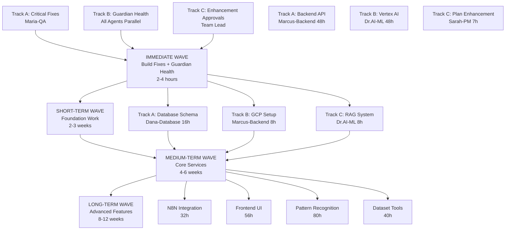

# VERSATIL SDLC Framework - Master Wave Orchestration Plan

**Generated**: 2025-11-18
**Status**: Active
**Total Todos**: 37 active items (22 immediate + 15 backlog)
**Total Effort**: ~250 hours
**Execution Mode**: Parallel waves with dependency management

---

## Executive Summary

This document provides a comprehensive orchestration plan for executing all pending todos across the VERSATIL framework using parallel agent execution within wave-based dependencies.

**Key Insights**:
- **Critical Blocker**: Build/test failures (Maria-QA) - blocks all development
- **Overloaded Agent**: Marcus-Backend (273h of work) - needs prioritization
- **Quick Wins**: 5 Guardian health checks can run in parallel (~2-4h total)
- **Major Initiative**: ML Workflow Automation (448h across 5 waves)

---

## Wave Structure Overview



---

## IMMEDIATE WAVE (Week 1) - Critical Blockers

**Priority**: CRITICAL - Unblock all development
**Duration**: 2-4 hours
**Parallel Execution**: YES (3 tracks)

### Track A: Critical Fixes (BLOCKING) 🔴

**Owner**: Maria-QA
**Duration**: 1-2 hours
**Priority**: CRITICAL - Must complete before anything else

| Todo | Issue | Confidence | Effort |
|------|-------|------------|--------|
| guardian-combined-maria-qa-critical-1763467269260-gtyk.md | Build failed: npm run build | 100% | 30-60min |
| guardian-combined-maria-qa-critical-1763467269260-gtyk.md | Tests failed: stdout maxBuffer exceeded | 100% | 30-60min |

**Execution Command**:
```bash
/maria-qa "Fix critical build and test failures per guardian-combined-maria-qa-critical-1763467269260-gtyk.md"
```

**Success Criteria**:
- [ ] `pnpm run build` completes successfully
- [ ] Tests run without maxBuffer errors
- [ ] All quality gates pass

**Blocks**: Everything - this must complete first

---

### Track B: Guardian Health Checks (Parallel) 🟡

**Owners**: Dr.AI-ML, Marcus-Backend
**Duration**: 1-2 hours
**Priority**: HIGH/LOW (mixed)
**Parallel Execution**: YES - different agents, no dependencies

#### Dr.AI-ML Guardian Fixes (HIGH Priority)

| Todo | Issues | Confidence | Auto-Apply | Effort |
|------|--------|------------|------------|--------|
| guardian-combined-dr-ai-ml-high-1763460419471-et9h.md | GraphRAG connection failed<br/>RAG Router malfunction | 90% | Yes | 30-60min |
| guardian-combined-dr-ai-ml-high-1763462647009-mdqm.md | GraphRAG query timeout (3270ms)<br/>RAG system issues | 90% | Yes | 30-60min |

**Execution Command**:
```bash
/dr-ai-ml "Fix RAG system issues per guardian-combined-dr-ai-ml-high-1763460419471-et9h.md and guardian-combined-dr-ai-ml-high-1763462647009-mdqm.md"
```

#### Marcus-Backend Guardian Fixes (LOW Priority)

| Todo | Issues | Confidence | Auto-Apply | Effort |
|------|--------|------------|------------|--------|
| guardian-combined-marcus-backend-low-1763460419470-1h0f.md | 46 outdated dependencies | 100% | Yes | 15-30min |
| guardian-combined-marcus-backend-low-1763467269262-4cyv.md | 1 TypeScript error<br/>46 outdated dependencies | 98% | Yes | 30-60min |

**Execution Command**:
```bash
/marcus-backend "Update dependencies and fix TypeScript error per guardian-combined-marcus-backend-low-1763460419470-1h0f.md and guardian-combined-marcus-backend-low-1763467269262-4cyv.md"
```

**Recommended Fix**:
```bash
pnpm update
pnpm run typecheck
```

---

### Track C: Enhancement Approvals (Batch Process) 🟢

**Owner**: Team Lead / Product Owner
**Duration**: 1 hour
**Priority**: HIGH - Unblocks 25.5 hours of work
**Parallel Execution**: YES - can review all 9 concurrently

#### Enhancement Review Queue (9 items, 25.5h total)

| Priority | Count | Total Effort | ROI Range |
|----------|-------|--------------|-----------|
| Critical | 2 | 5.5h | Manual review required |
| High | 2 | 8h | 39,008:1 to 117,026:1 |
| Medium | 5 | 12h | 6,643:1 to 119,938:1 |

**Approval Commands**:
```bash
# Critical items (Tier 3 - Manual Review Required)
/approve enhancement-reliability-critical-1761852491886-etli.md --review "Maria-QA: Build reliability (2636 occurrences/24h)"
/approve enhancement-reliability-critical-1761852491902-1je6.md --review "Marcus-Backend: Test reliability (2305 occurrences/24h)"

# High priority items (Tier 2 - Prompt for approval)
/approve enhancement-performance-high-1761852491915-gxwh.md "Marcus-Backend: Query optimization + caching (ROI: 39,008:1)"
/approve enhancement-reliability-high-1761852491915-s8bu.md "Marcus-Backend: RAG system reliability (ROI: 117,026:1)"

# Medium priority items (Tier 2)
/approve enhancement-reliability-medium-1761852491911-xxt5.md "Marcus-Backend: TypeScript reliability"
/approve enhancement-reliability-medium-1761852491916-f4fo.md "Sarah-PM: Agents reliability"
/approve enhancement-reliability-medium-1761852491923-r0he.md "Marcus-Backend: Hooks reliability"
/approve enhancement-reliability-medium-1761852491924-zulg.md "Marcus-Backend: Documentation reliability"
/approve enhancement-reliability-medium-1761852491925-5dr9.md "Marcus-Backend: Dependencies reliability"
```

**Alternative - Batch Approval**:
```bash
/approve-batch todos/enhancement-*.md --filter "priority:critical,high" --dry-run
/approve-batch todos/enhancement-*.md --filter "priority:critical,high" --confirm
```

---

### IMMEDIATE WAVE - Parallel Execution Plan

**Launch all tracks simultaneously** (except Track A must complete first):

```bash
# Step 1: CRITICAL PATH - Must complete first
/maria-qa "Fix critical build and test failures per guardian-combined-maria-qa-critical-1763467269260-gtyk.md"

# Step 2: Wait for Maria-QA completion, then launch parallel tracks
# (Launch these 3 commands in parallel - separate terminal sessions or use &)

# Track B1 - Dr.AI-ML
/dr-ai-ml "Fix RAG system issues per guardian-combined-dr-ai-ml-high-1763460419471-et9h.md and guardian-combined-dr-ai-ml-high-1763462647009-mdqm.md" &

# Track B2 - Marcus-Backend
/marcus-backend "Update dependencies and fix TypeScript error per guardian-combined-marcus-backend-low-1763460419470-1h0f.md and guardian-combined-marcus-backend-low-1763467269262-4cyv.md" &

# Track C - Manual review (can happen in parallel with B1/B2)
# Review and approve 9 enhancement todos using /approve commands above

wait  # Wait for all background jobs to complete
```

**Success Criteria**:
- [ ] Build and tests working (Maria-QA)
- [ ] RAG system operational (Dr.AI-ML)
- [ ] Dependencies updated, TypeScript clean (Marcus-Backend)
- [ ] All enhancements reviewed (approved/rejected/deferred)

**Duration**: 2-4 hours total (parallel execution)

---

## SHORT-TERM WAVE (Weeks 2-3) - Foundation

**Priority**: HIGH - Enables all subsequent work
**Duration**: 2-3 weeks
**Parallel Execution**: YES (3 tracks)
**Dependencies**: IMMEDIATE WAVE must complete

### Track A: Database Schema (CRITICAL PATH) 🔴

**Owner**: Dana-Database
**Duration**: 16 hours
**Priority**: P1 - BLOCKS Wave 2 work
**Parallel**: Can run with Track B and C

| Todo | Description | Effort | Blocks |
|------|-------------|--------|--------|
| backlog/014-pending-p1-database-schema-implementation.md | 11 core tables for ML workflow<br/>(workflows, datasets, models, experiments, features, metrics, etc.) | 16h | Backend API (48h)<br/>Vertex AI integration<br/>All Wave 2 work |

**Deliverables**:
- PostgreSQL schema with Prisma ORM
- Migration scripts
- Seed data for development
- Database documentation

**Execution Command**:
```bash
/dana-database "Implement database schema per backlog/014-pending-p1-database-schema-implementation.md"
```

**Success Criteria**:
- [ ] All 11 tables created with proper relationships
- [ ] Migrations tested (up/down)
- [ ] Seed data loads successfully
- [ ] Schema documented in docs/database/

---

### Track B: GCP Infrastructure (PARALLEL) 🟡

**Owner**: Marcus-Backend
**Duration**: 8 hours
**Priority**: P1 - BLOCKS Vertex AI integration
**Parallel**: Can run with Track A and C

| Todo | Description | Effort | Blocks |
|------|-------------|--------|--------|
| backlog/015-pending-p1-gcp-infrastructure-setup.md | GCP project setup, IAM, Cloud Storage, Vertex AI APIs | 8h | Vertex AI integration (48h) |

**Deliverables**:
- GCP project configured
- Service accounts and IAM roles
- Cloud Storage buckets
- Vertex AI APIs enabled
- Environment configuration

**Execution Command**:
```bash
/marcus-backend "Set up GCP infrastructure per backlog/015-pending-p1-gcp-infrastructure-setup.md"
```

**Success Criteria**:
- [ ] GCP project created and configured
- [ ] All required APIs enabled
- [ ] Service accounts with proper permissions
- [ ] Cloud Storage accessible
- [ ] Environment variables documented

---

### Track C: RAG System Completion (PARALLEL) 🟢

**Owner**: Dr.AI-ML
**Duration**: 8 hours
**Priority**: P1 - Multiple small tasks
**Parallel**: Can run with Track A and B

| Todo | Description | Effort |
|------|-------------|--------|
| backlog/008-pending-p1-rag-context-injection-fixed.md | Fix RAG context injection (COMPLETED - verify) | 30min |
| backlog/010-pending-p1-test-rag-with-real-questions.md | Test RAG with real user questions | 2h |
| backlog/012-pending-p1-context-management-audit.md | Audit context management system | 3h |
| backlog/013-pending-p1-create-library-context-files.md | Create context files for 14+ libraries | 2.5h |

**Execution Command**:
```bash
/dr-ai-ml "Complete RAG system fixes and testing per backlog/010, 012, 013"
```

**Success Criteria**:
- [ ] RAG responds accurately to real questions
- [ ] Context management audit complete
- [ ] Library context files created
- [ ] RAG performance benchmarked

---

### Track D: ML Workflow Validation (PARALLEL) 🟢

**Owner**: Iris-Guardian
**Duration**: 8 hours
**Priority**: P1 - Gap analysis
**Parallel**: Can run with Track A, B, and C

| Todo | Description | Effort |
|------|-------------|--------|
| backlog/013-pending-p1-guardian-ml-workflow-implementation-validation.md | Validate ML workflow across 12 components, 5 waves | 8h |

**Deliverables**:
- Gap analysis report
- Remediation todos generated
- Implementation status dashboard

**Execution Command**:
```bash
/guardian "Validate ML workflow implementation per backlog/013-pending-p1-guardian-ml-workflow-implementation-validation.md"
```

---

### SHORT-TERM WAVE - Parallel Execution Plan

```bash
# Launch all 4 tracks in parallel (no dependencies between them)

# Track A - CRITICAL PATH (longest duration)
/dana-database "Implement database schema per backlog/014-pending-p1-database-schema-implementation.md" &

# Track B
/marcus-backend "Set up GCP infrastructure per backlog/015-pending-p1-gcp-infrastructure-setup.md" &

# Track C
/dr-ai-ml "Complete RAG system fixes and testing per backlog/010, 012, 013" &

# Track D
/guardian "Validate ML workflow implementation per backlog/013-pending-p1-guardian-ml-workflow-implementation-validation.md" &

wait  # Wait for all to complete
```

**Success Criteria**:
- [ ] Database schema deployed and tested
- [ ] GCP infrastructure ready for Vertex AI
- [ ] RAG system fully operational
- [ ] ML workflow gaps identified

**Duration**: 2-3 weeks (parallel execution, Dana-Database is critical path)

---

## MEDIUM-TERM WAVE (Weeks 4-8) - Core Services

**Priority**: HIGH - Main functionality
**Duration**: 4-6 weeks
**Parallel Execution**: LIMITED (some dependencies)
**Dependencies**: SHORT-TERM WAVE must complete

### Track A: Backend API Development (SEQUENTIAL) 🔴

**Owner**: Marcus-Backend
**Duration**: 48 hours
**Priority**: P1 - BLOCKS frontend and N8N
**Dependencies**: Database schema (Track A from SHORT-TERM)

| Todo | Description | Effort | Dependencies |
|------|-------------|--------|--------------|
| backlog/017-pending-p1-backend-api-development.md | REST API for ML workflows<br/>/api/v1/workflows, /datasets, /models, /experiments | 48h | Database schema (16h) |

**Deliverables**:
- RESTful API endpoints
- Authentication & authorization
- API documentation (OpenAPI/Swagger)
- Integration tests
- Error handling

**Execution Command**:
```bash
# Must wait for database schema completion
/marcus-backend "Develop backend API per backlog/017-pending-p1-backend-api-development.md"
```

---

### Track B: Vertex AI Integration (PARALLEL) 🟡

**Owner**: Dr.AI-ML
**Duration**: 48 hours
**Priority**: P1 - Core ML functionality
**Dependencies**: GCP infrastructure (Track B from SHORT-TERM)
**Parallel**: Can run with Track A (different owners)

| Todo | Description | Effort | Dependencies |
|------|-------------|--------|--------------|
| backlog/018-pending-p1-vertex-ai-integration.md | Training, deployment, prediction services<br/>Model registry, experiment tracking | 48h | GCP setup (8h) |

**Deliverables**:
- Vertex AI training pipeline
- Model deployment service
- Prediction API
- Experiment tracking
- Model versioning

**Execution Command**:
```bash
# Must wait for GCP infrastructure completion
/dr-ai-ml "Implement Vertex AI integration per backlog/018-pending-p1-vertex-ai-integration.md"
```

---

### Track C: Plan Command Enhancement (PARALLEL) 🟢

**Owners**: Sarah-PM + Alex-BA + Marcus-Backend
**Duration**: 7 hours
**Priority**: P1 - Productivity improvement
**Parallel**: Can run with Track A and B

| Todo | Description | Effort | Wave |
|------|-------------|--------|------|
| backlog/006-pending-p1-plan-command-integration.md | Integrate pattern search, template matcher, todo generator | 2h | Wave 3 |
| backlog/005-pending-p2-integration-tests-plan-command.md | Integration tests for /plan workflow | 2h | Wave 2 |
| backlog/007-pending-p2-documentation-updates.md | Update docs with compounding engineering | 1h | Wave 4 |

**Execution Command**:
```bash
# Wave 2: Integration Tests (Maria-QA)
/maria-qa "Create integration tests per backlog/005-pending-p2-integration-tests-plan-command.md"

# Wave 3: Integration (after tests pass)
/sarah-pm "Integrate plan command enhancements per backlog/006-pending-p1-plan-command-integration.md"

# Wave 4: Documentation (after integration)
/sarah-pm "Update documentation per backlog/007-pending-p2-documentation-updates.md"
```

---

### Track D: Feature Engineering Pipeline (OPTIONAL PARALLEL) 🟢

**Owner**: Dr.AI-ML
**Duration**: 40 hours
**Priority**: P1 - Can start if bandwidth available
**Dependencies**: None (independent)

| Todo | Description | Effort |
|------|-------------|--------|
| backlog/016-pending-p1-feature-engineering-pipeline.md | Automated feature engineering pipeline | 40h |

**Execution Command**:
```bash
# Optional: Launch if Dr.AI-ML has capacity after Vertex AI
/dr-ai-ml "Build feature engineering pipeline per backlog/016-pending-p1-feature-engineering-pipeline.md"
```

---

### MEDIUM-TERM WAVE - Execution Plan

```bash
# Phase 1: Launch parallel tracks (Tracks A & B run together)
/marcus-backend "Develop backend API per backlog/017-pending-p1-backend-api-development.md" &
/dr-ai-ml "Implement Vertex AI integration per backlog/018-pending-p1-vertex-ai-integration.md" &

# Phase 2: Plan enhancement (can run in parallel with Phase 1)
/maria-qa "Create integration tests per backlog/005-pending-p2-integration-tests-plan-command.md"
# Wait for tests to pass, then:
/sarah-pm "Integrate plan command enhancements per backlog/006-pending-p1-plan-command-integration.md"
/sarah-pm "Update documentation per backlog/007-pending-p2-documentation-updates.md"

wait  # Wait for Phase 1 to complete
```

**Success Criteria**:
- [ ] Backend API operational and tested
- [ ] Vertex AI training/deployment working
- [ ] /plan command enhanced with RAG
- [ ] Integration tests passing (80%+ coverage)

**Duration**: 4-6 weeks (parallel execution)

---

## LONG-TERM WAVE (Weeks 9-16) - Advanced Features

**Priority**: MEDIUM - Enhancement features
**Duration**: 8-12 weeks
**Parallel Execution**: LIMITED (sequential dependencies)
**Dependencies**: MEDIUM-TERM WAVE must complete

### Track A: N8N Workflow Integration (SEQUENTIAL)

**Owner**: Marcus-Backend
**Duration**: 32 hours
**Dependencies**: Backend API (48h)

| Todo | Effort | Dependencies |
|------|--------|--------------|
| backlog/019-pending-p2-n8n-workflow-integration.md | 32h | Backend API |

**Execution Command**:
```bash
/marcus-backend "Implement N8N workflow integration per backlog/019-pending-p2-n8n-workflow-integration.md"
```

---

### Track B: Frontend UI Components (PARALLEL)

**Owner**: James-Frontend
**Duration**: 56 hours
**Dependencies**: Backend API (48h)
**Parallel**: Can run with Track A

| Todo | Effort | Dependencies |
|------|--------|--------------|
| backlog/020-pending-p2-frontend-ui-components.md | 56h | Backend API |

**Execution Command**:
```bash
/james-frontend "Build frontend UI components per backlog/020-pending-p2-frontend-ui-components.md"
```

---

### Track C: Pattern Recognition Framework (SEQUENTIAL)

**Owner**: Dr.AI-ML
**Duration**: 80 hours
**Dependencies**: Feature engineering pipeline, datasets

| Todo | Effort | Dependencies |
|------|--------|--------------|
| backlog/021-pending-p2-pattern-recognition-framework.md | 80h | Feature engineering |

**Execution Command**:
```bash
/dr-ai-ml "Build pattern recognition framework per backlog/021-pending-p2-pattern-recognition-framework.md"
```

---

### Track D: Dataset Building Tools (PARALLEL)

**Owner**: Dr.AI-ML
**Duration**: 40 hours
**Dependencies**: Backend API
**Parallel**: Can run with Track B

| Todo | Effort | Dependencies |
|------|--------|--------------|
| backlog/022-pending-p2-dataset-building-tools.md | 40h | Backend API |

**Execution Command**:
```bash
/dr-ai-ml "Create dataset building tools per backlog/022-pending-p2-dataset-building-tools.md"
```

---

### Track E: ML Test Coverage (SEQUENTIAL)

**Owner**: Maria-QA
**Duration**: 64 hours (estimated)
**Dependencies**: All ML components complete

| Todo | Effort | Dependencies |
|------|--------|--------------|
| backlog/023-pending-p1-ml-test-coverage.md | 64h | All ML components |

**Execution Command**:
```bash
/maria-qa "Create comprehensive ML test coverage per backlog/023-pending-p1-ml-test-coverage.md"
```

---

### Track F: ML Documentation (FINAL)

**Owner**: Sarah-PM
**Duration**: 16 hours
**Dependencies**: All ML work complete

| Todo | Effort | Dependencies |
|------|--------|--------------|
| backlog/024-pending-p3-ml-documentation.md | 16h | All ML work |

**Execution Command**:
```bash
/sarah-pm "Create ML documentation per backlog/024-pending-p3-ml-documentation.md"
```

---

### LONG-TERM WAVE - Execution Plan

```bash
# Phase 1: Backend-dependent work (parallel)
/marcus-backend "Implement N8N workflow integration per backlog/019-pending-p2-n8n-workflow-integration.md" &
/james-frontend "Build frontend UI components per backlog/020-pending-p2-frontend-ui-components.md" &
/dr-ai-ml "Create dataset building tools per backlog/022-pending-p2-dataset-building-tools.md" &

wait

# Phase 2: Advanced ML work (sequential)
/dr-ai-ml "Build pattern recognition framework per backlog/021-pending-p2-pattern-recognition-framework.md"

# Phase 3: Testing and documentation (sequential)
/maria-qa "Create comprehensive ML test coverage per backlog/023-pending-p1-ml-test-coverage.md"
/sarah-pm "Create ML documentation per backlog/024-pending-p3-ml-documentation.md"
```

**Duration**: 8-12 weeks

---

## Agent Workload Summary

### Critical Path Analysis

**Longest sequential chain** (critical path):
1. Maria-QA: Fix build/tests (1-2h) → BLOCKS EVERYTHING
2. Dana-Database: Database schema (16h) → BLOCKS Backend API
3. Marcus-Backend: Backend API (48h) → BLOCKS Frontend/N8N
4. James-Frontend: UI Components (56h) OR N8N Integration (32h)
5. Maria-QA: ML Test Coverage (64h)
6. Sarah-PM: Documentation (16h)

**Total Critical Path**: ~200 hours sequential work

**Parallel Work Available**: ~50 hours can run concurrently

**Total Calendar Time**: 12-16 weeks (with parallel execution and realistic velocity)

---

### Workload Distribution

| Agent | Immediate | Short-Term | Medium-Term | Long-Term | Total |
|-------|-----------|------------|-------------|-----------|-------|
| **Maria-QA** | 1-2h 🔴 | - | 2h | 64h | ~70h |
| **Marcus-Backend** | 1-2h | 8h | 48h | 32h | ~90h |
| **Dr.AI-ML** | 1-2h | 8h | 88h | 120h | ~220h |
| **Dana-Database** | - | 16h 🔴 | - | - | 16h |
| **Sarah-PM** | 1h | - | 3h | 16h | 20h |
| **Iris-Guardian** | - | 8h | - | - | 8h |
| **James-Frontend** | - | - | - | 56h | 56h |
| **Alex-BA** | - | - | Support | - | ~5h |

🔴 = Critical path / blocking work

---

## Risk Mitigation

### High-Risk Items

1. **Build/Test Failures (CRITICAL)** ⚠️
   - **Risk**: Blocks all development
   - **Owner**: Maria-QA
   - **Mitigation**: Make this THE top priority, all hands if needed
   - **Fallback**: Use CI/CD for testing temporarily

2. **Marcus-Backend Overload** ⚠️
   - **Risk**: 90 hours of assigned work (bottleneck)
   - **Mitigation**:
     - Delegate N8N work to another agent
     - Defer low-priority enhancements
     - Focus on critical path only
   - **Fallback**: Extend timeline or add resources

3. **Database Schema Blocker** ⚠️
   - **Risk**: 16h blocks 160+ hours of work
   - **Owner**: Dana-Database
   - **Mitigation**: Start immediately after build fixes
   - **Fallback**: Use SQLite for early development

### Medium-Risk Items

4. **GCP Infrastructure Dependencies** ⚠️
   - **Risk**: If GCP setup fails, Vertex AI blocked
   - **Mitigation**: Have Marcus-Backend start early, test incrementally
   - **Fallback**: Use local ML training temporarily

5. **RAG System Complexity** ⚠️
   - **Risk**: GraphRAG issues may be complex to debug
   - **Mitigation**: Dr.AI-ML has high confidence (90%) in fixes
   - **Fallback**: Use simpler vector store temporarily

---

## Success Metrics

### Wave Completion Criteria

**IMMEDIATE WAVE** ✅:
- [ ] Build passes: `pnpm run build` succeeds
- [ ] Tests pass: No maxBuffer errors
- [ ] RAG operational: GraphRAG responds correctly
- [ ] Dependencies current: `pnpm outdated` shows minimal issues
- [ ] Enhancements approved: All 9 reviewed (approved/rejected/deferred)

**SHORT-TERM WAVE** ✅:
- [ ] Database deployed: All 11 tables created
- [ ] GCP ready: Vertex AI APIs enabled
- [ ] RAG complete: Real questions answered accurately
- [ ] ML gaps identified: Guardian validation complete

**MEDIUM-TERM WAVE** ✅:
- [ ] API operational: All endpoints tested
- [ ] Vertex AI working: Training/deployment functional
- [ ] /plan enhanced: RAG-powered planning works
- [ ] Tests passing: 80%+ coverage maintained

**LONG-TERM WAVE** ✅:
- [ ] N8N integrated: Workflows automated
- [ ] Frontend complete: UI components functional
- [ ] ML advanced: Pattern recognition operational
- [ ] Documentation complete: All docs updated

---

## Monitoring & Reporting

### Daily Standup Template

```markdown
## VERSATIL Wave Execution - Daily Standup

**Date**: YYYY-MM-DD
**Current Wave**: [IMMEDIATE / SHORT-TERM / MEDIUM-TERM / LONG-TERM]

### Completed Today
- [ ] Agent: Task completed (Xh)

### In Progress
- [ ] Agent: Task name (Xh remaining)

### Blocked
- [ ] Agent: Task name - BLOCKER: reason

### Starting Tomorrow
- [ ] Agent: Task name (Xh estimated)

### Risks & Issues
- Issue: description
- Mitigation: plan

### Wave Progress
- IMMEDIATE: X/5 todos complete (X%)
- SHORT-TERM: X/4 tracks complete (X%)
- MEDIUM-TERM: X/4 tracks complete (X%)
- LONG-TERM: X/6 tracks complete (X%)
```

### Wave Transition Checklist

Before moving to next wave:
- [ ] All todos in current wave marked RESOLVED or DEFERRED
- [ ] Success criteria met (see above)
- [ ] Critical path validated (no blockers)
- [ ] Next wave dependencies satisfied
- [ ] Agent capacity confirmed
- [ ] Risks documented and mitigated

---

## Quick Reference Commands

### Launch Entire IMMEDIATE WAVE
```bash
# Critical path first
/maria-qa "Fix critical build and test failures per guardian-combined-maria-qa-critical-1763467269260-gtyk.md"

# Then parallel execution
/dr-ai-ml "Fix RAG system issues per guardian-combined-dr-ai-ml-high-1763460419471-et9h.md and guardian-combined-dr-ai-ml-high-1763462647009-mdqm.md" &
/marcus-backend "Update dependencies and fix TypeScript error per guardian-combined-marcus-backend-low-1763460419470-1h0f.md and guardian-combined-marcus-backend-low-1763467269262-4cyv.md" &
wait
```

### Launch SHORT-TERM WAVE (Parallel)
```bash
/dana-database "Implement database schema per backlog/014-pending-p1-database-schema-implementation.md" &
/marcus-backend "Set up GCP infrastructure per backlog/015-pending-p1-gcp-infrastructure-setup.md" &
/dr-ai-ml "Complete RAG system fixes and testing per backlog/010, 012, 013" &
/guardian "Validate ML workflow implementation per backlog/013-pending-p1-guardian-ml-workflow-implementation-validation.md" &
wait
```

### Check Wave Status
```bash
# List all active todos
find todos -name "*.md" ! -path "*/archive/*" -type f

# Count by agent
grep -r "assigned_agent:" todos/*.md | sort | uniq -c

# Check priority distribution
grep -r "priority:" todos/*.md | sort | uniq -c
```

---

**Last Updated**: 2025-11-18
**Status**: Active - Ready for execution
**Next Review**: After IMMEDIATE WAVE completion

🤖 Generated with Claude Code
Co-Authored-By: Claude <noreply@anthropic.com>
