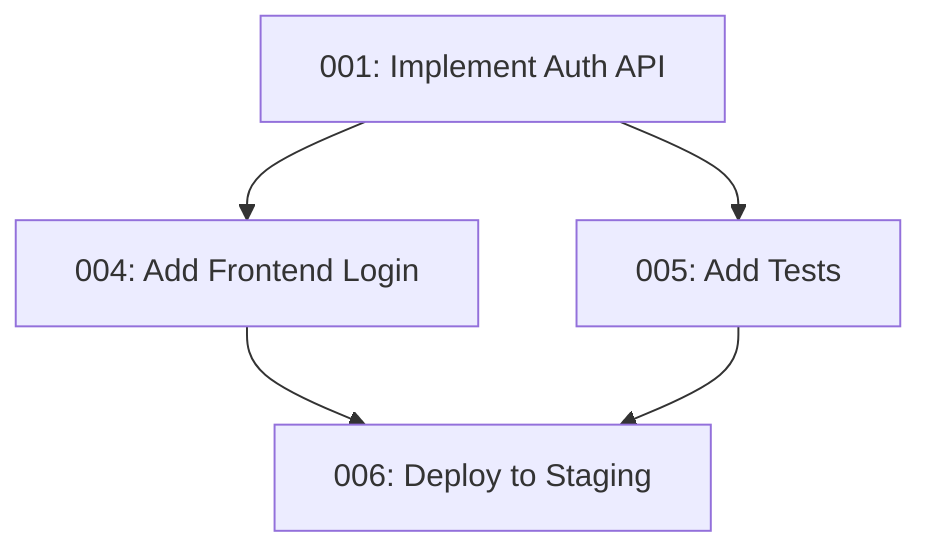

# VERSATIL OPERA Todo System

**Persistent task tracking** for cross-session continuity and team collaboration.

## Overview

VERSATIL uses a **dual todo system** inspired by Every Inc's proven workflow:

1. **`todos/*.md` files** (this directory) - Persistent, cross-session tracking
2. **TodoWrite tool** - In-session, real-time progress visibility

Together, these systems ensure **zero context loss** across sessions and enable effective team collaboration.

### 🆕 Automated Todo Generation (v6.6.0+)

The enhanced `/plan` command now automatically generates both todo systems using the **Todo File Generator** service:

```bash
/plan "Add user authentication"
```

**What Gets Created**:
- ✅ Numbered `todos/*.md` files (001-pending-p1-auth-api.md, 002-pending-p1-login-ui.md, etc.)
- ✅ TodoWrite items synchronized with files
- ✅ Dependency graphs (Mermaid diagrams)
- ✅ Execution waves (parallel vs sequential task detection)
- ✅ Auto-numbering (finds next available number)
- ✅ Agent assignments (Marcus-Backend, James-Frontend, etc.)

**Benefits**:
- **Zero manual file creation** - All todos generated automatically
- **Dependency tracking** - Visual graphs show task relationships
- **Parallel execution** - Detects which tasks can run simultaneously
- **Consistent structure** - Template-based generation ensures quality

**See**: [Pattern Search Service](../src/planning/todo-file-generator.ts) for implementation details

---

## File Naming Convention

```
[NUMBER]-[STATUS]-[PRIORITY]-[SHORT-DESCRIPTION].md

Examples:
├── 000-pending-p1-TEMPLATE.md          ← Template (don't modify)
├── 001-pending-p1-implement-auth-api.md
├── 002-pending-p2-add-test-coverage.md
├── 003-resolved-optimize-queries.md
└── 004-pending-p1-fix-accessibility.md
```

### Components

- **NUMBER**: Sequential (001, 002, 003...) - Run `ls todos/ | grep -o '^[0-9]\+' | sort -n | tail -1` to get last number
- **STATUS**:
  - `pending` - Not yet started or in progress
  - `resolved` - Completed and verified
- **PRIORITY**:
  - `p1` - Critical (blocks other work, production issues)
  - `p2` - High (important features, significant bugs)
  - `p3` - Medium (enhancements, minor bugs)
  - `p4` - Low (nice-to-have, technical debt)
- **SHORT-DESCRIPTION**: Kebab-case summary (e.g., `implement-auth-api`)

---

## Workflow

### 1. Creating New Todos

**Manual Creation**:
```bash
# Get next number
NEXT=$(ls todos/ | grep -o '^[0-9]\+' | sort -n | tail -1 | awk '{print $1+1}')
NEXT=$(printf "%03d" $NEXT)  # Pad with zeros

# Copy template
cp todos/000-pending-p1-TEMPLATE.md todos/${NEXT}-pending-p2-your-task-name.md

# Edit the file
code todos/${NEXT}-pending-p2-your-task-name.md
```

**Via `/versatil:plan` Command**:
- Automatically creates todos from feature requirements
- Sets priority based on Alex-BA's analysis
- Links dependencies
- Loads into TodoWrite for session tracking

**Via `/versatil:review` Command**:
- Creates todos from code review findings
- Each finding becomes a tracked task
- Triaged with priority assignment

### 2. Working on Todos

**Via `/versatil:work` Command**:
```bash
# Analyzes work document
# Loads existing todos/*.md files
# Creates TodoWrite list for session tracking
# Executes systematically, updating both systems
```

**Via `/versatil:resolve` Command**:
```bash
# Loads all pending todos
# Analyzes dependencies
# Creates parallel execution plan
# Resolves multiple todos simultaneously
```

**Manual Execution**:
1. Open the todo file: `cat todos/001-pending-p1-task.md`
2. Review acceptance criteria and context
3. Execute the work (with appropriate OPERA agent)
4. Update checklist as you progress
5. Mark as resolved when complete

### 3. Resolving Todos

**Option A: Move to resolved directory**
```bash
mkdir -p todos/resolved
mv todos/001-pending-p1-task.md todos/resolved/001-resolved-task.md
```

**Option B: Rename with resolved prefix**
```bash
mv todos/001-pending-p1-task.md todos/001-resolved-task.md
```

**Option C: Update status in file** (keep for audit trail)
- Change `- [ ] Pending` to `- [x] Resolved`
- Add resolution date
- Add notes about implementation

---

## Integration with TodoWrite

### During Active Sessions

**Load Persistent State**:
```bash
# /versatil:work command automatically:
1. Scans todos/*.md for pending tasks
2. Creates TodoWrite list from todos
3. Links each TodoWrite item to its file
4. Updates both systems as work progresses
```

**TodoWrite → File Sync**:
- When TodoWrite item marked `completed` → Update corresponding `.md` file
- When all criteria met → Move file to resolved
- Progress saved across sessions

**Example Session Flow**:
```
Session 1:
  /versatil:work feature-plan.md
  → Loads todos/001-pending-p1-auth.md
  → Creates TodoWrite: [Implement Auth API] (pending)
  → Mark as in_progress in TodoWrite
  → Complete task
  → Mark as completed in TodoWrite
  → Update todos/001-pending-p1-auth.md → resolved

Session ends → Progress saved to todos/*.md files

Session 2:
  /versatil:work feature-plan.md
  → Loads remaining todos (002, 003, 004...)
  → Skips 001 (already resolved)
  → Creates TodoWrite for remaining tasks
  → Continue where left off ✅
```

---

## Priority Guidelines

### P1 - Critical
- **When**: Production issues, blocking bugs, security vulnerabilities
- **Response**: Immediate attention required
- **Examples**:
  - Security breach fix
  - Production API down
  - Data loss bug
  - Deployment blocker

### P2 - High
- **When**: Important features, significant bugs, sprint commitments
- **Response**: Complete within current sprint
- **Examples**:
  - Core feature implementation
  - Major refactoring
  - Important accessibility fixes
  - Performance optimization

### P3 - Medium
- **When**: Enhancements, minor bugs, quality improvements
- **Response**: Complete when capacity allows
- **Examples**:
  - UI polish
  - Code cleanup
  - Test coverage improvements
  - Documentation updates

### P4 - Low
- **When**: Nice-to-have features, technical debt, optimizations
- **Response**: Backlog for future sprints
- **Examples**:
  - Experimental features
  - Minor refactoring
  - Code style improvements
  - Aspirational enhancements

---

## Agent Assignment

Match todos to OPERA agents based on domain:

- **Maria-QA**: Testing, quality gates, bug fixes, security audits
- **James-Frontend**: UI components, accessibility, frontend performance, design system
- **Marcus-Backend**: APIs, databases, security, scalability, backend performance
- **Alex-BA**: Requirements analysis, user stories, business logic, stakeholder communication
- **Sarah-PM**: Project coordination, documentation, roadmaps, sprint planning
- **Dr.AI-ML**: ML models, data processing, AI integration, model deployment

**Multi-Agent Todos**: Some todos require multiple agents (e.g., full-stack features). List all involved agents in the file.

---

## Dependency Management

### Tracking Dependencies

In each todo file:
```markdown
## Dependencies
- **Depends on**: 003 - API endpoint must be implemented first
- **Blocks**: 007, 008 - Frontend components waiting for this
- **Related to**: 012 - Similar authentication work
```

### Visualization

Create dependency graph:
```bash
# /versatil:resolve analyzes dependencies and generates mermaid diagram
```



### Parallel vs Sequential

- **Parallel**: Todos with no dependencies can be resolved simultaneously
- **Sequential**: Dependencies must complete first
- `/versatil:resolve` automatically identifies parallelization opportunities

---

## Best Practices

### ✅ Do

1. **Create todos early** - Don't wait until you're ready to start
2. **Be specific** - Clear acceptance criteria prevent scope creep
3. **Link context** - Reference issues, PRs, docs, design files
4. **Update regularly** - Keep status current, add notes as you learn
5. **Break down large tasks** - Create multiple todos for complex features
6. **Use priorities** - Don't make everything P1
7. **Track dependencies** - Helps with planning and parallelization
8. **Resolve completely** - All criteria met, tests pass, docs updated

### ❌ Don't

1. **Don't leave todos stale** - If no longer relevant, resolve with notes
2. **Don't skip the template** - Consistent structure helps everyone
3. **Don't make vague todos** - "Make it better" isn't actionable
4. **Don't forget testing** - All todos should have test requirements
5. **Don't ignore dependencies** - Blocking work leads to frustration
6. **Don't work without todos** - Tracking ensures nothing is forgotten
7. **Don't create duplicate todos** - Search first: `grep -r "auth" todos/`

---

## Commands Reference

### List Pending Todos
```bash
ls todos/*-pending-*.md

# By priority
ls todos/*-pending-p1-*.md  # Critical only
ls todos/*-pending-p2-*.md  # High only
```

### Search Todos
```bash
# Find todos about authentication
grep -r "auth" todos/

# Find todos assigned to Marcus
grep -r "Marcus-Backend" todos/*-pending-*.md
```

### Count Stats
```bash
# Pending count
ls todos/*-pending-*.md | wc -l

# Resolved count
ls todos/*-resolved-*.md | wc -l

# By priority
ls todos/*-pending-p1-*.md | wc -l
```

### Create Next Todo
```bash
# Get next number
NEXT=$(ls todos/ | grep -o '^[0-9]\+' | sort -n | tail -1 | awk '{print $1+1}')
NEXT=$(printf "%03d" $NEXT)

# Copy and edit
cp todos/000-pending-p1-TEMPLATE.md todos/${NEXT}-pending-p2-my-task.md
code todos/${NEXT}-pending-p2-my-task.md
```

---

## Workflow Command Integration

### `/versatil:plan [feature]`
1. Analyzes feature requirements with OPERA agents
2. Creates numbered todo files for each deliverable
3. Sets priorities based on business value
4. Links dependencies
5. Generates TodoWrite list for session

### `/versatil:review [PR]`
1. Multi-agent code review
2. Creates todo files for findings
3. Triages by severity (findings → priority)
4. Links to PR for context
5. Ready for `/versatil:resolve`

### `/versatil:work [plan file]`
1. Loads existing todos/*.md files
2. Creates TodoWrite for session tracking
3. Executes tasks systematically
4. Updates both TodoWrite and files
5. Resolves todos as completed

### `/versatil:resolve [filter]`
1. Loads pending todos (filtered by priority/agent)
2. Analyzes dependencies
3. Creates parallel execution plan
4. Spawns agent tasks in parallel
5. Resolves todos and updates files

---

## Example Todo File

See [000-pending-p1-TEMPLATE.md](000-pending-p1-TEMPLATE.md) for the complete template.

**Real Example**:
```markdown
# Implement JWT Authentication API - P1

## Status
- [ ] Pending
- **Priority**: P1 (Critical - blocks frontend work)
- **Created**: 2025-10-12
- **Assigned**: Marcus-Backend
- **Estimated Effort**: Large

## Description
Implement secure JWT-based authentication for the REST API. This includes user login, token generation, token validation middleware, and refresh token functionality.

## Acceptance Criteria
- [ ] POST /api/auth/login endpoint accepts email/password, returns JWT
- [ ] JWT tokens expire after 15 minutes
- [ ] Refresh tokens expire after 7 days
- [ ] Middleware validates JWT on protected routes
- [ ] OWASP Top 10 compliance validated
- [ ] 80%+ test coverage

## Context
- **Related Issue**: #45 - User Authentication Feature
- **Related PR**: TBD (will create after implementation)
- **Files Involved**:
  - `src/api/auth/login.ts`
  - `src/middleware/jwt-validator.ts`
  - `src/models/user.ts`
- **References**:
  - [JWT Best Practices](https://...)
  - [OWASP Authentication Cheatsheet](https://...)

## Dependencies
- **Depends on**: 001 - Database user table must exist first
- **Blocks**: 004 - Frontend login component
- **Blocks**: 005 - Protected API endpoints

## Implementation Notes
Use `jsonwebtoken` library with RS256 algorithm (asymmetric keys).
Store refresh tokens in Redis for fast validation and revocation.

### Suggested Approach
1. Create user model with password hashing (bcrypt)
2. Implement login endpoint with validation
3. Generate JWT with user claims
4. Create middleware for JWT validation
5. Add refresh token functionality

[... rest of template ...]
```

---

## Questions?

- **Where do todos come from?** Created by workflow commands or manually
- **Do I have to use both systems?** Yes - persistent files + TodoWrite work together
- **What if I forget to resolve?** Run `/versatil:resolve` to sync state
- **Can I modify the template?** Yes, but keep the core structure
- **How do I track time?** Add estimates and actual time in notes section

---

**Last Updated**: 2025-10-12
**Maintained By**: VERSATIL OPERA Framework Team
