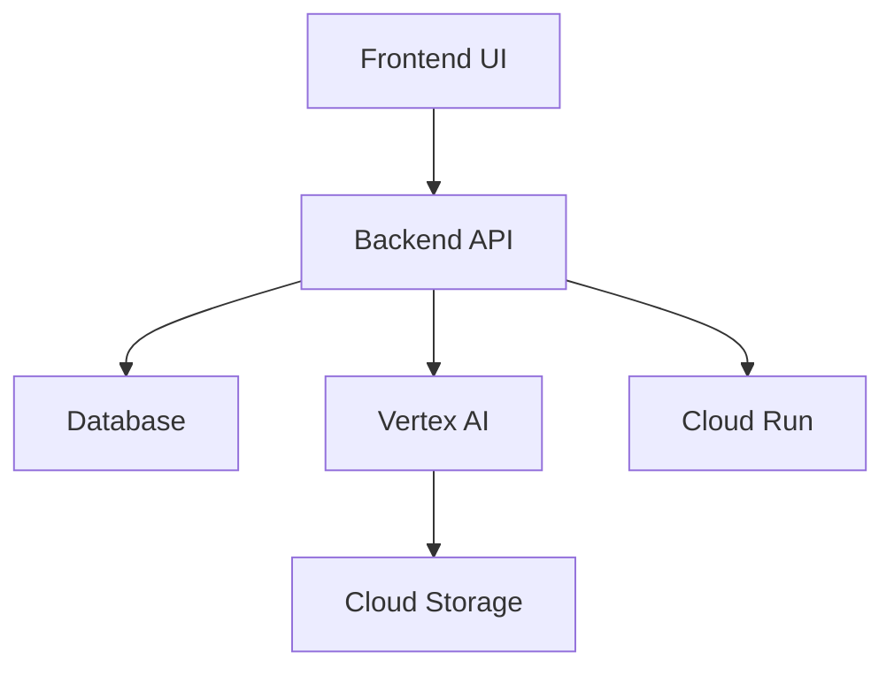

# ML Documentation - ML Workflow Automation

**Status**: Pending
**Priority**: P3 (Low - Post-Implementation)
**Assigned**: Sarah-PM
**Estimated**: 16h
**Wave**: 5 (Quality & Documentation)
**Created**: 2025-10-29

## Mission

Create comprehensive documentation for ML workflow automation covering architecture, API reference, user guides, deployment instructions, and troubleshooting. Ensure documentation is accessible, searchable, and maintained.

## Context

**Validation Finding**: ⚠️ PARTIAL (Framework has docs/ but NO ML-specific documentation)
- Framework documentation exists (CLAUDE.md, README.md, architecture docs)
- No ML feature documentation
- No API reference for ML endpoints
- No user guides for ML workflows
- No deployment guides for Vertex AI/Cloud Run

**Why This is Important**:
- Onboarding new developers (reduces ramp-up from weeks to days)
- User adoption (non-technical users need guides)
- Maintenance (future developers understand decisions)
- Support reduction (self-service via docs)

**Not Critical Path**: Features work without docs, but adoption suffers

## Requirements

### Documentation Structure (6 Categories)

#### 1. Architecture Documentation
**Files**:
- `docs/ml/ARCHITECTURE.md` - System design, component diagram, data flow
- `docs/ml/DATABASE_SCHEMA.md` - ER diagram, table descriptions
- `docs/ml/API_DESIGN.md` - RESTful design principles, versioning strategy

**Content**:
- High-level architecture diagram (frontend → API → Vertex AI → database)
- Component interaction flows (training pipeline, prediction pipeline)
- Technology stack rationale
- Scalability considerations
- Security architecture

#### 2. API Reference
**Files**:
- `docs/ml/API_REFERENCE.md` - Complete endpoint documentation
- `openapi.yaml` - OpenAPI 3.0 specification (machine-readable)

**Content** (for each endpoint):
- HTTP method and path
- Request parameters (path, query, body)
- Request body schema (JSON)
- Response codes (200, 400, 401, 404, 500)
- Response body schema
- Code examples (curl, JavaScript, Python)
- Error handling

**Example Entry**:
```markdown
### POST /api/v1/workflows

Create new workflow.

**Request Body**:
```json
{
  "name": "string",
  "workflow_type": "training" | "prediction" | "data-processing",
  "description": "string (optional)",
  "config": {
    "dataset_id": "string (optional)",
    "model_id": "string (optional)",
    "parameters": {}
  }
}
```

**Response** (201 Created):
```json
{
  "data": {
    "id": "uuid",
    "name": "string",
    "status": "draft",
    "created_at": "ISO8601 timestamp"
  }
}
```

**Errors**:
- 400: Invalid request body
- 401: Unauthorized
- 500: Internal server error

**Example**:
```bash
curl -X POST https://api.example.com/api/v1/workflows \
  -H "Authorization: Bearer $TOKEN" \
  -H "Content-Type: application/json" \
  -d '{"name": "My Workflow", "workflow_type": "training"}'
```
```

#### 3. User Guides
**Files**:
- `docs/ml/USER_GUIDE.md` - Getting started, common workflows
- `docs/ml/DATASET_MANAGEMENT.md` - Upload, version, explore datasets
- `docs/ml/MODEL_TRAINING.md` - Create experiments, configure training
- `docs/ml/MODEL_DEPLOYMENT.md` - Deploy to Cloud Run, A/B testing
- `docs/ml/PATTERN_RECOGNITION.md` - Use pre-trained models, fine-tuning

**Content** (step-by-step with screenshots):
- Prerequisites
- Walkthrough with example data
- Expected outcomes
- Troubleshooting common issues

**Example Walkthrough**:
```markdown
## Creating Your First Training Workflow

### Step 1: Prepare Dataset

1. Navigate to Datasets page
2. Click "New Dataset"
3. Upload files (images, CSV, etc.)
   ![Dataset Upload Screenshot]
4. Review dataset preview
5. Click "Create"

### Step 2: Create Workflow

1. Go to Workflows page
2. Click "New Workflow"
3. Drag "Dataset" node to canvas
4. Drag "Training" node to canvas
5. Connect nodes
   ![Workflow Canvas Screenshot]
6. Configure training parameters:
   - Epochs: 10
   - Batch size: 32
   - Learning rate: 0.001
7. Click "Save"

### Step 3: Execute Training

1. Click "Execute" button
2. Monitor progress in real-time
   ![Training Dashboard Screenshot]
3. View metrics (loss, accuracy)
4. Wait for completion (5-30 minutes)

### Step 4: View Results

1. Navigate to Models page
2. Find your trained model
3. Review metrics and hyperparameters
4. Download model or deploy to Cloud Run
```

#### 4. Deployment Guides
**Files**:
- `docs/ml/DEPLOYMENT.md` - Production deployment checklist
- `docs/ml/GCP_SETUP.md` - GCP project configuration
- `docs/ml/VERTEX_AI_SETUP.md` - Vertex AI setup and permissions
- `docs/ml/CLOUD_RUN_DEPLOYMENT.md` - Container deployment

**Content**:
- Prerequisites (GCP account, billing, quotas)
- Step-by-step infrastructure provisioning
- Environment variables
- Security best practices
- Monitoring and logging setup
- Disaster recovery

#### 5. Troubleshooting Guides
**Files**:
- `docs/ml/TROUBLESHOOTING.md` - Common errors and solutions
- `docs/ml/FAQ.md` - Frequently asked questions

**Content** (problem → solution format):
```markdown
## Training Job Fails with "Out of Memory"

**Symptoms**:
- Training job fails after a few minutes
- Vertex AI logs show "OOM: Out of memory"

**Cause**:
- Batch size too large for GPU memory
- Model too large
- Insufficient GPU memory allocated

**Solution**:
1. Reduce batch size in training config (32 → 16)
2. Use gradient accumulation
3. Upgrade to larger GPU (T4 → V100)
4. Enable mixed precision training (FP16)

**Prevention**:
- Start with small batch sizes
- Monitor GPU memory usage during training
```

#### 6. Contributing Guide
**Files**:
- `docs/ml/CONTRIBUTING.md` - How to contribute new features
- `docs/ml/DEVELOPMENT.md` - Local development setup

**Content**:
- Code of conduct
- Development environment setup
- Testing requirements (85%+ coverage)
- PR process
- Coding standards

## Acceptance Criteria

- [ ] All 6 documentation categories created
- [ ] API reference complete (25+ endpoints documented)
- [ ] 5+ user guides with step-by-step instructions
- [ ] OpenAPI 3.0 spec generated and validated
- [ ] All code examples tested and working
- [ ] Screenshots/diagrams included (10+)
- [ ] Searchable (docs site with search)
- [ ] Accessible (WCAG 2.1 AA compliant)
- [ ] Version controlled (in Git)
- [ ] Review and approval by 2+ team members

## Technical Approach

### Documentation Platform

**Option 1**: Markdown in Git + Docusaurus (Recommended)
- **Pros**: Version controlled, search, versioning, React components
- **Cons**: Requires build step

**Option 2**: GitHub Wiki
- **Pros**: Simple, integrated with repo
- **Cons**: Limited customization, no version control

**Option 3**: GitBook
- **Pros**: Beautiful UI, search, collaboration
- **Cons**: Paid for private docs

**Recommended**: Docusaurus for professional, searchable docs

### Documentation Generation

**API Reference**: Generate from OpenAPI spec
```bash
# Generate OpenAPI spec from code
npx swagger-jsdoc -d swaggerDef.js src/api/routes/*.ts -o openapi.yaml

# Generate markdown docs from OpenAPI
npx widdershins openapi.yaml -o docs/ml/API_REFERENCE.md
```

**Database Schema**: Generate from Prisma schema
```bash
npx prisma-docs-generator
```

### Diagram Generation

**Architecture Diagrams**: Mermaid (markdown-based)


**ER Diagrams**: dbdiagram.io or Mermaid

### Code Examples Testing

Embed examples in tests to ensure correctness:
```typescript
// tests/docs/api_examples.test.ts
describe('API Documentation Examples', () => {
  it('POST /api/v1/workflows example should work', async () => {
    // Exact code from docs
    const response = await request(app)
      .post('/api/v1/workflows')
      .set('Authorization', `Bearer ${token}`)
      .send({
        name: 'My Workflow',
        workflow_type: 'training'
      });

    expect(response.status).toBe(201);
  });
});
```

## Dependencies

**Required Tools**:
```json
{
  "devDependencies": {
    "@docusaurus/core": "^3.0.0",
    "@docusaurus/preset-classic": "^3.0.0",
    "swagger-jsdoc": "^6.2.0",
    "widdershins": "^4.0.0",
    "mermaid": "^10.6.0"
  }
}
```

**Blocks**: None (documentation can lag implementation slightly)

**Depends On**: All implementation todos (014-022) - document what exists

## Testing Requirements

**Documentation Quality Checks**:
- [ ] All links working (no 404s)
- [ ] All code examples tested
- [ ] All images/diagrams render correctly
- [ ] No spelling/grammar errors (Grammarly)
- [ ] Accessibility (axe-core for docs site)

**Tools**:
```bash
# Check for broken links
npx markdown-link-check docs/**/*.md

# Spell check
npx cspell docs/**/*.md
```

## Performance Requirements

| Metric | Target | Method |
|--------|--------|--------|
| Docs site load time | <2 seconds | Static site, CDN |
| Search latency | <500ms | Algolia DocSearch |
| Build time | <5 minutes | Incremental builds |

## Files to Create

1. `docs/ml/ARCHITECTURE.md`
2. `docs/ml/DATABASE_SCHEMA.md`
3. `docs/ml/API_REFERENCE.md`
4. `docs/ml/USER_GUIDE.md`
5. `docs/ml/DATASET_MANAGEMENT.md`
6. `docs/ml/MODEL_TRAINING.md`
7. `docs/ml/MODEL_DEPLOYMENT.md`
8. `docs/ml/PATTERN_RECOGNITION.md`
9. `docs/ml/DEPLOYMENT.md`
10. `docs/ml/GCP_SETUP.md`
11. `docs/ml/VERTEX_AI_SETUP.md`
12. `docs/ml/CLOUD_RUN_DEPLOYMENT.md`
13. `docs/ml/TROUBLESHOOTING.md`
14. `docs/ml/FAQ.md`
15. `docs/ml/CONTRIBUTING.md`
16. `docs/ml/DEVELOPMENT.md`
17. `openapi.yaml` (API spec)
18. `website/` (Docusaurus site)

## Success Metrics

- [ ] All documentation categories complete
- [ ] 0 broken links
- [ ] All code examples working
- [ ] 90%+ user satisfaction (survey)
- [ ] Searchable and accessible
- [ ] Team approval obtained

## Related Todos

- **Blocks**: None
- **Part of**: Wave 5 (Quality & Documentation)
- **Depends on**: All Todos 014-022

---

**Agent**: Sarah-PM
**Auto-Activate**: YES (documentation expertise required)
**Estimated**: 16 hours
**Priority**: P3 (Post-implementation)
